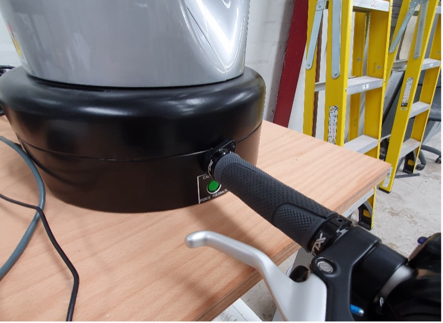

.. _Haption Calibration:

Haption Calibration
===================

To calibration of the :ref:`Haption Virtuose 6D TAO`, the following steps are required:

.. note:: First, make sure the :ref:`Haption Virtuose 6D TAO` is connected to the computer and the Haption software is running. Check :ref:`Haption Starting Up`.

#. Press the ``Play`` button. It will ask you to calibrate the Haption device.
#. Insert the two prongs on the end of the handle into the corresponding slots on the base of the device, see :numref:`fig_haption_calibration`. Push in until the calibrate message goes away.

.. _fig_haption_calibration:

    Haption Calibration Position

