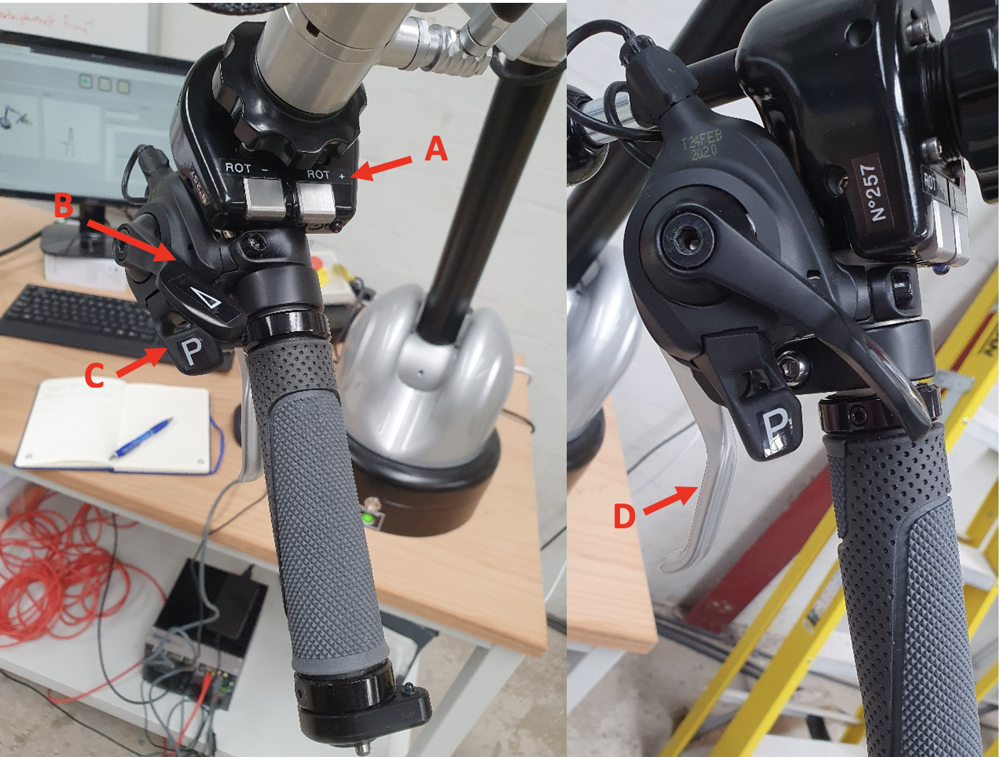
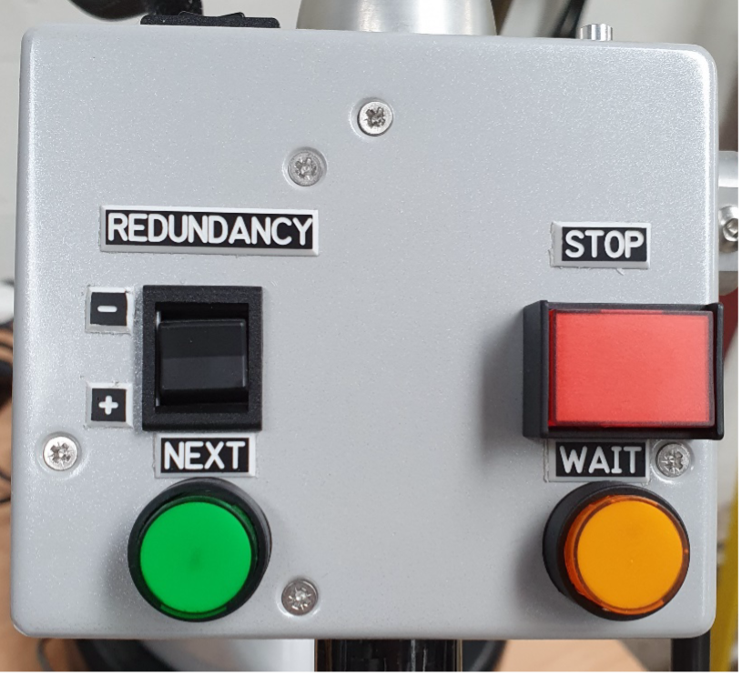

.. _Haption Demo:

Haption Kinova Demo
===================

This demo shows how to use the Haption device with the Kinova Gen3 Arm.

To run the demo follow these steps:

1. Turn on the Kinova Gen3 Arm. To do this, see the :ref:`Kinova Gen3 Starting Up`.
2. Turn on the Haption device. To do this, see the :ref:`Haption Starting Up`.
3. Do the calibration of the Haption device. To do this, see the :ref:`Haption Calibration`.
4. Move the handle to a comfortable starting position, you will see it move on screen.
5. Make sure the green button on the front of the base is lit up, may need to press it twice.
6. When ready to start controlling the manipulator press the ``orange button`` on the forearm of the Haption device.
7. Will feel an increase in resistance from the Haption as you take control, as you move the handle the manipulator will now move.

.. note:: To change the level of force feedback and scale of movement, you can use the options under the graphic of the Haption.

8. There is a dead man’s switch in the handle, if you release the handle all movement will stop, to retake control hold the handle and press the ``orange button`` again.
9. Image :numref:`fig_haption_control` shows the control of the Haption device.

    - **A** is a touch button for end effector rotation.
    - **B** is a clutch system press and hold to reposition controller without moving manipulator.
    - **C** locks the gripper position.
    - **D** closes the gripper.

.. _fig_haption_control:

    Haption Control

10. The control box on the forearm, has buttons labelled redundancy that move the arm whilst keeping the end effector in the same position. The performance of this depends on the manipulator position so won’t always work. See :numref:`fig_haption_control_box` for the control box.

.. _fig_haption_control_box:

    Forearm Control Box

