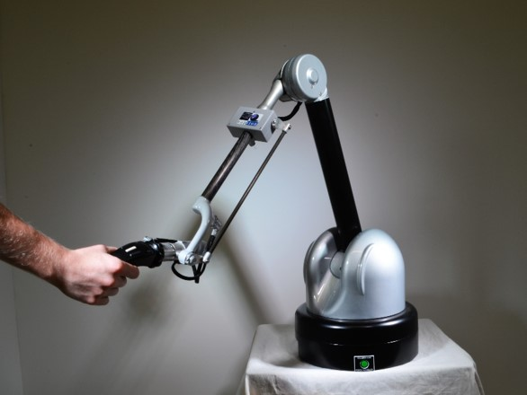

.. _Haption Virtuose 6D: https://www.haption.com/en/products-en/virtuose-6d-tao-en.html
.. _Haption Virtuose 6D Products: https://www.haption.com/robotics/products-1
.. _Haption Virtuose 6D VPP Example: https://github.com/vancegroup/vpp-examples

.. _Haption Virtuose 6D TAO:

Haption Virtuose 6D TAO
=======================

.. _fig_haption:

    Haption Virtuose 6D

+------------------+--------------------------------------------+
| Location         | Dry Lab                                    |
+------------------+--------------------------------------------+
| Contacts         | Mohammad                                   |
+------------------+--------------------------------------------+
| Manufacturer     | `Haption Virtuose 6D`_                     |
+------------------+--------------------------------------------+
| Further info     |`Haption Virtuose 6D Products`_             |
+------------------+--------------------------------------------+
| VPP Example      |`Haption Virtuose 6D VPP Example`_          |
+------------------+--------------------------------------------+
| Issues           |                                            |
+------------------+--------------------------------------------+

The Haption Virtuose 6D is a force-feedback manipulator that is used for tele-operation and remote handling applications.

In this document, we will go through the steps to setup and use the Haption Virtuose 6D TAO in the Dry Lab.

.. toctree::

    startup
    calibration
    demo

