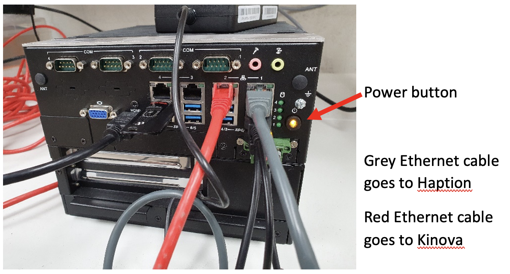
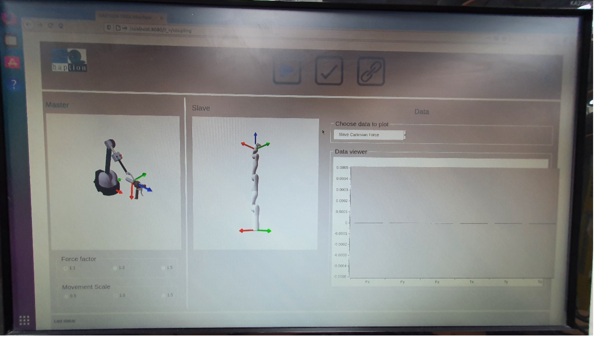

.. _Haption Starting Up:

===================
Haption Starting Up
===================

The :ref:`Haption Virtuose 6D TAO` is connected to the computer via Ethernet cable.
To start the Haption device, the following steps are required:

#. Turn on the Haption device using the power button on the **Power Box**.
#. Power on control PC. The power button on front right, see :numref:`fig_haption_startup`.

.. _fig_haption_startup:

    Haption Startup

#. Log in as ``guest`` with password ``guest``.
#. Double click the `TeleRobotics Extender` icon on the desktop to open the user interface.
#. Log in with username ``admin`` and password ``trex``.
#. Under the configuration tab, press the ``green run`` button for the manipulator you want to control.
#. Will have screen in figure :numref:`fig_haption_software_interface`, showing both the Haption and the robot manipulator, on the bottom left you can change the force factor and movement scale, on the right you can select which information is plotted.

.. _fig_haption_software_interface:

    Haption Software Interface

