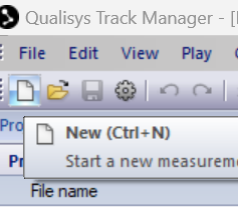
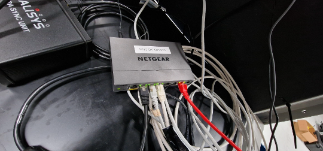
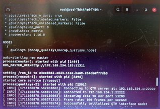
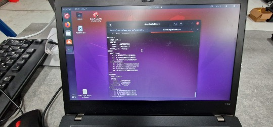
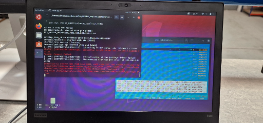

=============
Ros Interface
=============

This section goal is to connect a laptop running linux (Ubuntu 20.04 tested) with ``ROS`` on it to receive Qualisys
data in real-time. The laptop is configured as a ROS master.

.. warning:: Don't change IPs on Qualisys PC Air in an attempt to match the networking requirements of your robot.

Instead, change the robot's IPs to match what is already set up on Qualisys PC Air.
Your ROS node needs to be on the same network with the cameras (IP class ``192.168.254.x/24``).

.. note:: You can check the IP information by :guilabel:`right-click on the icon Windows Taskbar -> Qualisys DHCP Server -> right click`, then select :guilabel:`Configuration wizard -> click the button More`, adjacent to ``Cameras``.

ROS Interface Setup
-------------------

First, Launch :guilabel:`Qualisys PC Air -> QTM -> New`, and provided that all camera information loads successfully, and a rigid body was defined.
Then `QTM automatically` streams data on the IP ``192.168.254.1`` on the cameras network, to any listener.
So, any `ROS node` can pick up those messages. See :numref:`fig_qualisys_new_icon_1`.

.. _fig_qualisys_new_icon_1:

    Qualisys New Icon

The rigid body is now correctly identified by Qualisys Air system, and data is being streamed on the `Cameras` port.
If not see the :ref:`Qualisys Air Rigid Body` section.

Connect the laptop to the cameras' network with plugin an Ethernet cable into the Netgear switch. See :numref:`fig_qualisys_ethernet`.

.. _fig_qualisys_ethernet:

    Qualisys Ethernet

Now, in the laptop, first, set up the network IP `192.168.254.183`. Also, create a new ROS workspace.
In the new terminal:

.. code-block::

    $ cd ~/qualisys_ws/src
    $ git clone https://github.com/KTH-SML/motion_capture_system
    $ cd ~/qualisys_ws
    $ catkin_make

Now, edit the .bashrc file to include the following lines:

.. code-block::

    $ gedit ~/.bashrc
    $ source ~/qualisys_ws/devel/setup.bash
    $ export ROS_MASTER_URI=http://192.168.254.183 :11311
    $ export ROS_IP=192.168.254.183

Now, close all terminals, then open a new terminal and run the following commands:

.. code-block::

    $ rospack profile
    $ roslaunch mocap_qualisys qualisys.launch server_address:=192.168.254.1

The Figure :numref:`fig_qualisys_ros_interface` below shows the ROS node started successfully.

.. _fig_qualisys_ros_interface:

    ROS Interface

Check all topics. You should be able to see the object in by typing

.. code-block::

    $ rostopic list

Check data is coming through. For example, for a rigid body called Mallard_pattern1 do this:

.. code-block::

    $ rostopic echo /qualisys/Mallard_pattern1/pose

See :numref:`fig_qualisys_ros_topic` below.

.. _fig_qualisys_ros_topic:

    ROS Topic

Troubleshooting ROS
-------------------

To do a quick check, do the following steps:

1. The error below appears where there is no direct connection between the ROS node and the Qualisys server. See :numref:`fig_qualisys_ros_error`.

.. _fig_qualisys_ros_error:

    ROS Error

2. Try pinging the server in terminal

.. code-block::

    $ ping 92.168.254.1

If not successful check the cables, and whether the network switch is operational or not.
You could also check packets being transmitted and received by the laptop, e.g. using code below in terminal

.. code-block::

    $ iptraf-

Also, make sure no typos are present in the command, e.g. ``sever_address`` instead of ``server_address``.

.. note:: If the rigid body name contains spaces, e.g. ``rigid body1``, roslaunch will fail.

