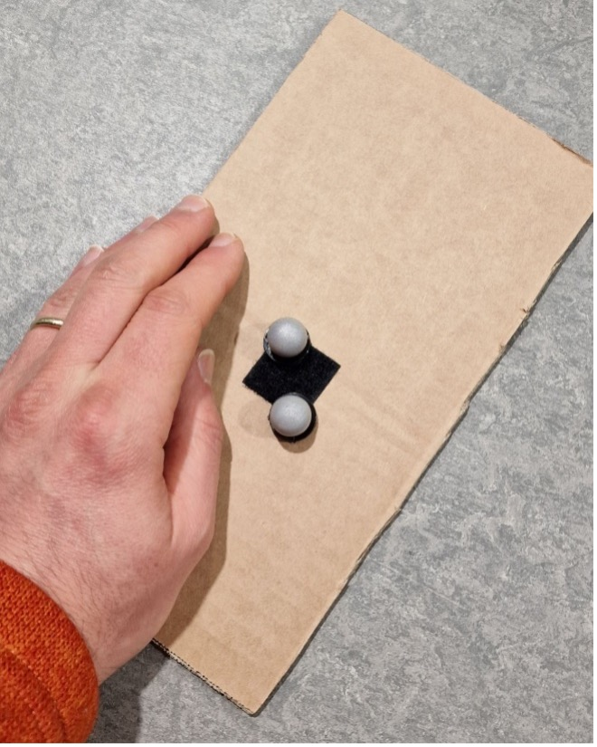
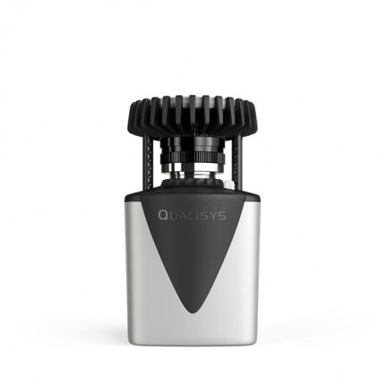
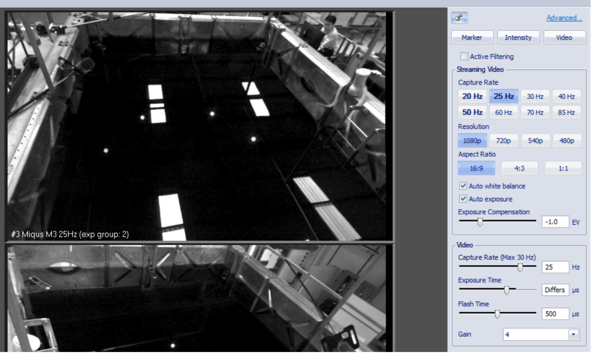
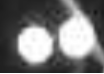

.. _Qualisys Air Calibration:

========================
Qualisys Air Calibration
========================

First of all decide your overall region of interest (RoI) where robots with markers on them need to be tracked by the
Qualisys system. An example of RoI is the water tank's surface area. It is acceptable that one camera cannot cover the
entire RoI, however together, all cameras need to be able to cover the entire RoI.

Select one camera to be calibrated. Start by placing 2 markers as far away in the RoI but still within sight of the
camera (i.e. on the boundary of RoI). See :numref:`fig_qualisys_marker` for an example.
The distance between the two markers needs to be representative of the pattern
that you want to place on your robot. For small robots, the markers will be closer to each other, whereas for larger
robots the markers can be further apart. However, when the pattern turns, we want the camera to be able to distinguish
between the two markers. When it comes to calibration, there are 2 parts: hardware and software.

.. _fig_qualisys_marker:

    Example of Qualisys marker placement for calibration

Hardware Calibration
--------------------

The hardware calibration use the rings that are attached to the camera. There are 2 rings on the cameras corresponding to Aperture and Focus that need to be set up. See :numref:`fig_qualisys_rings` for an example.

.. _fig_qualisys_rings:

    Qualisys Air Camera Rings

The aperture defines the quantity of light that gets inside the camera.
During the Qualisys training `14-15 June 2023`, the instructor set all cameras to 2.8.
Smaller number means more light but less depth (think of markers being seen as too bright).
Larger number means less lightless light but more depth.

The focus makes parts of the image clear to the detriment of other parts that might appear blurry.
Say we focus on a point located close to the camera (select a low value for focus).
Then, the surroundings located far away will appear blurry.
The other way around, say we focus on the surroundings located far away (select a large value for focus, say infinity).
Then, the nearby point will appear blurry.

A Guideline for the aperture and focus values
~~~~~~~~~~~~~~~~~~~~~~~~~~~~~~~~~~~~~~~~~~~~~

First, Select video mode for that camera. See :numref:`fig_qualisys_video_mode` for an example.

.. _fig_qualisys_video_mode:

    Qualisys Air Camera Video Mode

Start by setting the focus ring to infinity.
The reason is that we want to be able to see the whole scene as clear as possible,
instead of focusing on a particular point in space that might be located closer to the camera.
In the video, zoom on the two markers that had been placed on the boundary of RoI.
What we are looking for are two bright objects, see :numref:`fig_qualisys_focus`.

.. _fig_qualisys_focus:

    Qualisys Air Camera Focus

The aperture is related to the frequency of data collection. The higher the frequency rate,
the more light needs to get inside the camera for an object to get the chance to be recognised.

Software Calibration
--------------------

There are two software parameters that need to be set up: the ``Exposure & Flash Time (ET)`` and ``Marker Threshold (MT)``.
ET sets up how long the light ring should be on during a sampling time T (say the Capture Rate is set to 100 Hz, then T=0.01 sec).
The higher this value, the more light the cameras emit.

MT Setting Up
~~~~~~~~~~~~~

