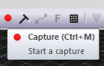
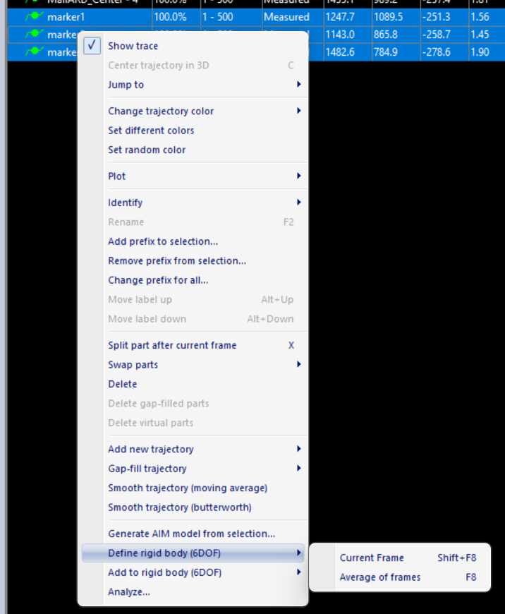
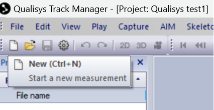

.. _Qualisys Air Calibration:

========================
Qualisys Air Calibration
========================

First of all decide your overall region of interest (RoI) where robots with markers on them need to be tracked by the
Qualisys system. An example of RoI is the water tank's surface area. It is acceptable that one camera cannot cover the
entire RoI, however together, all cameras need to be able to cover the entire RoI.

Select one camera to be calibrated. Start by placing 2 markers as far away in the RoI but still within sight of the
camera (i.e. on the boundary of RoI). See :numref:`fig_qualisys_marker` for an example.
The distance between the two markers needs to be representative of the pattern
that you want to place on your robot. For small robots, the markers will be closer to each other, whereas for larger
robots the markers can be further apart. However, when the pattern turns, we want the camera to be able to distinguish
between the two markers. When it comes to calibration, there are 2 parts: hardware and software.

.. _fig_qualisys_marker:

.. figure:: ../../../images/qualisys_air/qualisys_marker.jpg
    :scale: 50%
    :align: center
    :alt: Qualisys Marker Placement

    Example of Qualisys marker placement for calibration

Hardware Calibration
--------------------

The hardware calibration use the rings that are attached to the camera. There are 2 rings on the cameras corresponding to Aperture and Focus that need to be set up. See :numref:`fig_qualisys_rings` for an example.

.. _fig_qualisys_rings:

.. figure:: ../../../images/qualisys_air/qualisys_rings.jpg
    :scale: 80%
    :align: center
    :alt: Qualisys Rings

    Qualisys Air Camera Rings

The aperture defines the quantity of light that gets inside the camera.
During the Qualisys training `14-15 June 2023`, the instructor set all cameras to 2.8.
Smaller number means more light but less depth (think of markers being seen as too bright).
Larger number means less lightless light but more depth.

The focus makes parts of the image clear to the detriment of other parts that might appear blurry.
Say we focus on a point located close to the camera (select a low value for focus).
Then, the surroundings located far away will appear blurry.
The other way around, say we focus on the surroundings located far away (select a large value for focus, say infinity).
Then, the nearby point will appear blurry.

A Guideline for the aperture and focus values
~~~~~~~~~~~~~~~~~~~~~~~~~~~~~~~~~~~~~~~~~~~~~

First, Select video mode for that camera. See :numref:`fig_qualisys_video_mode` for an example.

.. _fig_qualisys_video_mode:

    Qualisys Air Camera Video Mode

Start by setting the focus ring to infinity.
The reason is that we want to be able to see the whole scene as clear as possible,
instead of focusing on a particular point in space that might be located closer to the camera.
In the video, zoom on the two markers that had been placed on the boundary of RoI.
What we are looking for are two bright objects, see :numref:`fig_qualisys_focus`.

.. _fig_qualisys_focus:

.. figure:: ../../../images/qualisys_air/qualisys_focus.png
    :scale: 100%
    :align: center
    :alt: Qualisys Focus

    Qualisys Air Camera Focus

The aperture is related to the frequency of data collection. The higher the frequency rate,
the more light needs to get inside the camera for an object to get the chance to be recognised.

Software Calibration
--------------------

There are two software parameters that need to be set up: the ``Exposure & Flash Time (ET)`` and ``Marker Threshold (MT)``.
ET sets up how long the light ring should be on during a sampling time T (say the Capture Rate is set to 100 Hz, then T=0.01 sec).
The higher this value, the more light the cameras emit.

MT Setting Up
~~~~~~~~~~~~~

Firstly select the ``Intensity`` mode. See :numref:`fig_qualisys_intensity` for an example.

.. _fig_qualisys_intensity:

    Qualisys Air Camera Intensity

The light ring on the camera turns on in green. See :numref:`fig_qualisys_green` for an example.

.. _fig_qualisys_green:

    Qualisys Air Camera Green

As a guideline, we are looking at ET to be from 50 to 300 microsecond, and MT to be between 20 to 60 %.
Start with low ET and MT values and check whether the two markers are clearly identified.
If not, try increasing ET initially and MT afterwards, then reiterate, meaning increase ET and then MT.
Satisfactory results would look like in the images below. Two clear and separate balls had been identified.
See :numref:`fig_qualisys_detection_markers` for an example.

.. _fig_qualisys_detection_markers:

    Detected Markers

.. figure:: ../../../images/qualisys_air/qualisys_detection_marker_2.png
    :scale: 94%
    :align: left
    :alt: Qualisys Detection Markers

    Detected Markers

|
|
|
|
|

Next, set to ``Marker`` mode. See :numref:`fig_qualisys_marker_mode` for an example.

.. _fig_qualisys_marker_mode:

    Qualisys Air Camera Marker Mode

and zoom on the two markers. We want to be able to see them clearly and distinct like below. See :numref:`fig_qualisys_detected_black_markers` for an example.

.. _fig_qualisys_detected_black_markers:

    Detected Black Markers

Next, we need to look at artefacts.
Although markers might be clearly identified using the settings above, this might come at the expense of artefacts,
as seen in the :numref:`fig_qualisys_artefacts`.

.. _fig_qualisys_artefacts:

    Qualisys Artefacts

Now, we need to revise ET and MT parameters such that there is a balance (trade-off)
between the clarity of the identified markers and the reduction of artefacts (ideally, we want to see clear markers
and make artefacts disappear).

.. note:: Artefacts: not useful objects that get picked up by cameras, such as reflections, shadows, etc.

Try switching to ``Video mode`` and see what creates those artefacts. If the source of the artefacts are physical objects
like aluminium rods lying in the RoI, then ``physically remove/eliminate`` them by placing them somewhere else,
away from the scene. Other examples of artefacts include water reflections from the outside light coming through
the roof windows, which cannot be physically removed. Instead, we can try to reduce its effects by ``tuning/playing``
with the ``ET and MT parameters``. And redo Step 3 for all tracker cameras.

Masking the Artefacts
~~~~~~~~~~~~~~~~~~~~~

After having put all effort in eliminating or at least reducing the effects of artefacts, the leftovers need to be masked.
First, make sure to remove any markers from RoI so that what is left over are just artefacts.
Two options: Auto-Mask or Manual Masking.

1. Auto-Mask: Select the ``Auto-Mask`` mode with clicking the Auto-Mask button at ``the right hand side of the menu``.
See :numref:`fig_qualisys_auto_mask`.

.. _fig_qualisys_auto_mask:

    Qualisys Auto Mask

2. Manual Masking: Click on the ``Marker Mask Tool`` at ``left-hand side menu``.
Then use the mouse to draw rectangles on each camera representing the region to be masked.
See :numref:`fig_qualisys_manual_mask`.

.. _fig_qualisys_manual_mask:

.. figure:: ../../../images/qualisys_air/qualisys_manual_mask.png
    :scale: 80%
    :align: center
    :alt: Qualisys Manual Mask

    Qualisys Manual Mask

Define global coordinate system
~~~~~~~~~~~~~~~~~~~~~~~~~~~~~~~

To do calibration we will use the ``Calibration kit 600``. Art no 130456, Serial number 2412, consisting of an L-shape
and a wand, shown at :numref:`fig_qualisys_calibration_kit`.

.. _fig_qualisys_calibration_kit:

    Qualisys Calibration Kit

Place the ``L-shape`` somewhere in the Region of Interest (RoI) where you want the global coordinate system to be.
See :numref:`fig_qualisys_l_shape`.

.. _fig_qualisys_l_shape:

    Qualisys L-Shape

Next, take the ``T-shape 601.7 mm`` wand. Make sure to indicate the details of this kit
(consisting of the ``T-shape wand and L-frame``) by going to :guilabel:`Project Options -> Camera System -> Calibration`.

.. _fig_qualisys_project_options:

    Qualisys Project Options

Then, Click the ``wand icon`` on the top horizontal menu. See :numref:`fig_qualisys_wand_icon`.

.. _fig_qualisys_wand_icon:

.. figure:: ../../../images/qualisys_air/qualisys_wand_icon.png
    :scale: 100%
    :align: center
    :alt: Qualisys Wand Icon

    Qualisys Wand Icon

and, on the window that pops up on the screen, choose the ``calibration time`` (e.g. 60 seconds) and
the Delay in calibration (e.g. 5 seconds), then hit ``OK``. See :numref:`fig_qualisys_calibration_time`.

.. _fig_qualisys_calibration_time:

    Qualisys Calibration Time

Take the ``T-shape 601.7 mm wand`` and start waiving it in the RoI.
Combine the two motions below to create a waiving motion.

    1. Move the wand round the tank in a ``spiral motion`` with the head of the ``T- wand vertical``.
    2. Move the wand up-down with the head of the ``T- wand horizontal``.

Try to cover as much as possible of entire RoI (not just a small region).
Once the data has been recorded, you can view and play it again.

Create a rigid body
~~~~~~~~~~~~~~~~~~~

For the tracking the rigid body, we need to create a non-symmetric pattern with the Air markers. See :numref:`fig_qualisys_rigid_body`.

.. _fig_qualisys_rigid_body:

    Qualisys Rigid Body Example

Make sure the following three windows are available on the screen, :guilabel:`hit View -> Trajectory Info -> Unidentified`. Then hit ``Labeled`` and finally hit ``Discarded``.
See :numref:`fig_qualisys_windows`.

.. _fig_qualisys_windows:

    Qualisys Windows

Click on the ``Record icon`` on the top horizontal menu. See :numref:`fig_qualisys_record_icon`.

.. _fig_qualisys_record_icon:

    Qualisys Record Icon

and start capturing a short video that contains the pattern. See :numref:`fig_qualisys_capture_video`.

.. _fig_qualisys_capture_video:

    Qualisys Capture Video

Replay the recording and pause somewhere (hit spacebar). Markers’ data will show up in the box ``Unidentified trajectories``.
Click on each marker that forms the pattern, then drag and drop them into the ``Labeled trajectories``.
Give individual markers and associated trajectories names, e.g. marker1, marker2, etc.
Select all markers that form a pattern. Use :guilabel:`Shift + select, or Ctrl + click on each marker ball, right-click with the mouse -> Define rigid body (6DOF) -> Average of frames`.
See :numref:`fig_qualisys_rigid_body_creation`.

.. _fig_qualisys_rigid_body_creation:

    Qualisys Rigid Body Creation

Then give it a name, as shown in :numref:`fig_qualisys_rigid_body_name`.

.. _fig_qualisys_rigid_body_name:

    Qualisys Rigid Body Name

.. note:: Make sure the name does NOT have any spaces, and does not start with a number, otherwise it would fail to work on ROS.

.. note:: In tutorial below, we shall work with a different rigid body called ``Mallard_pattern1`` instead of ``rigid_body1``.

Next, we need to adjust the body coordinate system, i.e. the ``xyz-coordinate axes``.
For that, click on the ``settings button`` from the horizontal top menu. See :numref:`fig_qualisys_settings_button`.

.. _fig_qualisys_settings_button:

    Qualisys Settings Button

and go to :guilabel:`Processing > 6DOF Tracking`. See :numref:`fig_qualisys_6dof_tracking`.

.. _fig_qualisys_6dof_tracking:

    Qualisys 6DOF Tracking

Then, click on ``Translate`` button and adjust accordingly. See :numref:`fig_qualisys_translate_button`.

.. _fig_qualisys_translate_button:

    Qualisys Translate Button

You can also click on ``Rotate``. For example, below we set up the ``y-axis`` going through points 1 and 3. See :numref:`fig_qualisys_rotate_button`.

.. _fig_qualisys_rotate_button:

    Qualisys Rotate Button

To know which point has what number, click on a point and look at the number shown in the upper right corner of the white window.
For example, below the point 2 was clicked on. See :numref:`fig_qualisys_point_number`.

.. _fig_qualisys_point_number:

    Qualisys Point Number

To check the list of all rigid bodies stored in QTM, go to :guilabel:`Project Options -> Processing -> 6DOF Tracking`.
See :numref:`fig_qualisys_rigid_bodies`.

.. _fig_qualisys_rigid_bodies:

    Qualisys Rigid Bodies

Close the active window inside QTM (hit the second X from top to down, on the upper right corner of the screenshot above)
and when the dialog box appears, select ``Yes, save settings``. Click the ``New`` icon to start streaming
(broadcasting) data of the rigid bodies defined above, across the network (the Netgear switch).
See :numref:`fig_qualisys_new_icon`.

.. _fig_qualisys_new_icon:

    Qualisys New Icon

