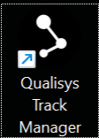
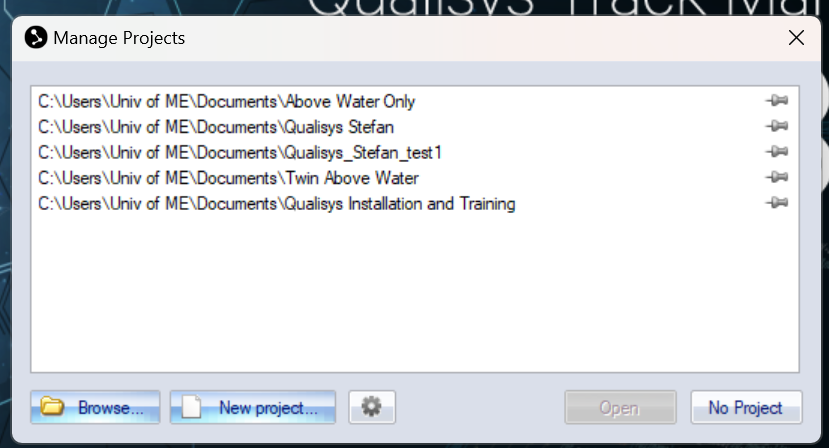
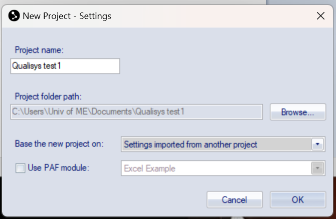
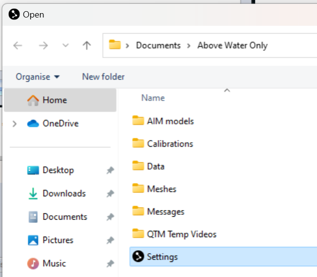
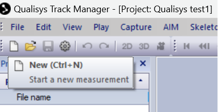
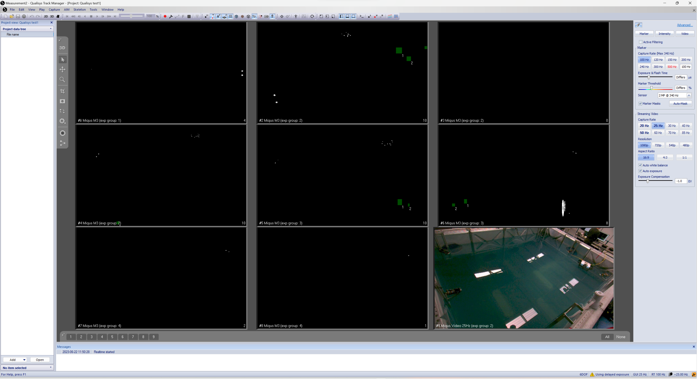
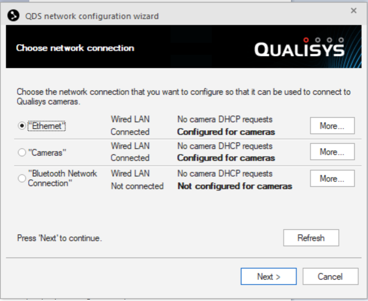
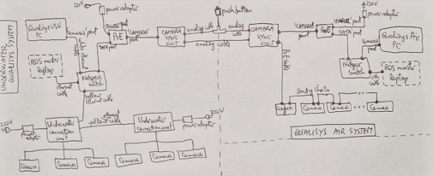

.. _qualisys_startup:

===========
Starting Up
===========

The goal of this document is to provide a step-by-step guide to starting up the :ref:`Qualisys Air` system and recognize a ``Rigid Body``, and stream the data into ROS.

To start up the Qualisys system, follow these steps:

1. Turn on the Qualisys computer.
2. Open the Qualisys Track Manager software. See the :numref:`fig_qualisys_logo`.

.. _fig_qualisys_logo:

    Qualisys Logo

3. Click on ``New project`` button shows in the :numref:`fig_qualisys_new_project`.

.. _fig_qualisys_new_project:

    New Project

4. Give the project a name, e.g. `Qualisys_Stefan_test1`, then select :guilabel:`Settings imported from another project`, click ``OK``. See the :numref:`fig_qualisys_new_project_2`.

.. _fig_qualisys_new_project_2:

    New Project

5. Select ``Settings`` file at the location indicated below (i.e. Documents -> Above Water Only) and hit ``OK``. See the :numref:`fig_qualisys_setting`.

.. _fig_qualisys_setting:

    Setting

6. Click on the ``New`` icon to start the system. See the :numref:`fig_qualisys_new`. Make sure all 8 tracker cameras + 1 video camera are operational. See the :numref:`fig_qualisys_operation`.

.. _fig_qualisys_new:

    New

.. _fig_qualisys_operation:

    Operation

===============
Troubleshooting
===============

If the Qualisys system is not working properly or cameras do not show up, follow these steps:

1. Try turning off the power to all cameras (there is just one large power adapter poering them all), then wait for a couple of seconds, and then turn back on;
2. Check the networking settings. Right-click on the :guilabel:`Qualisys DHCP Server` icon -> Configuration wizard. See the :numref:`fig_qualisys_dhcp`. The IP for the ``Ethernet port`` should be ``192.168.0.2``, and for the ``Cameras port`` the IP should be ``192.168.254.1``. In case that is not the case and you need to change/amend them, 1st select the port then click Next and follow the instructions.

.. _fig_qualisys_dhcp:

    DHCP

.. note:: The other Qualisys computer, namely Qualisys UW, has its :guilabel:`Ethernet port IP set to 192.168.0.1` so a different IP was selected for Qualisys Air computer.

3. Check the wiring is done according to diagram shown in the :numref:`fig_qualisys_wiring`.

.. _fig_qualisys_wiring:

    Wiring Diagram

