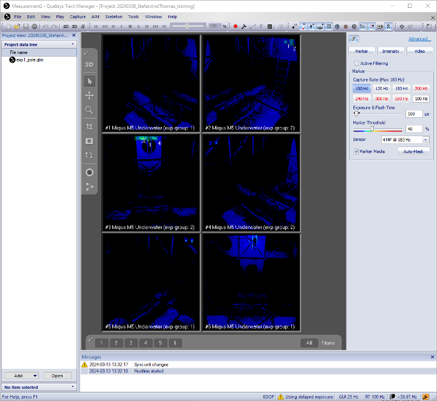
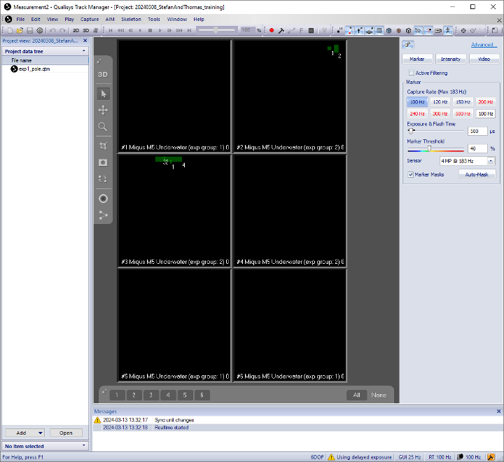

.. _Qualisys Underwater Calibration:

===========
Calibration
===========

The calibration of the Qualisys system is a crucial step in the process of setting up the system.
There are 2 types of calibration that need to be done: the hardware calibration and the software calibration.

Hardware Calibration
--------------------

The hardware part has been done for you already, meaning the Aperture and Focus rings have been set up by
a Qualisys trainer and then the camera was enclosed in its water sealing enclosure.
Aluminium frames have been designed by the same Qualisys trainer based on what the overall region of interest (RoI)
needed to be, where robots with markers on them needed to be tracked by the Qualisys system.

Software Calibration
---------------------

There are two software parameters that need to be set up: the ``Exposure & Flash Time (ET)`` and ``Marker Threshold (MT)``.
``ET`` sets up how long the light ring should be on during a sampling time T (say the Capture Rate is set to 100 Hz, then T=0.01 sec).
The higher this value, the more light the cameras emit.

MT Setting
~~~~~~~~~~

First of all, place 2 markers that are close enough inside the water, as far away in the region of interest,
but ensure they are visible by the camera you intend to calibrate. See the image :numref:`fig_uw_markers` for an example.

.. _fig_uw_markers:

    Underwater Markers

In QTM, select Intensity mode. See :numref:`fig_uw_intensity_mode` for an example.

.. _fig_uw_intensity_mode:

    Intensity Mode

As a guideline: start with ``ET=500µs`` and ``MT=40%``. Start with low ``ET and MT`` values and check whether the two
markers are clearly identified. If not, try increasing ET initially and MT afterwards, then reiterate,
meaning increase ET and then MT. Satisfactory results would look like in the image :numref:`fig_uw_markers_identified`.
Two clear and separate balls had been identified representing the 2 markers.

.. _fig_uw_markers_identified:

    Identified Markers

    Identified Markers

|
|
|
|
|

Next, set to Marker mode. See :numref:`fig_uw_marker_mode` for an example.

.. _fig_uw_marker_mode:

    Marker Mode

Zoom on the two markers. We want to be able to see them clearly and distinct like below. See :numref:`fig_uw_markers_zoomed` for an example.

.. _fig_uw_markers_zoomed:

    Identified Markers

Next, we need to look at artefacts (= not useful objects that get picked up by cameras).
Although markers might be clearly identified using the settings above, this might come at
the expense of artefacts, as seen in the image below. Now, we need to revise ET and MT parameters
such that there is a balance (trade-off) between the clarity of the identified markers and the reduction
of artefacts (ideally, we want to see clear markers and make artefacts disappear).

