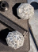

.. _Qualisys Underwater Calibration:

===========
Calibration
===========

The calibration of the Qualisys system is a crucial step in the process of setting up the system.
There are 2 types of calibration that need to be done: the hardware calibration and the software calibration.

Hardware Calibration
--------------------

The hardware part has been done for you already, meaning the Aperture and Focus rings have been set up by
a Qualisys trainer and then the camera was enclosed in its water sealing enclosure.
Aluminium frames have been designed by the same Qualisys trainer based on what the overall region of interest (RoI)
needed to be, where robots with markers on them needed to be tracked by the Qualisys system.

Software Calibration
---------------------

There are two software parameters that need to be set up: the ``Exposure & Flash Time (ET)`` and ``Marker Threshold (MT)``.
``ET`` sets up how long the light ring should be on during a sampling time T (say the Capture Rate is set to 100 Hz, then T=0.01 sec).
The higher this value, the more light the cameras emit.

MT Setting
~~~~~~~~~~

First of all, place 2 markers that are close enough inside the water, as far away in the region of interest,
but ensure they are visible by the camera you intend to calibrate. See the image :numref:`fig_uw_markers` for an example.

.. _fig_uw_markers:

    Underwater Markers

In QTM, select Intensity mode. See :numref:`fig_uw_intensity_mode` for an example.

.. _fig_uw_intensity_mode:

.. figure:: ../../../images/qualisys_uw/qualisys_uw_intensity_mode.png
    :scale: 70%
    :align: center
    :alt: qualisys_uw_intensity_mode

    Intensity Mode

As a guideline: start with ``ET=500µs`` and ``MT=40%``. Start with low ``ET and MT`` values and check whether the two
markers are clearly identified. If not, try increasing ET initially and MT afterwards, then reiterate,
meaning increase ET and then MT. Satisfactory results would look like in the image :numref:`fig_uw_markers_identified`.
Two clear and separate balls had been identified representing the 2 markers.

.. _fig_uw_markers_identified:

.. figure:: ../../../images/qualisys_uw/qualisys_uw_markers_identified_1.png
    :scale: 110%
    :align: left
    :alt: qualisys_uw_markers_identified

    Identified Markers

    Identified Markers

|
|
|
|
|

Next, set to Marker mode. See :numref:`fig_uw_marker_mode` for an example.

.. _fig_uw_marker_mode:

.. figure:: ../../../images/qualisys_uw/qualisys_uw_marker_mode.png
    :scale: 70%
    :align: center
    :alt: qualisys_uw_marker_mode

    Marker Mode

Zoom on the two markers. We want to be able to see them clearly and distinct like below. See :numref:`fig_uw_markers_zoomed` for an example.

.. _fig_uw_markers_zoomed:

.. figure:: ../../../images/qualisys_uw/qualisys_uw_markers_zoomed.png
    :scale: 110%
    :align: center
    :alt: qualisys_uw_markers_zoomed

    Identified Markers

Next, we need to look at artefacts.
The ``Artifacts`` means not useful objects that get picked up by cameras.
Although markers might be clearly identified using the settings above, this might come at
the expense of artefacts, as seen in the image below. Now, we need to revise ET and MT parameters
such that there is a balance (trade-off) between the clarity of the identified markers and the reduction
of artefacts (ideally, we want to see clear markers and make artefacts disappear). See :numref:`fig_uw_artefacts` for an example.

.. _fig_uw_artefacts:

.. figure:: ../../../images/qualisys_uw/qualisys_uw_artefacts.png
    :scale: 50%
    :align: center
    :alt: qualisys_uw_artefacts

    Artefacts

Try switching to Video mode and see what creates those artefacts.
If the source of the artefacts are physical objects like aluminium rods lying in the RoI,
then physically remove/eliminate them by placing them somewhere else, away from the scene.
Other examples of artefacts include water reflections from the outside light coming through the roof windows,
which cannot be physically removed. Instead, we can try to reduce its effects by tuning/playing with
the parameters ET and MT.

ANd then, redo Step 3 for all tracker cameras.

Masking artefacts
-----------------

After having put all effort in eliminating or at least reducing the effects of artefacts, the leftovers need to be masked.

First, make sure to remove any markers from RoI so that what is left over are just artefacts. There are two options ``Auto-Mask`` or ``Manual Masking``.

Auto-Mask
~~~~~~~~~

Hit the button below from the right-hand side menu. See :numref:`fig_uw_auto_mask`.

.. _fig_uw_auto_mask:

.. figure:: ../../../images/qualisys_uw/qualisys_uw_auto_mask.png
    :scale: 70%
    :align: center
    :alt: qualisys_uw_auto_mask

    Auto-Mask

Manual Masking
~~~~~~~~~~~~~~

Click on the ``Marker Mask Tool`` at left-hand side of the menu.
Then use the mouse to draw rectangles on each camera representing the region to be masked. See :numref:`fig_uw_manual_mask`.

.. _fig_uw_manual_mask:

    Manual Masking

Define global coordinate system
-------------------------------

Take the box with the Calibration kit that has a T-shape wand showing serial number 1815 and length 601.5mm.
For now, we only need the L-shape: it needs to be mounted on a large L-bracket made of aluminium profiles as in the image below. See :numref:`fig_uw_calibration_kit`.
Place the ``L-bracket`` with the ``L-shape`` inside the RoI in the middle of the water tank, where you want the global coordinate system to be.

.. _fig_uw_calibration_kit:

    Calibration Kit

The intention here is to have the L-shape visible by all cameras. See :numref:`fig_uw_calibration_kit_visible`.

.. _fig_uw_calibration_kit_visible:

    Calibration Kit Visible

Next, take the T-shape wand 601.5 mm. See :numref:`fig_uw_calibration_kit_t_shape`.

.. _fig_uw_calibration_kit_t_shape:

    Calibration Kit T-Shape

Make sure to indicate the details of this kit (consisting of the T-shape wand and L-frame) by going to
:guilabel:`Project Options -> Camera System -> Calibration`. See :numref:`fig_uw_calibration_kit_details`.

.. _fig_uw_calibration_kit_details:

    Calibration Kit Details

Click the wand icon on the top horizontal menu. See :numref:`fig_uw_calibration_kit_wand`.

.. _fig_uw_calibration_kit_wand:

    Calibration Kit Wand

and, on the window that pops up on the screen, choose the calibration time (e.g. 60 seconds) and
the Delay in calibration (e.g. 5 seconds), then hit ``OK``. See :numref:`fig_uw_calibration_kit_wand_window`.

.. _fig_uw_calibration_kit_wand_window:

    Calibration Kit Wand Window

Take the ``T-shape 601.5 mm wand`` and start waiving it in the RoI. Combine the two motions below to create a waiving motion:

    1. Move the wand round the tank in a spiral motion with the head of the ``T-wand vertical``.
    2. Move the wand up-down with the head of the ``T-wand horizontal``.

Try to cover as much as possible of entire RoI (not just a small region).
Once the data has been recorded, you can view and play it again.

