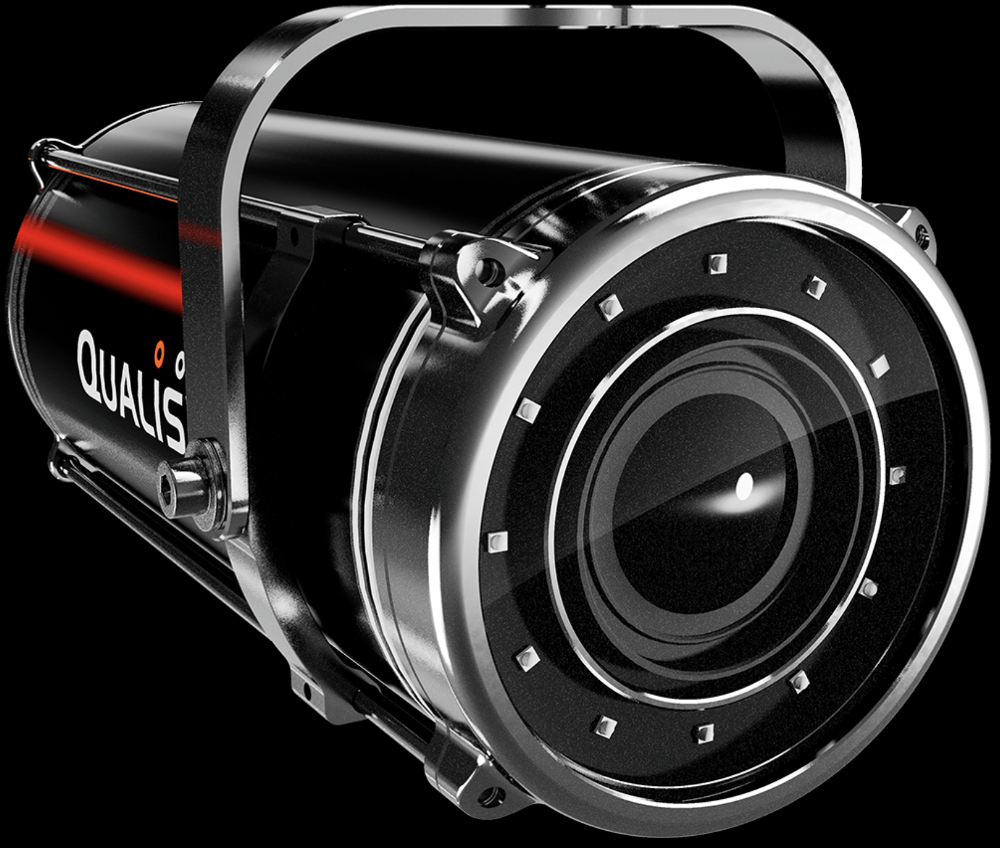

.. _Qualisys: https://www.qualisys.com/
.. _Qualisys User Guide: https://docs.qualisys.com/getting-started/content/getting%20started/introduction.htm
.. _Qualisys ROS: https://github.com/qualisys/ros-resources/
.. _Qualisys ROS2: https://github.com/MOCAP4ROS2-Project/mocap4ros2_qualisys
.. _Qualisys Videos: https://www.youtube.com/playlist?list=PLayfN54QgJo0KeRAEIdHl1i6HJy0v4njl

.. _Qualisys Under Water:

Qualisys Under Water
====================

.. _fig_qualisys_uw:

    Qualisys Under Water

+------------------+--------------------------------------------+
| Location         |  Water Tank                                |
+------------------+--------------------------------------------+
| Contacts         |  Mohammad                                  |
+------------------+--------------------------------------------+
| Manufacturer     |  `Qualisys`_                               |
+------------------+--------------------------------------------+
| Video Guide      |  `Qualisys Videos`_                        |
+------------------+--------------------------------------------+
| User_Guide info  |  `Qualisys User Guide`_                    |
+------------------+--------------------------------------------+
| ROS              |  `Qualisys Ros`_                           |
+------------------+--------------------------------------------+
| ROS2             |  `Qualisys Ros2`_                          |
+------------------+--------------------------------------------+

The Qualisys is a motion capture system that uses infrared cameras to track the position of reflective markers on a subject.
The system is capable of tracking the position of markers in 3D space Under water with sub-millimeter accuracy.

.. toctree::

    startup
    calibration
    RosInterface

