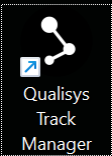
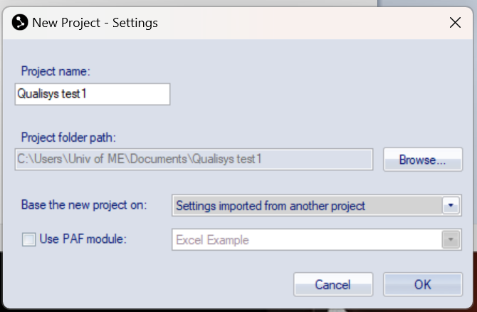

.. _qualisys_underwater_startup:

===========
Starting Up
===========

The goal of this document is to provide a step-by-step guide to starting up the :ref:`Qualisys Under Water` system and recognize a ``Rigid Body``, and stream the data into **ROS**.

To start up the Qualisys system, follow these steps:

1. Turn on the Qualisys computer.
2. Open the Qualisys Track Manager software. See the :numref:`fig_qualisys_uw_logo`.

.. _fig_qualisys_uw_logo:

    Qualisys Logo

3. Click on ``New project`` button shows in the :numref:`fig_qualisys_uw_new_project`.

.. _fig_qualisys_uw_new_project:

    New Project

4. Give the project a name, e.g. `Qualisys_Stefan_test1`, then select :guilabel:`Settings imported from another project`, click ``OK``. See the :numref:`fig_qualisys_uw_new_project_2`.

.. _fig_qualisys_uw_new_project_2:

    New Project

5. Select ``Settings`` file at a location where the system worked before. :guilabel:`Documents -> 20240308_StefanAndThomas_training` and hit ``OK``.

6. Click on the ``New`` icon to start the system. See the :numref:`fig_qualisys_uw_new`. Make sure all 6 tracker cameras are operational. See the :numref:`fig_qualisys_uw_operation`.

.. _fig_qualisys_uw_new:

.. figure:: ../../../images/qualisys_air/qualisys_new.png
    :scale: 50%
    :align: center
    :alt: qualisys_new

    New

.. _fig_qualisys_uw_operation:

    Operation

===============
Troubleshooting
===============

If cameras do not show up in the Qualisys Track Manager, try the following:

1. Try turning off the power to all cameras (there is just one large power adapter poering them all), then wait for a couple of seconds, and then turn back on.
2. Check the networking settings. :guilabel:`right-click on the `Qualisys DHCP Server` icon -> Configuration wizard`.

See the :numref:`fig_qualisys_uw_dhcp`.

.. _fig_qualisys_uw_dhcp:

    DHCP

3. The IP for the `Ethernet 2 port` should be ``192.168.0.1``, and for the `Cameras port` the IP should be ``192.168.2.1``.
In case that is not the case and you need to change/amend them, first select the port then click ``Next`` and follow the instructions.

.. note:: Another Qualisys computer, namely `Qualisys Air`, has its `Ethernet` port IP set to ``192.168.0.2``, so a different IP.

4. Check the wiring is done according to the :ref:`qualisys_underwater_wiring` diagram.

.. _qualisys_underwater_wiring:

    Wiring Scheme

    Wiring Diagram

