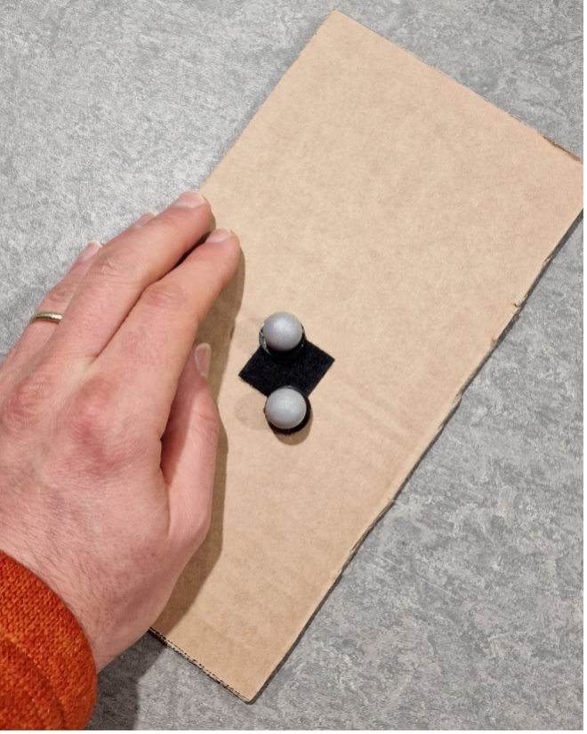

.. _vicon_calibration:

Calibration
===========

The :ref:`Vicon vero 2.2` system contains eight cameras, a computer, a router, and a calibration wand.
The architecture of the system is ``vero`` which is like ``Bonita`` architecture shown in the figure :numref:`fig-bonita`.

.. _fig-bonita:

    Vicon Bonita 2.2 Architecture

The system is controlled by the software ``Vicon Tracker`` which is installed on the Dell computer.
The computer is connected to the router which is connected to the cameras.
The cameras are placed in the ``Mobile Arena`` and are connected to the router.
The calibration wand is used to calibrate the system.
The calibration wand is a stick with a ball in a ``T`` style.
The ball has a reflective surface which is used to calibrate the cameras.
The calibration wand is connected to the computer via USB.

The system needs to be calibrated before it can be used. There are two types of calibration: `Hardware Calibration`_ and `Software Calibration`_.

.. _Hardware Calibration:

Hardware Calibration
--------------------

.. _vicon_calibration_hardware_method1:

Method 1
~~~~~~~~

For hardware calibration follow the steps below:

1. Select camera 7 and change display view from 3D Perspective to Camera (see :numref:`fig-vicon-camera7`).

.. _fig-vicon-camera7:

    Vicon Camera 7

.. note:: It is possible to Pause the scene by hitting spacebar on the keyboard. Similarly, hitting spacebar pauses the scene in 3D Perspective view too (a triangular shape sign will appear on the upper-right corner).

2. Place 2 balls next to each other at a reasonable distance to camera 7 with the aim of visualize them sufficiently clear to be able to distinguish between them. For each ball: `We are looking for tight circular image with bright white middle and a gradient of grayscale towards the edges`. See video `Vicon System Setup`_ for more information. Also, see :numref:`fig-vicon-balls` for software view.

.. _fig-vicon-balls:

    Vicon Calibration

.. _Vicon System Setup:

.. raw:: html

    

        <iframe width="695" height="350" src="https://www.youtube.com/embed/mDVtfTXvbVw?si=zQQaVILJIQjv1z8o" title="YouTube video player" frameborder="0" allow="accelerometer; autoplay; clipboard-write; encrypted-media; gyroscope; picture-in-picture; web-share" referrerpolicy="strict-origin-when-cross-origin" allowfullscreen></iframe>
    

     

3. Start turning the 3 screws on the camera (see :numref:`fig-vicon-screws`). From left to right, the rings are, Zoom, Focus, and aperture.

.. _fig-vicon-screws:

    Vicon Camera calibration Rings

.. note:: Start by setting the zoom ring to infinity, by turning this ring all the way. Secure ring1. Next, turn the focus ring all the way and secure screw2. The reason is that we want to be able to see the whole scene as clear as possible, instead of focusing on a particular point in space that might be located closer to the camera. Last, adjust the aperture ring so that sufficient light from the environment will get the chance to get inside the cameras, but not too much to saturate the readings. The aperture is related to the frequency of data collection: the higher the frequency rate, the more light needs to get inside the camera for an object to get the chance to be recognised.

.. _vicon_calibration_hardware_method2:

Method 2
~~~~~~~~

Another method for hardware calibration, is to start by adjusting the zoom ring according to the area of interest,
then simultaneously play with the other 2 rings in a succession of steps: adjust the focus ring a bit,
then the aperture, then again the focus, and then the aperture, etc.

The pattern used for hardware calibration of cameras consisting of 2 closed markers can be seen in the figure :numref:`fig-vicon-calibration_pattern`.

.. _fig-vicon-calibration_pattern:

    Vicon Hardware Calibration

Example of pattern with 2 markers located closed apart, visible with one camera shows in the figure :numref:`fig-vicon-calibration_pattern_example`.

.. _fig-vicon-calibration_pattern_example:

    Vicon Hardware Calibration Example

Figure :numref:`fig-vicon-calibration_pattern_adjecent` shows the two adjacent balls are in the middle of the screen and the reflections on the right is the ceiling (the camera was placed inclined at 90 degrees).

.. _fig-vicon-calibration_pattern_adjecent:

    Vicon Hardware Calibration Adjacent

By selecting all cameras, we can see the content (view) of all cameras. The figure :numref:`fig-vicon-calibration_pattern_all` shows the view of all cameras.

.. _fig-vicon-calibration_pattern_all:

    Vicon Hardware Calibration All Cameras

.. _Software Calibration:

Software Calibration
--------------------

To calibrate the system, follow the steps below:

1. **Mask (regions with) artifacts**. [remove all useful information (markers) from the scene]. In the software, :guilabel:`Calibrate -> Create camera masks -> clk Start button`, and leave it running for a few seconds until flickering stops to be visible on the images (reaches a sort-of steady-state). See :numref:`fig-vicon-mask`.

.. _fig-vicon-mask:

    Vicon Mask

2. **Using T wand**. In software, :guilabel:`Calibrate -> Calibrate cameras -> clk Start`, then move wand in arena while cameras record info. No need to ``clk`` any Stop button, the software stops when calibration is done. There is an option to specify how many samples to collect. See :numref:`fig-vicon-calibration`. Ongoing data collection for calibration purpose. Once sufficient data is captured by individual cameras, their LED light changes color to green. . At the end of the calibration, the table on the left-down window shows the precision reached: we expect ``<1mm`` errors. See :numref:`fig-vicon-calibration-end`.

.. _fig-vicon-calibration:

    Vicon Calibration

.. _fig-vicon-calibration-end:

    Vicon Calibration End

.. note:: Make sure to remove high visibility vest and other reflective clothing, shoes, etc.

.. note:: The ``T`` wand and its charger are located in the drawer of the computer desk. See :numref:`fig-vicon-t-wand`.

.. _fig-vicon-t-wand:

    Vicon T Wand and Charger

It might a problem with the ground level surface like :numref:`fig-vicon-calibration-ground`. For the correction do next step.

.. _fig-vicon-calibration-ground:

    Vicon Calibration Ground

3. **Set inertial frame**. place wand on the ground, view it as inertial coordinate frame ``o0x0y0z0``; turn it on. in software, :guilabel:`Calibrate -> Set volume origin -> clk Start`, then ``clk again`` the same button having changed its name to ``Set Volume Origin``. Now the scene reflects the real world. See :numref:`fig-vicon-inertial-frame`.

.. _fig-vicon-inertial-frame:

    Vicon Inertial Frame

