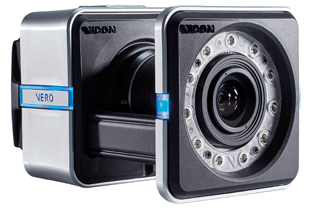

.. _Vicon: https://www.vicon.com/
.. _Vicon_Tracker_User_Guide: https://help.vicon.com/download/attachments/14057847/Vicon%20Tracker%20User%20Guide.pdf
.. _Vicon_Tracker_Python_API: https://help.vicon.com/download/attachments/14057847/Vicon%20Tracker%20Python%20API%20Quick%20Start%20Guide.pdf
.. _Vicon_ROS: https://github.com/KumarRobotics/motion_capture_system/tree/master
.. _Vicon_ROS2: https://github.com/IMRCLab/motion_capture_tracking
.. _Vicon_YouTube: https://www.youtube.com/@Vicon

.. _Vicon Vero 2.2:

===============
Vicon Vero 2.2
===============

.. _fig_vicon_vero:

    Vicon Vero 2..2

+------------------+--------------------------------------------+
| Location         |  Mobile Arena                              |
+------------------+--------------------------------------------+
| Contacts         |  Mohammad                                  |
+------------------+--------------------------------------------+
| Manufacturer     |  `Vicon`_                                  |
+------------------+--------------------------------------------+
| Video Guide      |  `Vicon_YouTube`_                          |
+------------------+--------------------------------------------+
| User_Guide info  |  `Vicon_Tracker_User_Guide`_               |
+------------------+--------------------------------------------+
| Python API info  |  `Vicon_Tracker_Python_API`_               |
+------------------+--------------------------------------------+
| ROS              |  `Vicon_ROS`_                              |
+------------------+--------------------------------------------+
| ROS2             |  `Vicon_ROS2`_                             |
+------------------+--------------------------------------------+

The :ref:`Vicon Vero 2.2` is a Motion Capture System that provides real-time tracking of objects in 3D space.
The system consists of multiple cameras that are placed around the area of interest.
The cameras are connected to a computer that processes the images and provides the 3D position of the objects being tracked.
The system can be used to track the position of objects such as robots, humans, and other objects in real-time.
The system can be used for a variety of applications including robotics, animation, and virtual reality.

The document provides information on how to use the :ref:`Vicon Vero 2.2` Motion Capture System.
The document includes the following sections:

.. toctree::

    startup
    tracking

