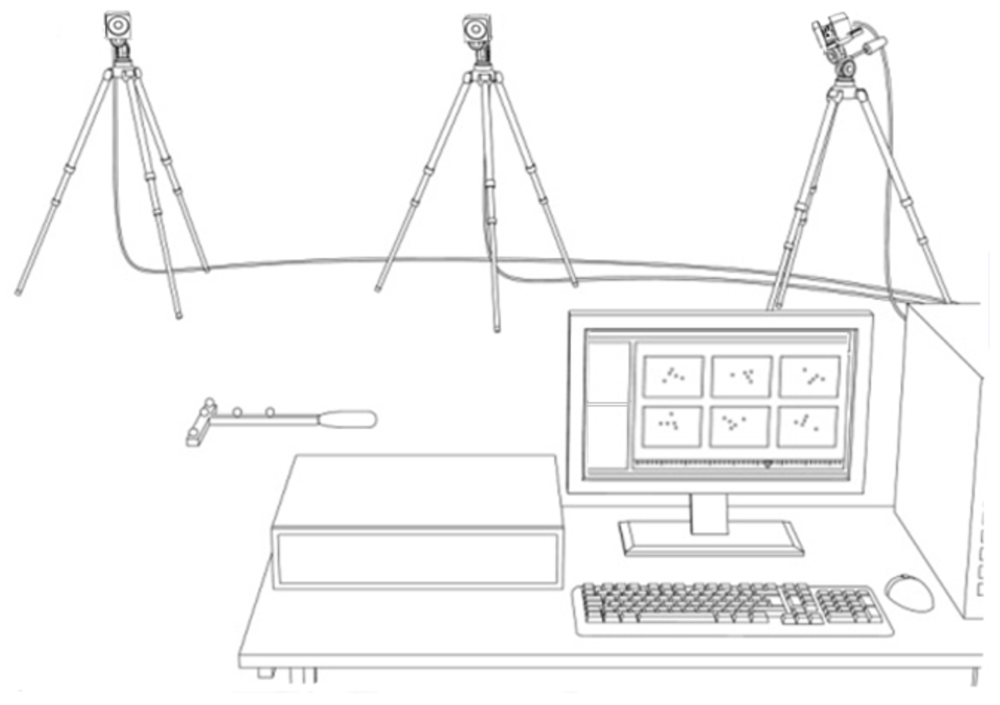

Start Up
========

The :ref:`Vicon Veron 2.2` system contains eight cameras, a computer, a router, and a calibration wand.
The architecture of the system is ``Veron`` which is like ``Bonita`` architecture shown in the figure :numref:`fig-bonita`.

.. _fig-bonita:

    Vicon Bonita 2.2 Architecture

The system is controlled by the software ``Vicon Tracker`` which is installed on the Dell computer.
The computer is connected to the router which is connected to the cameras.
The cameras are placed in the ``Mobile Arena`` and are connected to the router.
The calibration wand is used to calibrate the system.
The calibration wand is a stick with a ball in a ``T`` style.
The ball has a reflective surface which is used to calibrate the cameras.
The calibration wand is connected to the computer via USB.

Calibration
-----------

Hardware Calibration
~~~~~~~~~~~~~~~~~~~~

Software Calibration
~~~~~~~~~~~~~~~~~~~~

Tracking
--------
