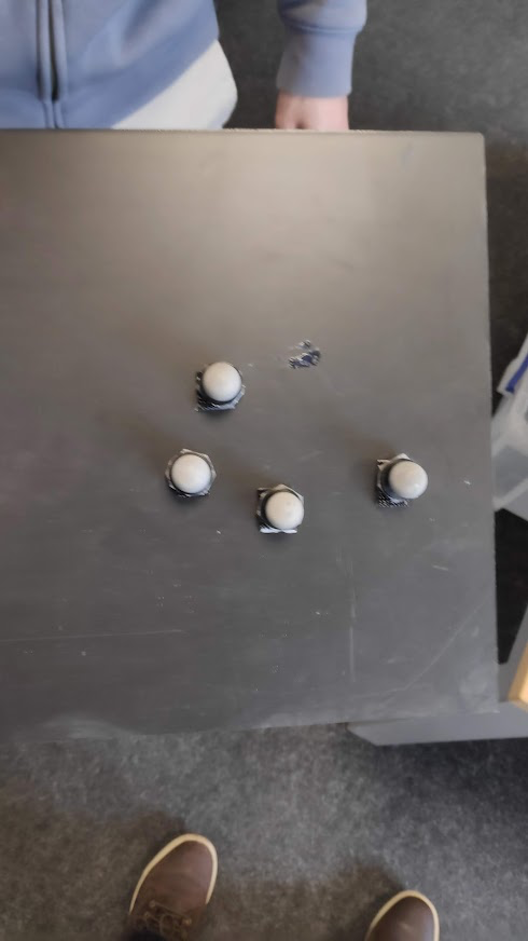
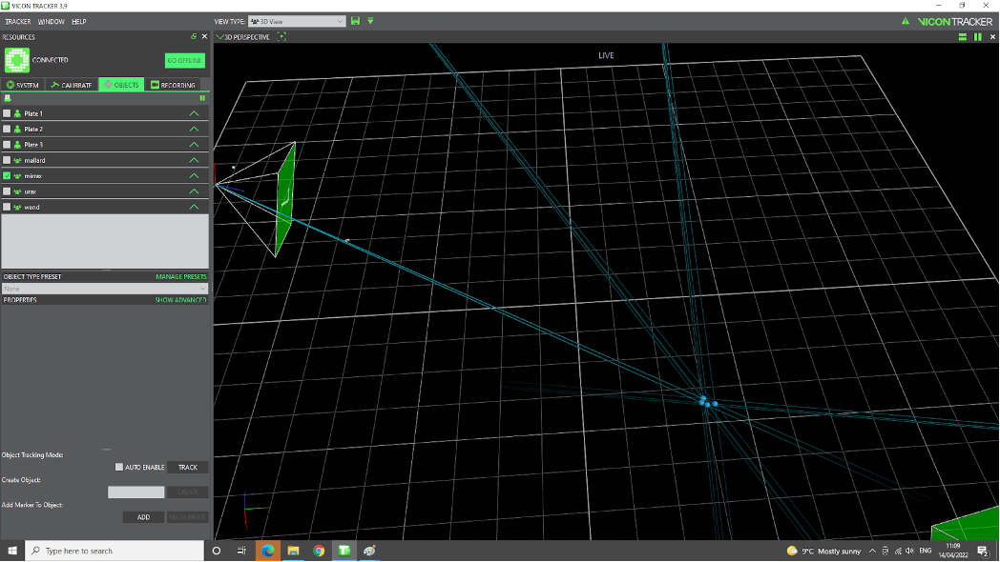
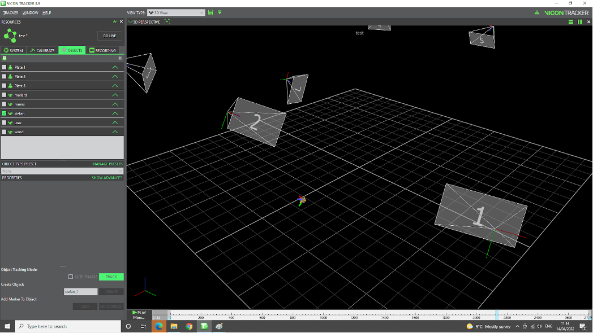
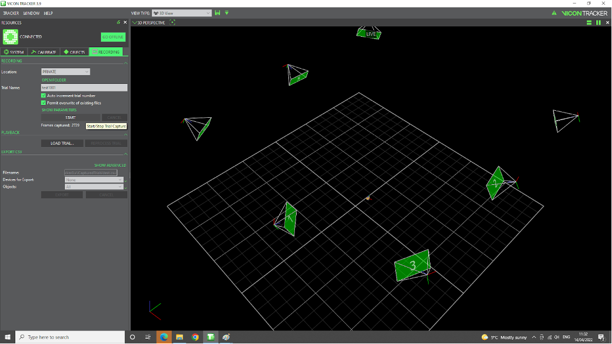
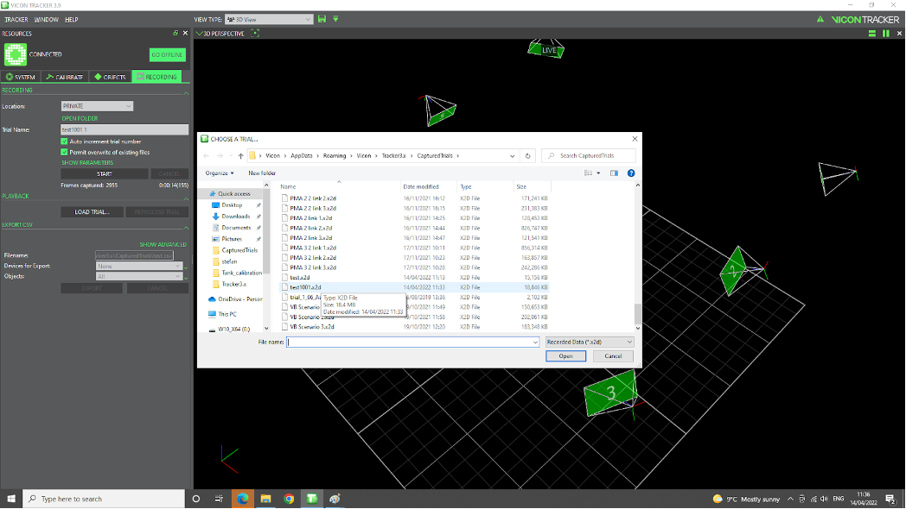
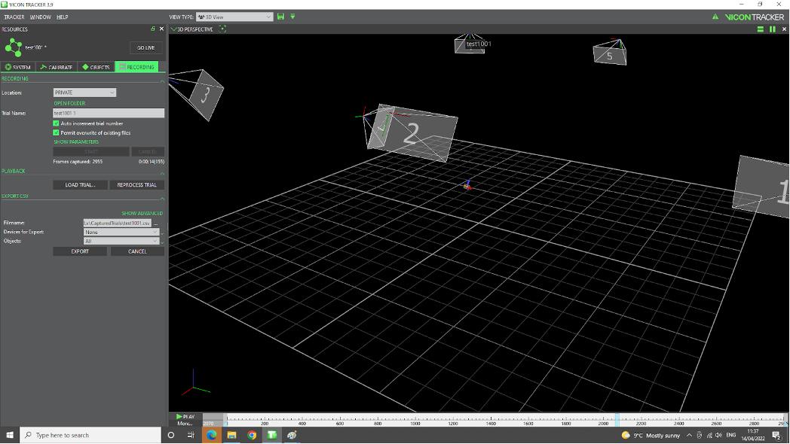
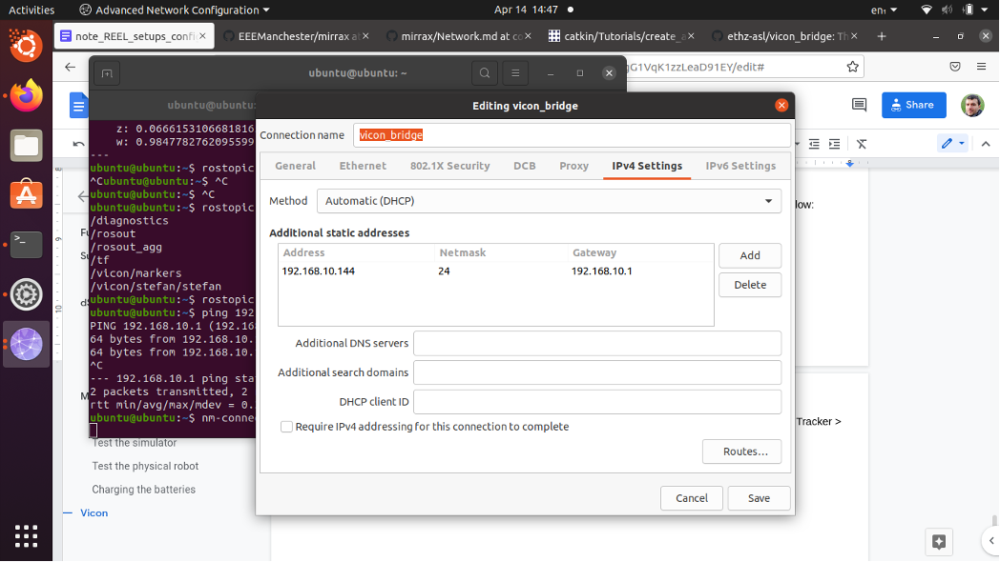
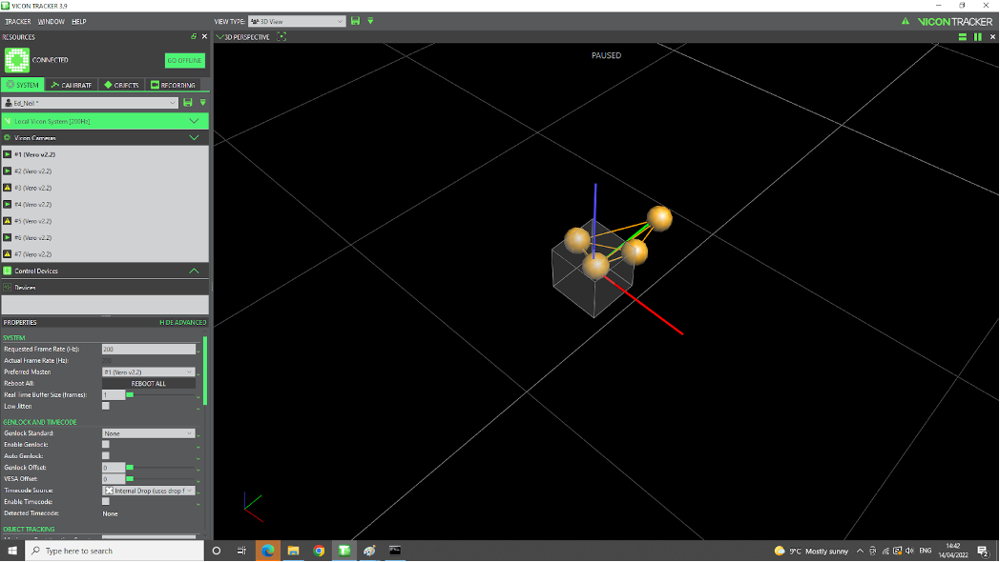

.. _vicon_bridge: https://github.com/ethz-asl/vicon_bridge

.. _vicon_application:

Vicon Applications
==================

.. _vicon_tracking:

Object Tracking
---------------

Before do tracking, you need to calibrate the :ref:`Vicon vero 2.2` system. The calibration process is described in the :ref:`vicon_calibration` page.

To do tracking,

1. first of all you need to creat a Create a non-symmetrical pattern using vicon markers, that will eventually be attached to the robot that we intend to track. See the :numref:`vicon-non-symmetrical-pattern` as an example.

.. _vicon-non-symmetrical-pattern:

    Vicon non-symmetrical pattern

2. In the software, :guilabel:`Vicon tracker -> Objects -> select using Alt + click (or Ctrl + click)` to crop using mouse the ensemble of markers. See the :numref:`vicon-crop`.

.. _vicon-crop:

    Vicon crop

3. Give it a name by filling in the white box next to ``Create object``, and hit Create button. Say we give this object the name `stefan_1` as an example in the :numref:`vicon-create-object`.

.. _vicon-create-object:

    Vicon create object

4. By selecting the ``object`` alone that we are interested in, then ``clk Track button``, only that specific object will be visible on the scene.

.. _vicon_recording:

Recording Locally
-----------------

To record the tracking data locally, you can use the ``Vicon Tracker`` software. The steps are as follows:

1. Select :guilabel:`Recording -> Trial name` give it a name, e.g. test1001, then ``click Start``, move the object (run intended the experiment), then ``click Stop``. See the :numref:`vicon-recording`.

.. _vicon-recording:

    Vicon recording

2. click on ``Open Folder`` button to locate the files saved (e.g. test1001.system, test1001.x2d, test1001.xcp), as shown in the :numref:`vicon-recording-folder`.

.. _vicon-recording-folder:

    Vicon recording folder

.. _vicon_playback:

Playback
--------

To playback the recorded data, you can use the ``Vicon Tracker`` software. The steps are as follows:

1. :guilabel:`Recording -> Playback -> Load trial`. indicate a file name (e.g. trial1001.system). Immediately we see ``Go Offline`` changes to ``Go Live``. ``Click the Play`` button located on the lower part of the screen. See the :numref:`vicon-playback`.

.. _vicon-playback:

    Vicon playback

.. note:: To go back (and exit Playback mode), clk on ``Go Live`` again making it change to ``Go Offline``.

.. _vicon_ros_bridge:

ROS Bridge
----------

THe ROS repo presented in :ref:`Vicon vero 2.2` page. However, you can use `vicon_bridge`_ to bridge the Vicon data to ROS. The steps are as follows:

    .. code-block::

        $ cd ~/vicon_ws/src
        $ git clone https://github.com/ethz-asl/vicon_bridge.git
        $ cd ~/vicon_ws
        $ catkin_make
        $ source devel/setup.bash
        $ rospack profile

Now in the terminal, you can run the following command to set the Vicon IP:

    .. code-block::

        $ nm-connection-editor

Then, :guilabel:`click on Ethernet -> click Add -> select Ethernet`, then set config as shown in the :numref:`vicon-ethernet-config`.

.. _vicon-ethernet-config:

    Vicon ethernet config

.. note:: If the connection is not stable you can change the method into ``Manual``.

Now, Plug one cable into [laptop] and another one in the PoE switch, next to any of the cables going to the Vicon cameras. Then test the Network connection by running the following command:

    .. code-block::

        $ ping 192.168.10.1

To check the IP details, run the following command:

    .. code-block::

        $ vi ~/vicon_ws1/src/vicon_bridge/launch/vicon.launch

and make sure this line appears:

    .. code-block::

        <arg name="datastream_hostport" default="192.168.10.1:801"/>

Now, you can run the following command to start the Vicon bridge:

    .. code-block::

        $ roslaunch vicon_bridge vicon.launch

To check the data, run the following command:

    .. code-block::

        $ rostopic list
        $ rostopic echo /vicon/stefan/stefan

.. note:: stefan is the name of the object as selected on ``vicon-PC``, :guilabel:`Vicon Tracker -> Objects`. You can change it to the name of the object you are interested in. See the :numref:`vicon-object-name`.

.. _vicon-object-name:

    Vicon object name

