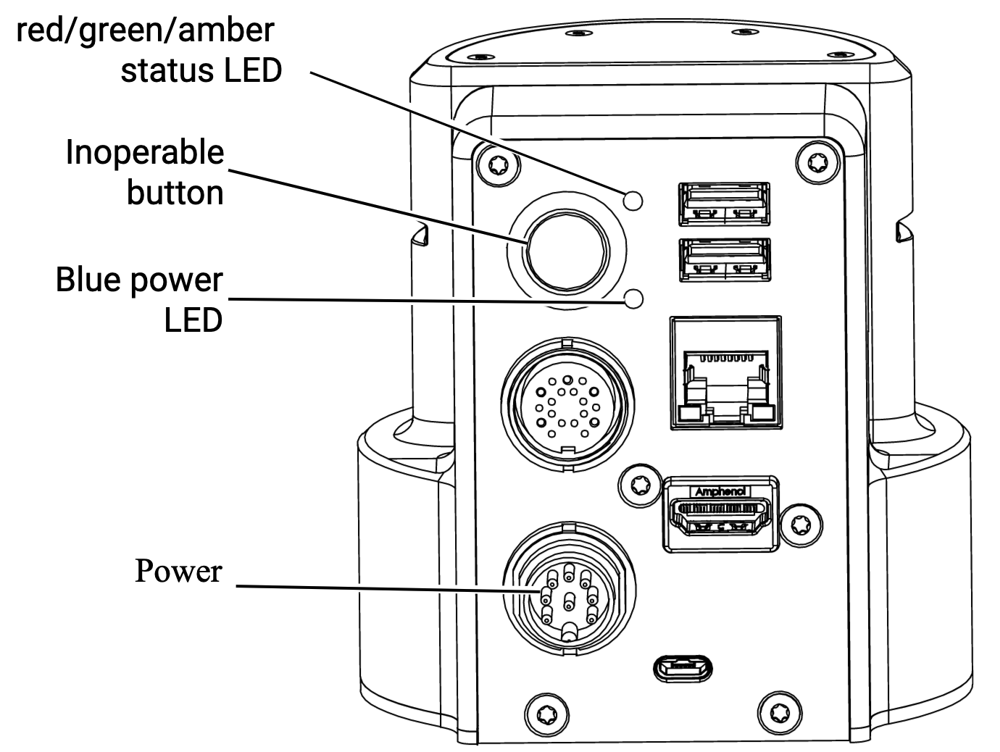

.. _Kinova Gen3 Quick Start Guide: https://drive.google.com/file/d/1vZHA3fQS3-5kkncsnYLjH8qAFj4wS6PJ/view

.. _Kinova Gen3 Starting Up:

Starting Up
===========

Please follow this instructions when you want to use :ref:`Kinova Gen3`. This instruction  is important to follow
to ensure that the robot is properly initialized and ready to use in the safest way possible.

Before starting up:
-------------------

.. note:: Before starting up the robot, read the `Kinova Gen3 Quick Start Guide`_.

Ensure that
    - The robot is properly connected to the power supply.

The power port is located on the back of the robot. Locate the power port in the pictures below.

   Power Board

.. figure:: ../../../images/kinova_gen3/kinova_gen3_power_port.jpg
    :scale: 7%
    :align: left
    :alt: Power Port

    Power Port

.. warning:: Connect the power supply to the robot in the correct way and tighten the screws to ensure a proper connection. See below video for more information.

.. raw:: html

    

        <iframe width="560" height="315" src="https://www.youtube.com/embed/gEQFbMs4-18?si=b7z1spuewypz7T2z" title="YouTube video player" frameborder="0" allow="accelerometer; autoplay; clipboard-write; encrypted-media; gyroscope; picture-in-picture; web-share" referrerpolicy="strict-origin-when-cross-origin" allowfullscreen></iframe>
    

     
