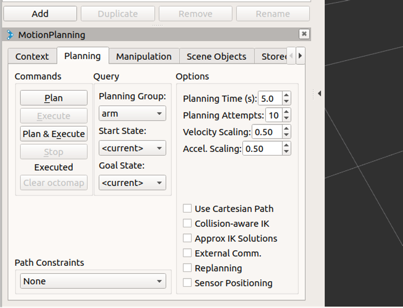

.. _kinova_gen3_real_arm:

========
Real Arm
========

First of all connect to the arm via the ``Ethernet`` port. For more information see :ref:`Kinova_Gen3_pc_connection`.

Now, follow the steps below:

1. Check the Gripper Connection
    - ``Menu`` -> ``Configuration`` -> ``Robot`` -> ``Product`` -> End Effector Type ``Not Installed``

2. Move to the Home position
    - ``Menu`` -> ``Operation`` -> ``Actions``, `Move to Zero position`

3. In Terminal run the following command to start the ROS driver:

    .. code-block::

        $ roslaunch kortex_driver kortex_driver.launch

`Rviz` will open. Do steps 4 and 5 in the `Rviz` window.

4. In `Rviz`, click on ``Add`` -> ``MotionPlanning``, a model of the arm with the current position will appear with the ``MoveIt``
interface on the left side.

5. Under option in the ``Motion planning``, ``Planning`` tab, reduce the ``Velocity`` and ``Acceleration`` scales. See the image
:ref:`fig_motion_planning` for more details.

.. _fig_motion_planning:

   Motion Planning Settings

Now you can move the `Rviz` model.

6. Use ``Plan/Plan`` & ``Execute`` feature to move the arm.

7. In the second terminal run the following command to run the vision node:

    .. code-block::

        $ roslaunch kinova_vision kinova_vision.launch

Now you can use RGBD data, and a 3D point cloud from the camera.

8. [Optional] Access to aligned coloured point cloud data:

    .. code-block::

        $ roslaunch kinova_vision kinova_vision_rgbd.launch

9. In `Rviz`:
    - ``Add`` -> ``By topic`` -> ``/depth_registered`` -> ``/points`` -> ``PointCloud2``