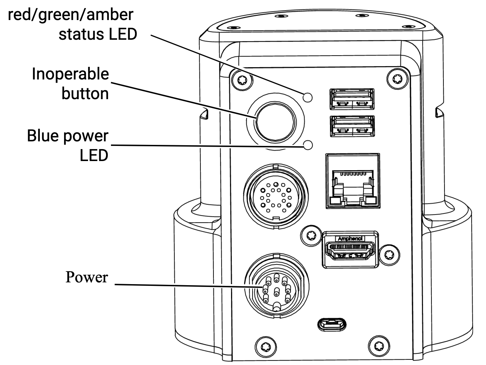

.. _Kinova Gen3 Quick Start Guide: https://drive.google.com/file/d/1vZHA3fQS3-5kkncsnYLjH8qAFj4wS6PJ/view

.. _Kinova Gen3 Starting Up:

Kinova Starting Up
==================

Please follow this instructions when you want to use :ref:`Kinova Gen3`. This instruction is important to
to ensure that the robot is properly initialized and ready to use in the safest way possible.

Before starting up:
-------------------

.. note:: Before starting up the robot, read the `Kinova Gen3 Quick Start Guide`_.

.. warning:: Fix the robot to the table using the screws provided in the robot package. This is important to ensure the robot is stable and does not fall during operation.
            See below images to know how to fix the robot to the table.

    Fixing Robot to Table

    Fixing Robot to Table

.. note:: Ensure that The robot is properly connected to the power supply.

The power port is located on the back of the robot. Locate the power port in the pictures :numref:`fig_power_board`.

.. _fig_power_board:

   Power Board

.. figure:: ../../../images/kinova_gen3/kinova_gen3_power_port.jpg
    :scale: 7%
    :align: right
    :alt: Power Port

    Power & Control Port

.. warning:: Connect the power supply to the robot in the correct way and tighten the screws to ensure a proper connection. See below video for more information.

.. raw:: html

    

        <iframe width="695" height="350" src="https://www.youtube.com/embed/gEQFbMs4-18?si=b7z1spuewypz7T2z" title="YouTube video player" frameborder="0" allow="accelerometer; autoplay; clipboard-write; encrypted-media; gyroscope; picture-in-picture; web-share" referrerpolicy="strict-origin-when-cross-origin" allowfullscreen></iframe>
    

     

Starting Up the Robot
---------------------

Follow the steps below to start up the robot:
    - Turn on the robot by pressing and holding the power button (Inoperable Button) located on the back of the robot until the blue light comes on. See image :numref:`fig_power_board` to locate the inoperable button.
    - Wait for the robot to initialize.
    - The blue light on the robot will turn on during the initialization process.
    - The robot will make a sound when the initialization process is complete.
    - The Green light on the robot will turn on when the robot is ready to use.

.. warning:: During this process the gripper wil be opened and closed. Keep your hands away from the gripper during this process.

To see the powering up process, see the video below.

.. raw:: html

    

        <iframe width="695" height="350" src="https://www.youtube.com/embed/PNa4MDRvkhY?si=bF1xcVggFZqyYlth" title="YouTube video player" frameborder="0" allow="accelerometer; autoplay; clipboard-write; encrypted-media; gyroscope; picture-in-picture; web-share" referrerpolicy="strict-origin-when-cross-origin" allowfullscreen></iframe>
    

     

Now the robot is ready to use. You can now use the XBox controller to control the robot and position it to the safe desired location.

To know how to use the XBox controller to control the robot, see :numref:`fig_xbox_controller`.

.. _fig_xbox_controller:

    XBox Controller
