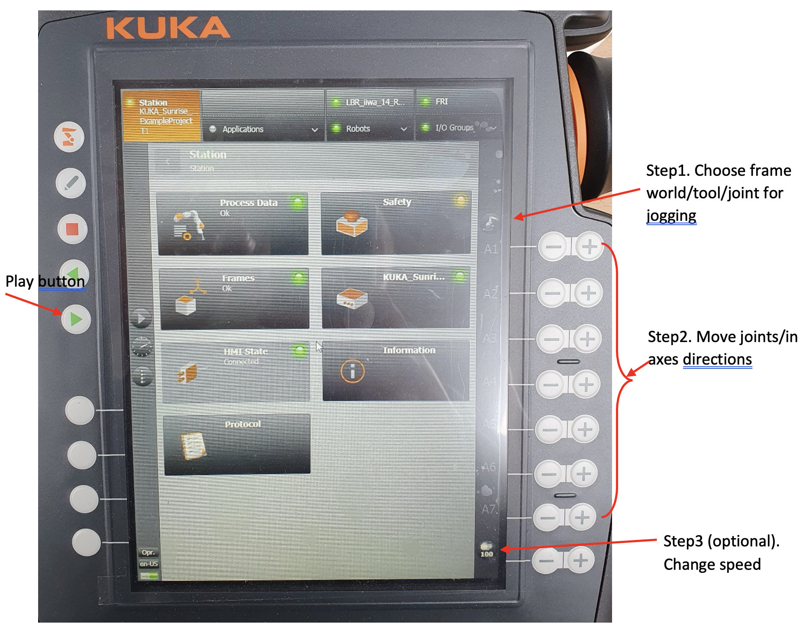
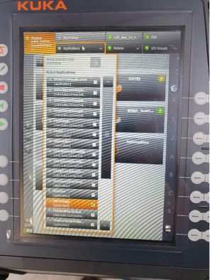

Manual Mode
===========

This section describes the manual mode of the robot control. The robot can be controlled using the smartPAD (Teach Pendant).
To run the manual mode, do the following steps:

    1. Choose the frame ``World/Tool/Joint`` by pressing the corresponding button on the smartPAD.
    2. Move the ``joints/in Axes Direction`` of the robot by pressing the corresponding buttons on the smartPAD.
    3. Change the speed of the robot by pressing the [Speed] button on the smartPAD. [Optional]
    4. Press the ``Play`` button on the smartPAD to start the robot.
    5. Press the ``DeadMan`` button on the smartPAD to stop the robot. [it’s gray, located on the back of the teach pendant]
    6. While holding the dead-man switch halfway through, press the ``+`` and ``–`` buttons located on the right side of the teach pendant.

See :numref:`fig_manual_mode` for more details.

.. _fig_manual_mode:

    KUKA LBR iiwa SmartPAD Control

.. todo::
    Add the image of the smartPAD with the buttons labeled.

.. todo::
    Add the image of the smartPAD with the DeadMan button labeled.

.. todo::
    Add the Video of the manual mode control.

Application of Manual Mode
--------------------------

To run an already available (pre-programmed) application select the application from the menu, see :numref:`fig_application_menu`.
then whilst holding the engagement switch (DeadMans switch) press and hold the play button on the left hand side

.. _fig_application_menu:

    KUKA LBR iiwa Application Menu

The following example demonstrates how to control the robot in manual mode.

.. note:: Some of these applications are documented on the :ref:`KUKA LBR iiwa 14 R820` page, in documentation link.

Example 1: Home Position
~~~~~~~~~~~~~~~~~~~~~~~~

The robot moves to the home position. The home position is the initial position of the robot. The robot moves to the home position by selecting the home position from the below path:

        ``Applications -> Home Position``

By pressing the ``play`` button and holding ``DeadMan`` button on the smartPAD, the robot moves to the home position which is 90 degrees arm. See below video for more details.

.. todo::
    Add the video of the robot moving to the home position.

Example 2: Impedance Control
~~~~~~~~~~~~~~~~~~~~~~~~~~~~

The robot moves to the impedance control position. The impedance control position is the position where the robot moves
with the force applied to the robot. The robot moves to the impedance control position by selecting the impedance control
position from the below path:

        ``Applications -> Impedance Control``

By pressing the ``play`` button, a pop-up window appears on the teaching pendant informing
``This app is intended for floor``: just press ``OK``.
Next, a new window appears ``Press of to finish the app``: **Do not press OK** .
Instead of pressing OK, just interact with the robotic arm by pushing/pulling it;
the robot will keep/hold the homing position in spite of external disturbance.

.. todo::
    Add the video of the robot moving to the impedance control position.

Example 3: Zero Position
~~~~~~~~~~~~~~~~~~~~~~~~

The robot moves to the `zero position`. The zero position is the position where the robot places the robot arm
in a ``straight-up position`` corresponding to zero values on all axes.

        ``Applications -> Mechanical Zero Position``

See the joints values on:

        ``Pad > Robots > Joint Position``

.. todo::
    Add the video of the robot moving to the zero position.

Example 4: Motions
~~~~~~~~~~~~~~~~~~

the robot executes some pre-defined motion including the redundancy (resembles drawing the infinite sign on a whiteboard).

        ``Applications -> Motions``

..  todo::
    Add the video of the robot executing the motions.

Example 5: SmartServoLINInteractionControl
~~~~~~~~~~~~~~~~~~~~~~~~~~~~~~~~~~~~~~~~~~

end effector executes up-down motion (a sine-wave) while still allowing interaction/physical-contact with user.

        ``Applications -> SmartServoLINInteractionControl``

.. todo::
    Add the video of the robot executing the SmartServoLINInteractionControl.