Programming Mode
================

This section describes how to start programming the :ref:`KUKA LBR iiwa 14 R820`, write custom applications that can be launched
on the teaching pendant.

.. note:: Programming is done on a laptop (NNUF laptop 1, the Lenovo T14s).

Connecting to the Robot
-----------------------

To connect the laptop to the robot, do the following steps (see :numref:`fig_kuka_network_settings`):
    1. Connect the Ethernet cable to the robot's X66 port (above the power switch) and to the laptop.
    2. Change the network settings of the laptop so that the ipv4 settings with :program:`IP address` ``172.31.1.100`` and subnet mask of ``255.255.255.0``.
    3. Launch Sunrise Workbench.
    4. Ping the Cabinet, open Command Prompt, and write ``ping 172.31.1.147``.

.. _fig_kuka_network_settings:

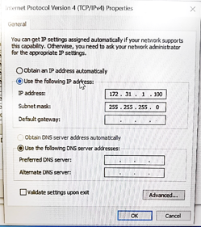

   KUKA iiwa Network settings

.. note:: Make sure the networking configuration looks like the one in :numref:`fig_kuka_network_architecture`.

.. _fig_kuka_network_architecture:

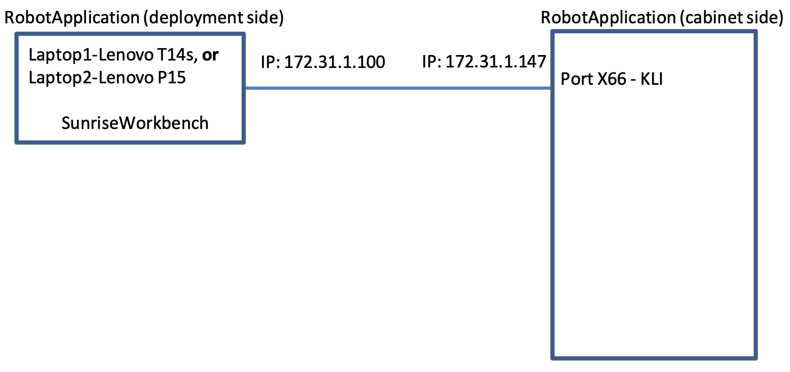

   KUKA iiwa Network architecture

Hello World without FRI
-----------------------

To start the robot without FRI (Fast Robot Interface), do the following steps:
    1. In case we start from scratch (never programmed the robot before), start by creating a new folder (say on desktop) that will play the role of workspace: give it a name, say, ``SunriseWorkbench_<yourName>`` (e.g. SunriseWorkbench_AnthonyChen).
    2. Open Sunrise workbench (click the link on the Desktop). A window opens asking for the workspace folder. here indicate the folder you have created at the previous step.
    3. This step describes uploading all projects from robot controller to laptop. Follow the instructions on Kuka workshop. `KUKA iiwa basic programming_manual_woNotes.pdf`, Section 11.6, page 101.
    4. Write your first application. In Sunrise workbench, on the left window go to ``<ProjectName> -> src -> application``, then right click on ``application -> New -> Sunrise Application``, select one of the templates from the list, namely ``RoboticsAPI`` Application, as shown on the figure :numref:`fig_kuka_sunrise_application`. Click ``Next`` and give it a name on the next screen, say ‘<your initials>_HelloWorld1’, e.g. MM_HelloWorld1 for the user Murilo Marinho. Then click on the ``Finish`` button.
    5. This step describes deploying a project from laptop to robot controller. Follow the instructions on Kuka workshop, ``KUKA iiwa basic programming_manual_woNotes.pdf``, Section 11.5.2, page 100. When the Authorization windows opens, provide the password ``kuka`` (without quotes, all lowercase letters) and select ``Expert``. Alternatively, select Use group, ``Safety maintenance technician``, and the Password, ``argus`` (without quotes, all lowercase letters).
    6. . Check that your application exists on the teach pendant and that it runs as expected. :guilabel:`PAD -> Applications -> <your initials>_HelloWorld1`.

.. note:: The “Synchronize” button used to deploy the application to the Cabinet is located on the ribbon on top. See :numref:`fig_kuka_sunrise_synchronize`.

.. note:: Make sure no active application is running on the teaching pendant, otherwise you will get an error.

.. _fig_kuka_sunrise_workbench:

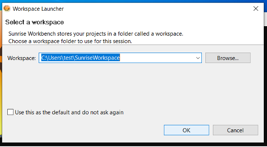

    KUKA Sunrise Workbench

.. _fig_kuka_sunrise_application:

.. figure:: ../../../images/kuka_lbr_iiwa/kuka_iiwa_sunrise_application.png
    :scale: 100%
    :align: center
    :alt: KUKA Sunrise Application

    KUKA Sunrise Application

.. _fig_kuka_sunrise_synchronize:

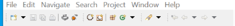

    KUKA Sunrise Synchronize

Hello World with FRI
--------------------

This section shows how to start programming the :ref:`KUKA LBR iiwa 14 R820` arm such that the application communicates
in real-time (i.e. at/during runtime) with a so-called client program running on a separate laptop. Running (launching) the
application involves using the teaching pendant.

First, make sure the network configuration is looking like the one in :numref:`fig_kuka_network_architecture_fri`.

.. _fig_kuka_network_architecture_fri:

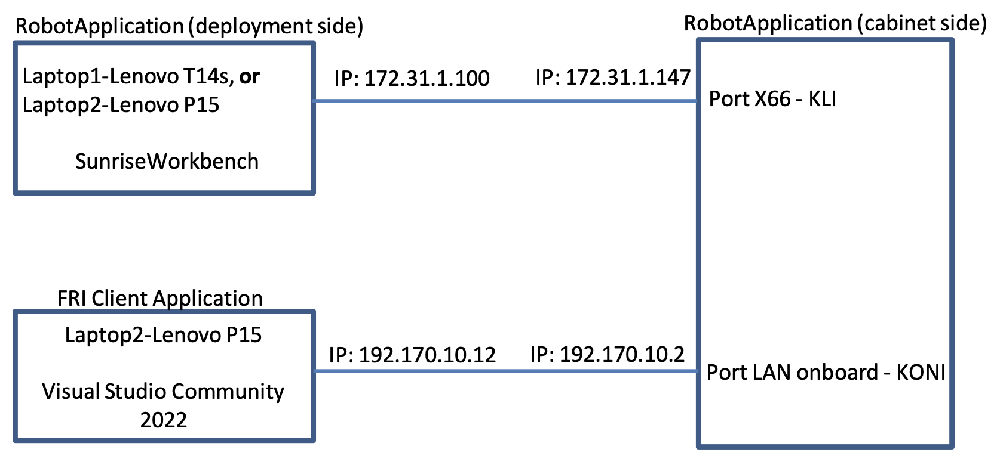

   KUKA iiwa Network architecture FRI

to check the IPs of the Cabinet, use :guilabel:`Laptop1-Lenovo T14s`, open :guilabel:`SunriseWorkbench -> Package Explorer`,
then go down and click on ``StationSetup.cat``, then select ``Configuration`` tab. A window will appear (see :numref:`fig_kuka_sunrise_station_setup`).

.. _fig_kuka_sunrise_station_setup:

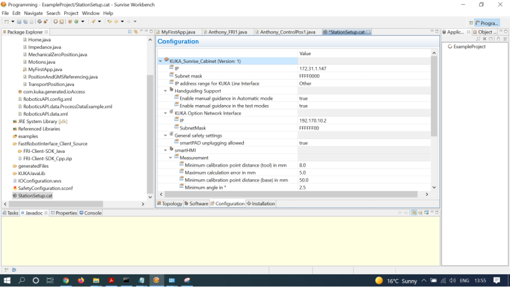

   KUKA Sunrise Station Setup

.. note:: For more information related to Networking, use the `KUKA Sunrise.OS 1.16 KUKA Sunrise.Workbench 1.16, Operating and Programming Instructions for System Integrators`

.. note:: The pdf accessible on the Transcend 32GB white usb stick with ``KUKA`` marked on it, located in the transparent box under the robotic arm -> search within the document for ``StationSetup.cat``

To start the robot with FRI, do the following steps:

    1. In :guilabel:`Laptop1-Lenovo T14s` go to Sunrise workbench, on the left window go to :guilabel:`<ProjectName> -> src -> application`, then right click on :guilabel:`application -> New -> Sunrise Application`, select one of the templates from the list, namely ``RoboticsAPI Application``, as shown on the figure :numref:`fig_kuka_sunrise_application2`. Click ``Next`` and give it a name on the next screen, say ``<your initials>_RealTime_FRI_App1``, for example `MM_RealTime_FRI_App1` for the user Murilo Marinho. Then, copy-paste the content `Code KUKA Sunrise Application`_, making sure to change the text accordingly (the name of the application, e.g. `Anthony_RealTime_FRI_App1` should match the name of the class and the object instantiation).
    2. In :guilabel:`teaching pendant` because the application ``RealTime_FRI_App1`` has already been loaded to the Cabinet in a previous step, it can now be selected via the teaching pendant. For that, :guilabel:`select PAD -> Applications -> RealTime_FRI_App1`, which will execute ``homing`` to a particular location then wait for info from FRI client.
    3. In :guilabel:`Laptop1-Lenovo T14s` make sure to read ``section 6.4``, Creating the FRI client application (C++), page 41`` of the manual ``kuka_FRI_PL-2303HX product brochure 011706.pdf`` (file accessible via :guilabel:`SunriseWorkbench -> Help -> Help Contents`. The file ``FastRobotInterface_Client_Source/FRI-Client-SDK_Cpp.zip`` can be found on :guilabel:`SunriseWorkbench -> PackageExplorer -> right click on FastRobotInterface_Client_Source -> select Properties -> take a look at Location`. Now, Open Win10 Explorer, then go to the Location indicated above, copy the file ``FRI-Client-SDK_Cpp.zip`` somewhere on :guilabel:`Laptop2-Lenovo P15` or alternatively on a usb stick.
    4. In :guilabel:`Laptop2-Lenovo P15` Unzip the archive ``FRI-Client-SDK_Cpp.zip`` somewhere on the local ssd, then open the file ``build/MSVisualStudio2010/FRIClientSDK.sln`` in :program:`Visual Studio Community 2022`, e.g. by double-clicking that file. A pop-up message might appear saying `One or more projects in the solution were not loaded correctly…`. Just ``click OK``. Then, click OK in case window appears (see :numref:`fig_kuka_vs2010`). Click the ``green Play`` button to run the program LBRJointSineOverlay (see :numref:`fig_kuka_run_program`).
    5. To teach the pendant, run the app according to Step2. You should see the robot doing sine waves (up-down motion), as requested by the FRI Client.
    6. [Optional] In case you want to test another program from the list in Solution Explorer [the right-hand side window], :guilabel:`right click on it then select “Set as Startup Project, then click the green Play button again`. If the application ``RealTime_FRI_RobotApp1`` is active, we should see the robot arm executing an up-down [sine wave] motion.

.. _fig_kuka_sunrise_application2:

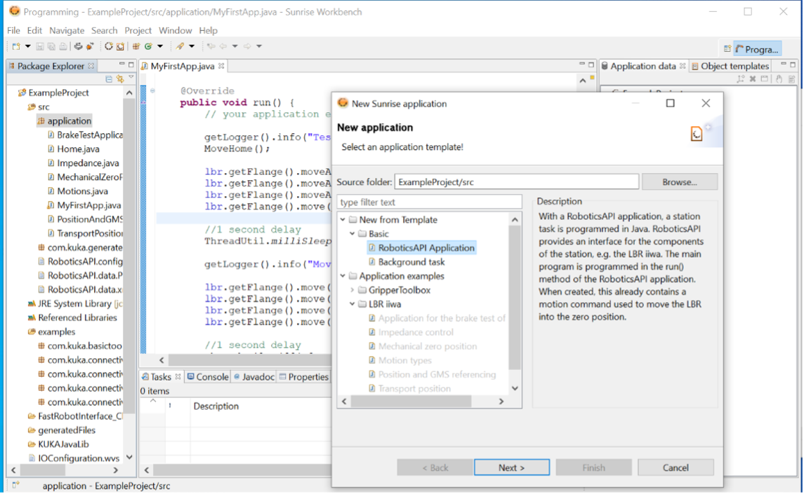

   KUKA Sunrise Application

.. _Code KUKA Sunrise Application:

.. code-block::

    package application;

    /*
    Import KUKA LBR packages
    */
    import static com.kuka.roboticsAPI.motionModel.BasicMotions.ptp;

    import com.kuka.roboticsAPI.applicationModel.RoboticsAPIApplication;
    import com.kuka.roboticsAPI.deviceModel.LBR;
    import com.kuka.roboticsAPI.motionModel.PositionHold;
    import com.kuka.roboticsAPI.motionModel.controlModeModel.JointImpedanceControlMode;
    import com.kuka.roboticsAPI.controllerModel.Controller;

    /*
    Import KUK FRI package
    */
    import java.util.concurrent.TimeUnit;
    import java.util.concurrent.TimeoutException;

    import com.kuka.connectivity.fastRobotInterface.FRIChannelInformation;
    import com.kuka.connectivity.fastRobotInterface.FRIConfiguration;
    import com.kuka.connectivity.fastRobotInterface.FRIJointOverlay;
    import com.kuka.connectivity.fastRobotInterface.FRISession;

    public class RealTime_FRI_RobotApp1 extends RoboticsAPIApplication {
        //Define a LBR object
            private LBR lbr_7_800;
            private Controller lbr_7_800_Ctrl;
            private String FRI_ClientIP;

        @Override
        public void initialize() {
            // initialize your application here
                    //lbr_7_800 = getContext().getDeviceFromType(LBR.class);

                    //*********
                    //Define the lbr object and lbr controller object
                    //*************/
                    lbr_7_800_Ctrl = (Controller) getContext().getControllers().toArray()[0];
                    lbr_7_800 = (LBR) lbr_7_800_Ctrl.getDevices().toArray()[0];
                    // **********************************************************************
                    // *** change next line to the FRIClient's IP address                 ***
                    // **********************************************************************
                    FRI_ClientIP = "192.170.10.12";
        }

        @Override
        public void run() throws Exception {
            //Initilise the control mode
            JointImpedanceControlMode ctrMode = new JointImpedanceControlMode(200, 200, 200, 200, 200, 200, 200);
            ctrMode.setDampingForAllJoints(0.5);
            //configure the robot to position hold mode
            PositionHold posHold = new PositionHold(ctrMode, -1, TimeUnit.SECONDS);
            //lbr_7_800.getController().getExecutionService().cancelAll();
            lbr_7_800.move(ptp(0,Math.toRadians(30),0,-Math.toRadians(90),0,-Math.toRadians(30),0).setJointVelocityRel(0.3));
            //lbr_7_800.move(ptp(Math.toRadians(40),Math.toRadians(40),Math.toRadians(40),Math.toRadians(40),Math.toRadians(40),Math.toRadians(40),Math.toRadians(40)).setJointVelocityRel(0.3));
            // configure and start FRI session
            FRIConfiguration friConfiguration = FRIConfiguration.createRemoteConfiguration(lbr_7_800, FRI_ClientIP);
            friConfiguration.setReceiveMultiplier(1);
            friConfiguration.setSendPeriodMilliSec(1);//Important: This number should be smaller than 10 for joint-position based control

            getLogger().info("Creating FRI connection to " + friConfiguration.getHostName());
            getLogger().info("SendPeriod: " + friConfiguration.getSendPeriodMilliSec() + "ms |"
                    + " ReceiveMultiplier: " + friConfiguration.getReceiveMultiplier());

            FRISession friSession = new FRISession(friConfiguration);
            FRIJointOverlay jointOverlay = new FRIJointOverlay(friSession);

            // wait until FRI session is ready to switch to command mode
            try
            {
                friSession.await(10, TimeUnit.SECONDS);

            }
            catch (final TimeoutException e)
            {
                //If there is no connection, then close the FRI session
                getLogger().error(e.getLocalizedMessage());
                friSession.close();
                return;
            }

            getLogger().info("FRI connection established.");
            lbr_7_800.move(ptp(0,Math.toRadians(30),0,-Math.toRadians(90),0,-Math.toRadians(30),0).setJointVelocityRel(0.3));

            // (friSession.getFRIChannelInformation().getQuality() == Conn_Qaulity)
            boolean App_Run = false;
            FRIChannelInformation.FRIConnectionQuality Conn_Quality = friSession.getFRIChannelInformation().getQuality();
            if ((Conn_Quality == FRIChannelInformation.FRIConnectionQuality.EXCELLENT) ||(Conn_Quality == FRIChannelInformation.FRIConnectionQuality.GOOD))
            {App_Run = true;}
            try
            {
                while (App_Run)
                {
                    //JointPosition JointPos = lbr_7_800.getCurrentJointPosition();
                    /****
                    //This is the first working version
                    lbr_7_800.moveAsync(ptp(.0, .0, .0, .0, .0, .0, .0).addMotionOverlay(jointOverlay));
                    */
                    lbr_7_800.moveAsync(posHold.addMotionOverlay(jointOverlay));
                    Conn_Quality = friSession.getFRIChannelInformation().getQuality();
                    if ((Conn_Quality != FRIChannelInformation.FRIConnectionQuality.EXCELLENT) && (Conn_Quality != FRIChannelInformation.FRIConnectionQuality.GOOD))
                    {App_Run = false;}
                    //getLogger().info(String.valueOf(friSession.getFRIChannelInformation().getJitter()));
                    //getLogger().info(String.valueOf(friSession.getFRIChannelInformation().getLatency()));
                }
            }
            catch(Exception run_err)
            {
                friSession.close();
                getLogger().error(run_err.getLocalizedMessage());
                getLogger().info(String.valueOf(friSession.getFRIChannelInformation().getLatency()));
                return;
            }

            friSession.close();
            getLogger().info("FRI connection ended.");

            //Close the FRI session if the programme is done.

        }

        public static void main(final String[] args)
        {
            final RealTime_FRI_RobotApp1 app = new RealTime_FRI_RobotApp1();
            app.runApplication();
        }
    }

.. note:: The code highly inspired from Kaiqiang knowledge transfer :guilabel:`folder -> LBR program [needs FRI] ->  RealTime_FRI_Template.java`.

.. note:: The important parts of the code are the ``FRI_ClientIP`` variable, and the name of the class which should appear when we create an object inside public static ``void main()``. Click on ``Synchronize`` to deploy the application to the Cabinet (see :numref:`fig_kuka_iiwa_barpic2`).

.. _fig_kuka_iiwa_barpic2:

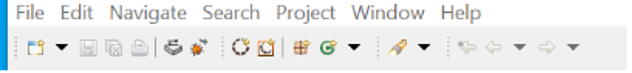

   KUKA iiwa Bar

.. _fig_kuka_vs2010:

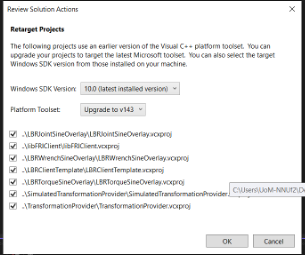

   KUKA iiwa Visual Studio 2010

.. _fig_kuka_run_program:

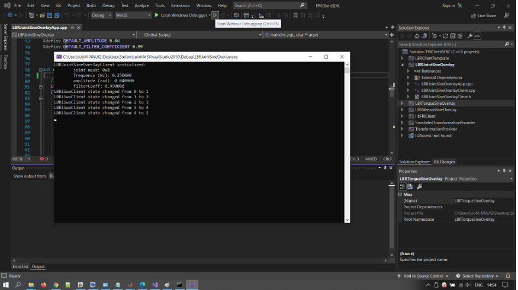

   KUKA iiwa Run Program

.. note::  In case you can only see the first 5 lines indicated in the command window :numref:`fig_kuka_run_program`, but not the other lines of code like ``LBRiiwaClient state changed from…``, this might be because you skipped ``Step4``.

.. note:: In case the command window :numref:`fig_kuka_run_program` shows a few lines of ``LBRiiwaClient state changed from …``, then the program stops unexpectedly, this might be due to the quality of the networking connection being judget too low. You might try: :guilabel:`1. Make sure [Laptop2-Lenovo P15] is powered on (to avoid any eco-mode enabled on the networking card)`; :guilabel:`2. Disable any other networking adapters on [Laptop2-Lenovo P15], like wifi`; :guilabel:`3. Change the Ethernet cable – prefer one that is shielded and short`; :guilabel:`4. Modify the C++ code above, so that it expects to receive data points at a lower frequency: replace the line below`

    .. code-block::

        // friConfiguration.setSendPeriodMilliSec(1);
        friConfiguration.setSendPeriodMilliSec(5);//5ms instead of 1ms

    Lastly, :guilabel:`Try changing the computer [Laptop2-Lenovo P15]  with another one.`

Advanced development
--------------------

Users intending to push the robot to its limits (in terms of velocities, torques, etc.), first need to select ``Auto mode``
using the physical switch on the teach pendant. This will immediately trigger a Safety error that can be seen on the
teaching pendant. This needs to be dealt with from :guilabel:`Sunrise Workbench, the right-hand side menu, click on
SafetyConfiguration.sconf file` and then, on the right-hand side screen, you will see the content of ``row 2``, as shown
in the :numref:`fig_kuka_safety_configuration` . ``By deleting it``, the error will probably go away but the robot is deemed to be unsafe e.g.
when colliding with an object. Instead, it is better to define some safety mechanisms: see the ``Safety`` chapter from
the Integrators manual which describes what and how that can be achieved. In particular, a hardware device with a
physical switch can be built, connected via ``X11`` to the cabinet, with 2 pairs of pins used to connect an enabling
switch – the so-called ``velocity mode`` on the error indicated on the teaching pendant.

.. _fig_kuka_safety_configuration:

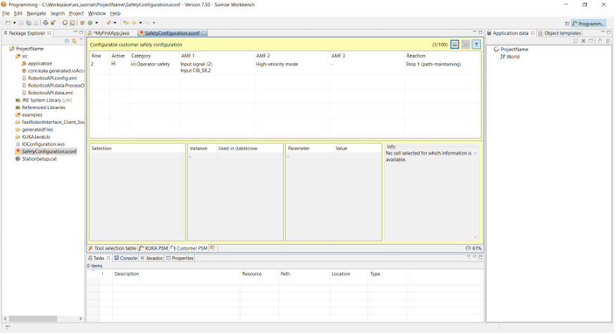

   KUKA iiwa Safety Configuration
