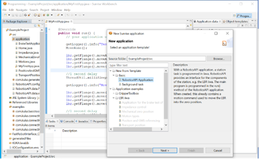

Programming Mode
================

This section describes how to start programming the :ref:`KUKA LBR iiwa 14 R820`, write custom applications that can be launched
on the teaching pendant.

.. note:: Programming is done on a laptop (NNUF laptop 1, the Lenovo T14s).

Connecting to the Robot
-----------------------

To connect the laptop to the robot, do the following steps (see :numref:`fig_kuka_network_settings`):
    1. Connect the Ethernet cable to the robot's X66 port (above the power switch) and to the laptop.
    2. Change the network settings of the laptop so that the ipv4 settings with IP address ``172.31.1.100`` and subnet mask of ``255.255.255.0``.
    3. Launch Sunrise Workbench.
    4. Ping the Cabinet, open Command Prompt, and write ``ping 172.31.1.147``.

.. _fig_kuka_network_settings:

   KUKA iiwa Network settings

.. note:: Make sure the networking configuration looks like the one in :numref:`fig_kuka_network_architecture`.

.. _fig_kuka_network_architecture:

.. figure:: ../../../images/kuka_lbr_iiwa/kuka_iiwa_network_architecture.png
   :scale: 30%
   :align: center
   :alt: KUKA network architecture

   KUKA iiwa Network architecture

Hello World without FRI (Fast Robot Interface)
----------------------------------------------

To start the robot, do the following steps:
    1. In case we start from scratch (never programmed the robot before), start by creating a new folder (say on desktop) that will play the role of workspace: give it a name, say, ``SunriseWorkbench_<yourName>`` (e.g. SunriseWorkbench_AnthonyChen).
    2. Open Sunrise workbench (click the link on the Desktop). A window opens asking for the workspace folder. here indicate the folder you have created at the previous step.
    3. This step describes uploading all projects from robot controller to laptop. Follow the instructions on Kuka workshop. `KUKA iiwa basic programming_manual_woNotes.pdf`, Section 11.6, page 101.
    4. Write your first application. In Sunrise workbench, on the left window go to ``<ProjectName> -> src -> application``, then right click on ``application -> New -> Sunrise Application``, select one of the templates from the list, namely ``RoboticsAPI`` Application, as shown on the figure :numref:`fig_kuka_sunrise_application`. Click ``Next`` and give it a name on the next screen, say ‘<your initials>_HelloWorld1’, e.g. MM_HelloWorld1 for the user Murilo Marinho. Then click on the ``Finish`` button.
    5. This step describes deploying a project from laptop to robot controller. Follow the instructions on Kuka workshop, ``KUKA iiwa basic programming_manual_woNotes.pdf``, Section 11.5.2, page 100. When the Authorization windows opens, provide the password ``kuka`` (without quotes, all lowercase letters) and select ``Expert``. Alternatively, select Use group, ``Safety maintenance technician``, and the Password, ``argus`` (without quotes, all lowercase letters).
    6. . Check that your application exists on the teach pendant and that it runs as expected. ``PAD -> Applications -> <your initials>_HelloWorld1``.

.. note:: The “Synchronize” button used to deploy the application to the Cabinet is located on the ribbon on top. See :numref:`fig_kuka_sunrise_synchronize`.

.. note:: Make sure no active application is running on the teaching pendant, otherwise you will get an error.

.. _fig_kuka_sunrise_workbench:

.. figure:: ../../../images/kuka_lbr_iiwa/kuka_iiwa_creat_workbench.png
    :scale: 100%
    :align: center
    :alt: KUKA Sunrise Workbench

    KUKA Sunrise Workbench

.. _fig_kuka_sunrise_application:

    KUKA Sunrise Application

.. _fig_kuka_sunrise_synchronize:

    KUKA Sunrise Synchronize

