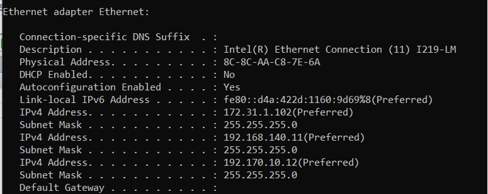

=====================
User return checklist
=====================

The idea is that measures/actions need to be taken so that all hardware and software can be brought back to their original state, making it safe for the next user.

The following steps should be taken by the user before returning the equipment:
    - log changes made inside the laptop (Sunrise Workbench software, IP address changes, etc.) and for the :ref:`KUKA LBR iiwa 14 R820` cabinet (any new hardware attached to it, etc.)
    - IP settings on the ``Lenovo P15`` should be the original ones. See :numref:`fig_kuka_ip_settings` for the original settings.

.. note:: IP ``172.31.1.102`` is shown here, as an equally valid alternative to ``172.31.1.100`` used throughout this document.

.. _fig_kuka_ip_settings:

    Original IP settings for the ``Lenovo P15`` laptop.

