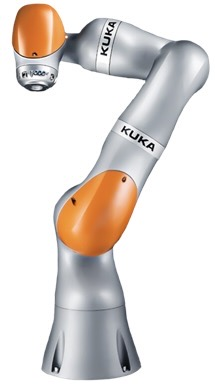

.. _KUKA:  https://www.kuka.com/en-gb
.. _KUKA LBR iiwa: https://www.kuka.com/en-gb/products/robotics-systems/industrial-robots/lbr-iiwa
.. _KUKA LBR iiwa 14 R820 Documents: https://my.kuka.com/s/product/lbr-iiwa-14-r820/01t58000002hnktAAA
.. _KUKA LBR iiwa ROS2: https://github.com/ICube-Robotics/iiwa_ros2
.. _KUKA LBR iiwa ROS: https://github.com/epfl-lasa/iiwa_ros?tab=readme-ov-file

.. _KUKA LBR iiwa 14 R820:

KUKA LBR iiwa 14 R820
=====================

.. _fig_kuka_lbr_iiwa_14_r820:

    KUKA LBR iiwa 14 R820

+------------------+--------------------------------------------+
| Location         |  Bay One                                   |
+------------------+--------------------------------------------+
| Contacts         |  Mohammad                                  |
+------------------+--------------------------------------------+
| Manufacturer     |  `KUKA`_ , `KUKA LBR iiwa`_                |
+------------------+--------------------------------------------+
| Further info     |  `KUKA LBR iiwa 14 R820 Documents`_        |
+------------------+--------------------------------------------+
| ROS              |  `KUKA LBR iiwa ROS`_                      |
+------------------+--------------------------------------------+
| ROS2             |  `KUKA LBR iiwa ROS2`_                     |
+------------------+--------------------------------------------+

The :ref:`KUKA LBR iiwa 14 R820` is a 7-axis robot arm with a payload of 14 kg and a reach of 820 mm.
It is designed for human-robot collaboration and is ideal for a wide range of applications, including assembly, testing, and inspection.

The document provides information on how to use the :ref:`KUKA LBR iiwa 14 R820` robot arm. The document includes the following sections:

.. toctree::

    startup
    ManualMode
    ProgrammingMode

