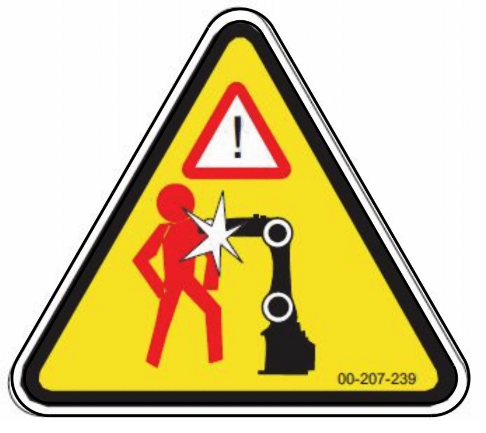
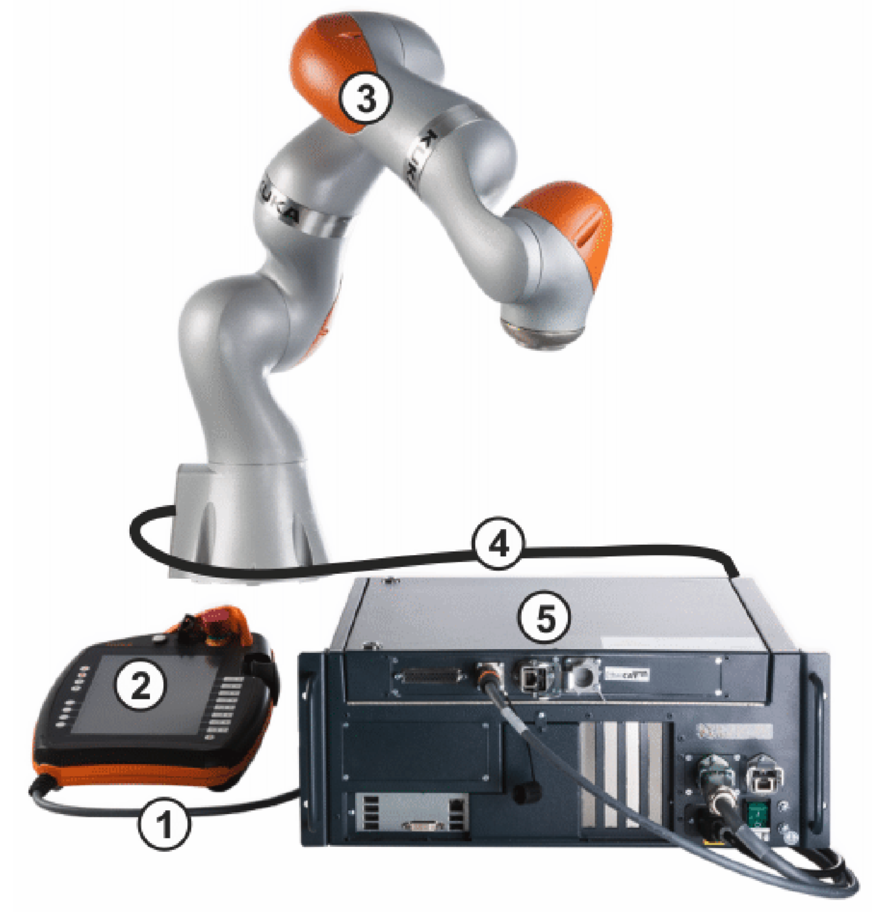
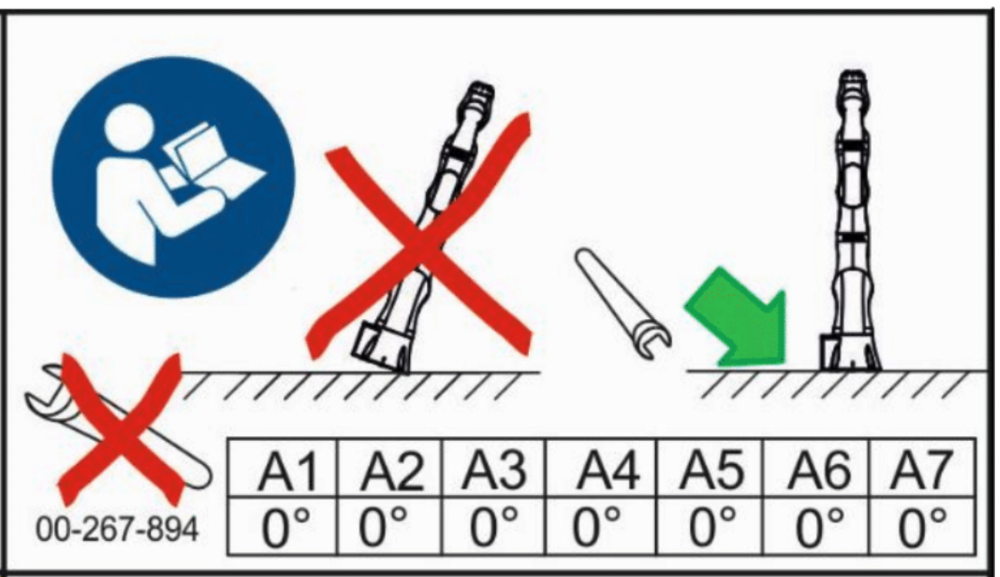
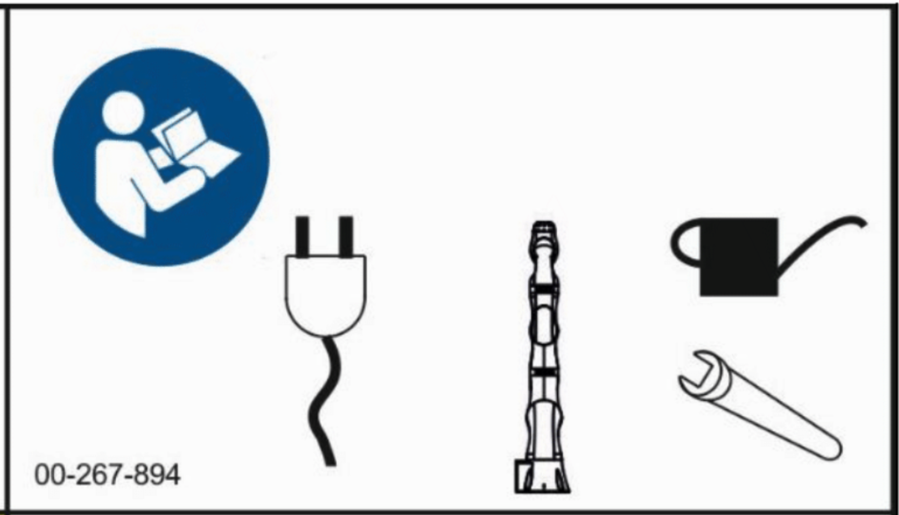

.. _kuka_lbr_iiwa_starting_up:

Starting Up
===========

Please follow the instructions below to power up the :ref:`KUKA LBR iiwa 14 R820` robot.
This instructions are based on the :ref:`KUKA LBR iiwa 14 R820` User Manual.

.. warning:: Entering the ``danger zone`` of the robot is prohibited if the robot is in operation or ready for operation. **Risk of injury!**

    KUKA LBR iiwa Danger Zone

Overview of the robot
---------------------

First of all you need to know the components of the robot system. The robot system consists of the following components (See image :numref:`kuka_iiwa_components`):
    - Arm
    - smartPAD (Control Panel)
    - KUKA Sunrise Cabinet (Controller)
    - Connecting cables
    - Software

.. _kuka_iiwa_components:

    KUKA LBR iiwa Components

The details of the components are as follows:
    1. Connecting cable to the smartPAD
    2. KUKA smartPAD control panel
    3. Manipulator
    4. Connecting cable to KUKA Sunrise Cabinet robot controller
    5. KUKA Sunrise Cabinet robot controller

.. note::

    To have more information about the :ref:`KUKA LBR iiwa 14 R820` robot, please refer to the :ref:`KUKA LBR iiwa 14 R820` User Manual.

Before Starting Up
------------------

Before starting up the robot, please make sure that the following conditions are met:
    - The robot is placed on a flat surface.
    - The robot connections are properly connected.
    - The robot is connected to a power source.

.. warning::

        Please make sure that the robot is placed on a flat surface. Otherwise, the robot may fall down and cause damage to the robot system. See :numref:`fig_kuka_iiwa_warning_1` and :numref:`fig_kuka_iiwa_warning_2`.

.. _fig_kuka_iiwa_warning_1:

    KUKA LBR iiwa Positioning

.. _fig_kuka_iiwa_warning_2:

    KUKA LBR iiwa operating instructions

Powering on
-----------

