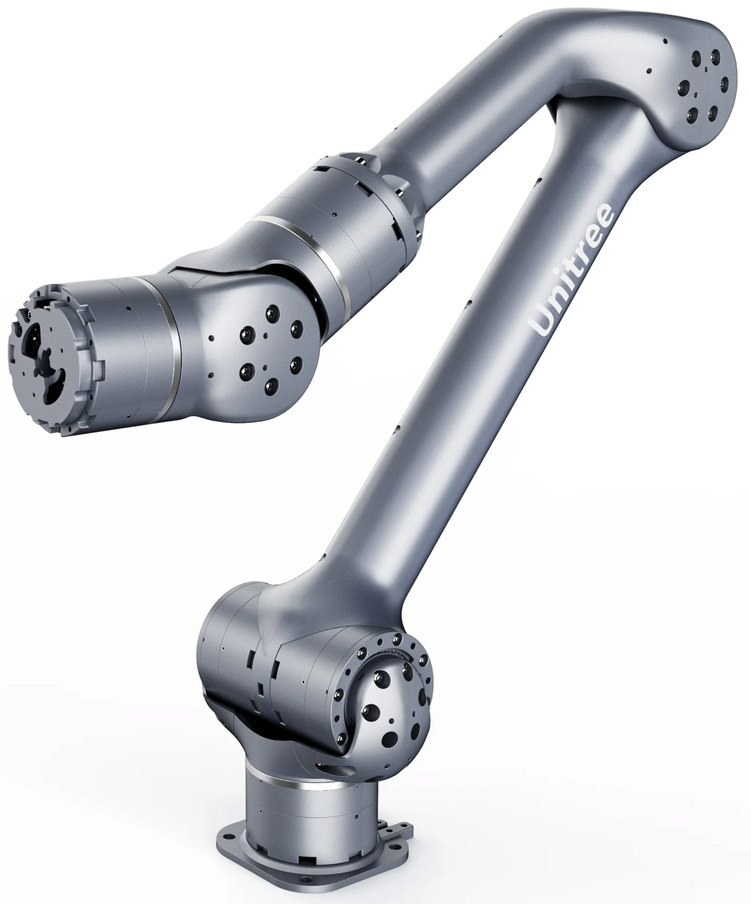

.. _Unitree: https://www.unitree.com/
.. _Z1 ROS: https://github.com/unitreerobotics/unitree_ros
.. _Z1 ROS2: https://github.com/unitreerobotics/unitree_ros2
.. _Z1 Documentation: https://dev-z1.unitree.com/
.. _Z1 SDK: https://github.com/unitreerobotics/z1_sdk
.. _Unitree Github: https://github.com/unitreerobotics

.. _Unitree_z1:

===========
Unitree Z1
===========

.. _fig_unitree_z1:

   Unitree Z1

+------------------+--------------------------------------+
| Location         | Dry Lab                              |
+------------------+--------------------------------------+
| Contacts         | Mohammad                             |
+------------------+--------------------------------------+
| Manufacturer     | `Unitree`_                           |
+------------------+--------------------------------------+
| Document         | `Z1 Documentation`_                  |
+------------------+--------------------------------------+
| Github           | `Unitree Github`_                    |
+------------------+--------------------------------------+
| ROS              | `Z1 ROS`_                            |
+------------------+--------------------------------------+
| ROS2             | `Z1 ROS2`_                           |
+------------------+--------------------------------------+
| SDK              | `Z1 SDK`_                            |
+------------------+--------------------------------------+

This document provides usage instructions for the Unitree Z1 robot arm.
Z1 can realize various upper-level control modes such as joint space control, Cartesian space control, etc.
It can also realize the low-level control of the underlying joint motors, based on which users can develop their own
control algorithms. To achieve the above control relies on the use of the robotic arm SDK.

This document provides an overview of the robot's hardware, software, and operation.

    .. toctree::

        z1_start

..        h1_manual_control
..        h1_power_off
..        h1_ros

