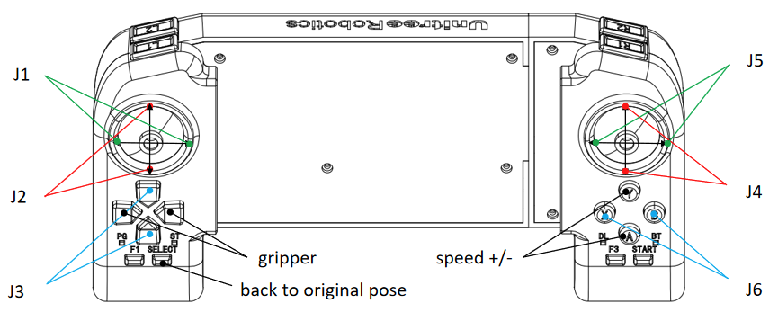
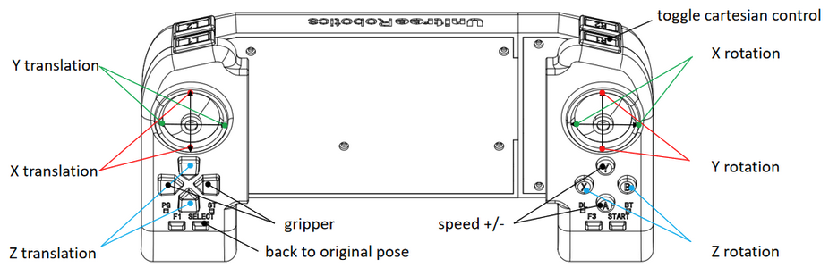

.. _z1_remote_control:

=================
Z1 Remote Control
=================

Control Mode
------------

The :ref:`Unitree_z1` robotic arm can be controlled using the joystick in three distinct modes:

    #. Joint Space Control: In this mode, the joystick allows for individual control of each motor.
    #. Cartesian Space Control: This mode enables the Z1 robotic arm to operate as a unified entity, with the joystick controlling movement along the XYZ axes and rotation around the XYZ axes.
    #. Fixed Trajectory Motion: In this mode, the Z1 robotic arm executes predefined movements for demonstration purposes.

Joint Space Control
~~~~~~~~~~~~~~~~~~~

When the B1 robot stops, press the ``L1+L2`` buttons simultaneously to switch control to the Z1 robotic arm,
thereby immobilizing the B1 robot. Next, press the ``R2`` button to enter the ``joint space control mode``,
allowing individual joint control using the joystick as depicted in the figure below.

After completing the movements, to maintain the Z1 robotic arm in its current position, press ``L2+R2`` simultaneously.
This action will prevent the arm from receiving further control signals from the joystick.
Subsequently, press ``L1+L2`` to regain control of the B1 robot while keeping the Z1 robotic arm in its current posture.

To resume controlling the Z1 robotic arm after the B1 robot has stopped, press the ``L1+L2`` buttons simultaneously,
immobilizing the B1 robot again. Then, press the ``R2`` button to continue controlling the Z1 robotic arm.
Upon completing the movements with the Z1 robotic arm, press the ``SELECT`` button to return it to its original position.
For more information, see :numref:`z1_cartesian_control`.

.. _z1_cartesian_control:

    Unitree Z1 Joint Control

Cartesian Space Control
-----------------------

When the B1 robot halts, simultaneously press the ``L1+L2`` buttons to transfer control to the Z1 robotic arm,
rendering the B1 robot immobile. At this point, or when the Z1 robotic arm is in joint space control mode,
press the ``R1`` button to enter ``Cartesian space control mode``, as depicted in the figure below.

Upon completing the desired movement, if you wish to maintain the Z1 robotic arm's current position,
press the ``L2+R2`` buttons simultaneously. This action will prevent the arm from receiving further joystick inputs.
Subsequently, press the ``L1+L2`` buttons to regain control of the B1 robot while keeping the Z1 robotic arm stationary.

When the B1 robot stops, press the ``L1+L2`` buttons simultaneously to switch control back to the Z1 robotic arm,
causing the B1 robot to stop moving. Then, press either the ``R2`` or ``R1`` button to continue controlling the Z1 robotic arm.
Once the Z1 robotic arm has completed its movement, press the ``SELECT`` button to return it to its original position.
For more information, see :numref:`z1_fixed_trajectory_motion`.

.. _z1_fixed_trajectory_motion:

    Unitree Z1 Cartesian Control

Fixed Trajectory Motion
-----------------------

When the B1 robot halts, simultaneously press the ``L1+L2`` buttons to transfer control to the Z1 robotic arm,
causing the B1 robot to stop moving. Press the ``R2`` button to enter joint space control mode.
To initiate the preset fixed trajectory movement, press the ``R2+X`` buttons simultaneously.

Once the movement is completed, press the ``SELECT`` button to return the robotic arm to its original position.

