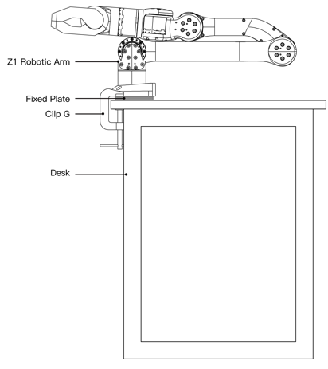
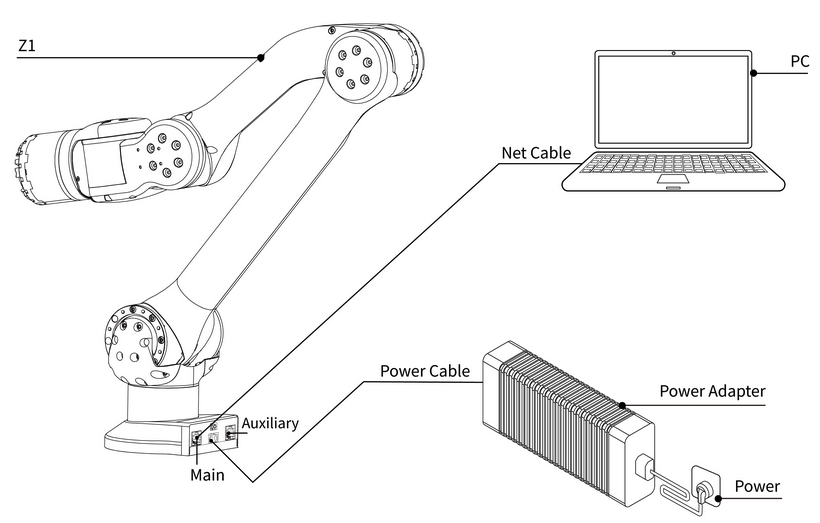

.. _z1_startup:

===========
Z1 Start Up
===========

Before starting the :ref:`Unitree_z1` robotic arm, watch the following video for unboxing and installation instructions.

.. raw:: html

    <vide>
        <iframe width="650" height="350" src="https://www.youtube.com/embed/feL61mulius?si=0OtQlZ0YtgV9gA6b" title="YouTube video player" frameborder="0" allow="accelerometer; autoplay; clipboard-write; encrypted-media; gyroscope; picture-in-picture; web-share" referrerpolicy="strict-origin-when-cross-origin" allowfullscreen></iframe>
    </vide>
     

Installation
------------

When securing the robotic arm, the user should design and install the platform based on the dimensions of the holes
in the robotic arm base and the actual environment. The platform must support not only the weight of the robotic arm
but also the dynamic forces generated during maximum acceleration. The robotic arm is fastened using four M6 bolts,
and installation is performed with a hex wrench. Please refer to the base installation details in :numref:`z1_base`.

.. _z1_base:

    Unitree Z1 Base

Cable Connection
----------------

There are two primary types of robotic arm cables:
power supply cables and telecommunication cables.
The power supply cable connector for the robotic arm is designed with a mistake-proof feature,
ensuring correct insertion into the power supply port. Please refer to the figure below for proper connection. See :numref:`z1_cable` for details.

.. _z1_cable:

    Unitree Z1 Cable Connection

.. note::

    The main network port is designated for controlling the robot, while the auxiliary network port is intended for changing the default IP address. These ports should not be interchanged.

    Additionally, the power supply is not hot-swappable.

Zero Position
-------------

Ensure that the z1_ctrl program is deactivated before powering on the robotic arm to prevent potential hazards.
Additionally, position the robotic arm in its ``zero position``, as illustrated in the :numref:`z1_base`.
In the zero position, the alignment lines on both sides of the joint gaps of J1 and J6 should correspond exactly,
while the remaining joints should be placed sequentially.

Power On
--------

Upon successful power-on, a steady green light indicates the status, and a blue light will flash once the self-check is completed.

It is important to ensure that each joint of the robotic arm is positioned at the zero position before every use.
This alignment ensures that the theoretical zero position in the control algorithm matches the actual mechanical zero position.
Additionally, the motor at the end of the robotic arm is powered by a DC24V supply through its black and white power cord.
If this power is not required, securely wrap the black and white power cord with insulating tape to prevent hazards
such as short circuits.

.. note::

    If the terminal prints ‘Arm Version 3-8’ after executing the ‘z1_Ctrl -v’, it’s allowed to power on the robot in any position.

    And the first thing when power on is to press ‘~’ key or execute ‘backtostart’.
