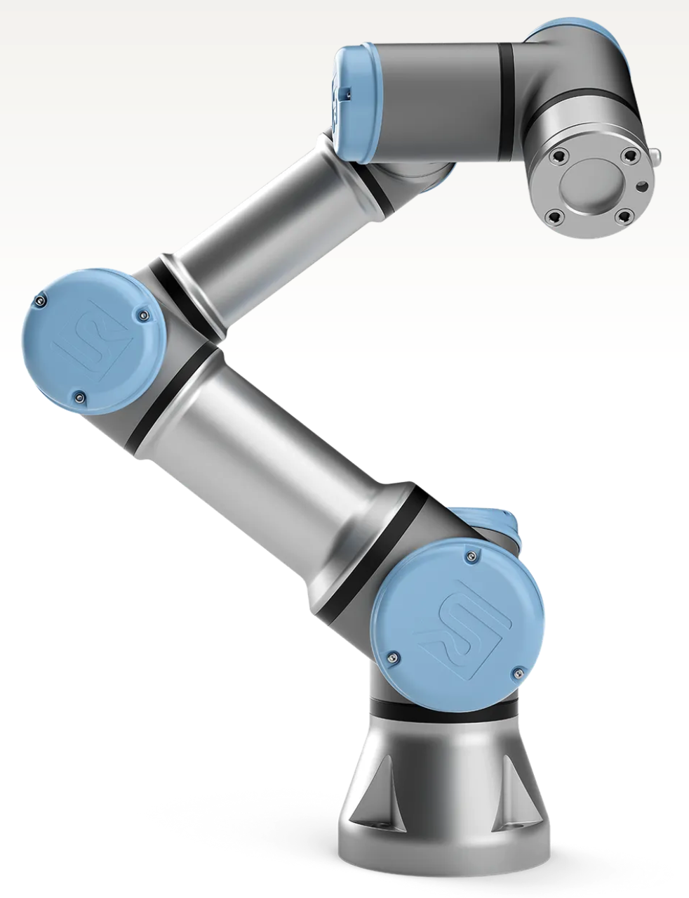

.. _Universal Robot: https://www.universal-robots.com
.. _Universal Robot ROS: https://github.com/UniversalRobots/Universal_Robots_ROS_Driver
.. _Universal Robot ROS2: https://github.com/UniversalRobots/Universal_Robots_ROS2_Driver
.. _UR3 Documentation: https://s3-eu-west-1.amazonaws.com/ur-support-site/219822/710-943-00_UR3e_User_Manual_en_Global.pdf
.. _Universal Robot Github: https://github.com/UniversalRobots
.. _UR Video Tutorials: https://academy.universal-robots.com/video-tutorials/

.. _ur3e:

=======================
Universal Robotics UR3e
=======================

.. _fig_ur3:

   UR3e

+------------------+--------------------------------------+
| Location         | Bay 1                                |
+------------------+--------------------------------------+
| Contacts         | Mohammad/Murilo                      |
+------------------+--------------------------------------+
| Manufacturer     | `Universal Robot`_                   |
+------------------+--------------------------------------+
| Document         | `UR3 Documentation`_                 |
+------------------+--------------------------------------+
| Github           | `Universal Robot Github`_            |
+------------------+--------------------------------------+
| ROS              | `Universal Robot ROS`_               |
+------------------+--------------------------------------+
| ROS2             | `Universal Robot ROS2`_              |
+------------------+--------------------------------------+
| Video Tutorials  | `UR Video Tutorials`_                |
+------------------+--------------------------------------+

The UR3e from Universal Robots is a compact, ultra-lightweight collaborative robot (cobot) designed for
efficiency in tight workspaces. With a reach of 500 mm and a payload capacity of 3 kg,
the UR3e is ideal for tasks like assembly, dispensing, and material handling.
It features high precision, safety functions, and easy integration into existing production environments.
The UR3e supports infinite rotation for screw driving and other applications, offering flexibility and
enhancing productivity. Its user-friendly interface ensures quick deployment and minimal downtime,
making it a versatile addition to any automation setup.
This document provides an overview of the robot's hardware, software, and operation.

    .. toctree::

        ur3e_safety

..        z1_remote_control
..        z1_ros

..        h1_power_off
..        h1_ros

