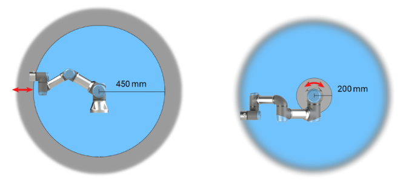
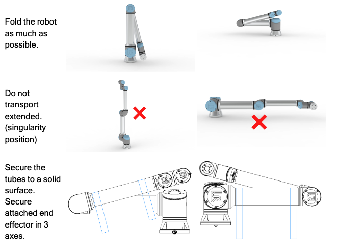

.. _ur3e_safety:

===========
UR3e Safety
===========

In this section, we will go through the UR3e safety instructions.

.. warning::
    Before using the :ref:`ur3e` make sure that read the safety instructions in the documentation.
    You can find the UR3e safety instructions in documentation pages 18-37, link at :ref:`ur3e` section.

General Warnings
----------------

Failure to adhere to the general safety practices, listed below, can result in injury.
    - Verify the robot arm and tool/end effector are properly and securely bolted in place.
    - Verify the robot arm has ample space to operate freely.
    - Verify the personnel are protected during installation, commissioning, programming/ teaching, operation and use.
    - Verify robot safety configuration parameters are set to protect personnel, including those who can be within reach of the robot application.
    - Avoid using the robot if it is damaged.
    - Avoid wearing loose clothing or jewelry when working with the robot. Tie back long hair.
    - Avoid placing any fingers behind the internal cover of the Control Box.
    - Inform users of any hazardous situations and the protection that is provided, explain any limitations of the protection and the residual risks.
    - Inform users of the location of the emergency stop button(s) and how to activate the emergency stop in case of an emergency or an abnormal situation.
    - Warn people to keep their heads and faces outside the reach of the robot, including when the robot is about to start operating.
    - Be aware of robot orientation to understand the direction of movement when using the Teach Pendant.

Handling tools/end effectors with sharp edges and/or pinch points can result in injury.
    - Make sure tools/end effectors have no sharp edges or pinch points.
    - Protective gloves and/or protective eyeglasses could be required

Prolonged contact with the heat generated by the robot arm and the Control Box, during operation, can lead to discomfort resulting in injury.
    - Do not handle or touch the robot while in operation or immediately after operation.
    - Check the temperature on the log screen before handling or touching the robot.
    - Allow the robot to cool down by powering it off and waiting one hour.

.. note::
    Very strong magnetic fields can damage the robot.
        - Do not expose the robot to permanent magnetic fields

Emergency Stop
--------------

The Emergency Stop (E-stop) is the red button on the Teach Pendant.
Press it to stop all robot motion immediately, triggering a stop category one.
E-stops are not safeguards but additional protective measures and must comply with ISO 13850.
After activation, the button latches and needs manual resetting.
Before resetting, check and resolve the cause of the E-stop.

To reset the emergency stop push-button
    #. Hold the push-button and twist clockwise until the latching disengages. You should feel when the latching is disengaged, indicating the push-button is reset.
    #. After resetting the emergency stop, restore power to the robot and resume operation.

Workspace
---------

The robot workspace is the area where the robot can reach.
The robot workspace is defined by the robot's reach and the robot's joint limits.
You can find the robot workspace in the figure :numref:`fig_ur3_workspace`.

.. _fig_ur3_workspace:

   UR3e Workspace

As you can see the certain areas around the robot arm pose pinching hazards due to its physical properties.
Attention is needed in the area to the left, where radial motions occur when the wrist 1 joint is at least 450 mm from the robot base.
Another area to watch is within 200 mm of the base, where tangential movements happen.

Transport Without Packaging
---------------------------

Universal Robots recommends transporting the robot in its original packaging to minimize vibrations and joint movement.
If the original packaging is unavailable, follow these guidelines:

    #. Fold the robot as much as possible – do not transport the robot in the singularity position.
    #. Move the center of gravity in the robot as close to the base as possible.
    #. Secure each tube to a solid surface on two different points on the tube.
    #. Secure any attached end effector rigidly in 3 axes.

:numref:`fig_ur3_transport` shows the robot in a transport position.

.. _fig_ur3_transport:

   UR3e Transport Position

