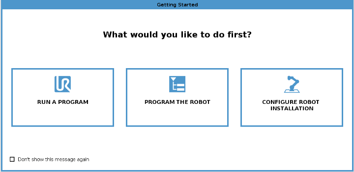
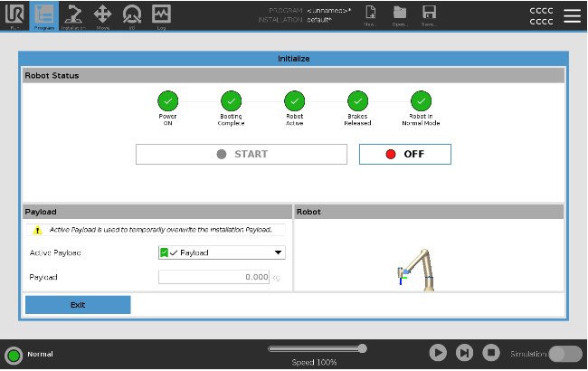

.. _ur3e_start:

============
UR3e StartUp
============

To have a better understanding of the UR3e startup procedure, you can see the videos in and of this page.

Startup Procedure
-----------------

This section provides a step-by-step guide to starting up the :ref:`ur3e` robot arm.
To know more about the UR3e, visit the UR3 Documentation at :ref:`ur3e`.
Before starting up the robot arm, ensure the following:

.. caution::
    Failure to verify the payload and installation before starting up the robot arm can lead to injury to personnel and/or property damage.

    * Always verify the actual payload and installation are correct before starting up the robot arm.

.. caution::
    Incorrect payload and installation settings prevent the robot arm and Control Box from functioning correctly.

    * Always verify the payload and installation settings are correct.

.. note::
    Verify the robot arm has ample space to operate freely.

.. note::
    Starting up the robot in lower temperatures can result in lower performance, or stops, due to temperature-dependent oil and grease viscosity.

    * Starting up the robot in low temperatures can require a warm-up phase.

    See the support article, "Best Practice for Robot Start-up in Cold Environments" on `universal-robots.com <https://www.universal-robots.com>`_.

Initialization
--------------

1. On your Teach Pendant, press the ``power button`` to turn on the control box.
2. Wait as text from the underlying operating system, followed by buttons, appear on the screen.
3. A Getting Started screen :numref:`fig_ur3e_getting_start` can appear, prompting you to begin programming the robot.

.. _fig_ur3e_getting_start:

    Getting Started Screen

On your first start up a ``Cannot Proceed`` dialog box can appear. Select ``Go`` to initialization screen to access the Initialize screen.

In the Footer, to the left, the Initialize button indicates the status of the robot arm using colors:

* **Red** Power off. The robot arm is in a stopped state.
* **Yellow** Idle. The robot arm is on, but not ready for normal operation.
* **Green** Normal. The robot arm is on and ready for normal operation.

.. _fig_ur3e_initialize:

    Initialize Screen

Turning the Robot On/Off
------------------------

To start the robot:

1. Tap the ``ON`` button with the green LED to start the initialization process. Then, the LED turns yellow to indicate the power is on and in Idle.
2. Tap the ``START`` button to release the brakes.
3. Tap the ``OFF`` button with the red LED to power off the robot arm.

    * When the PolyScope starts, tap the ``ON`` button once to power the robot arm. Then, the status changes to yellow to indicate the robot is on and idle.
    * When the robot arm state is Idle, tap the ``START`` button to start the robot arm. At this point, sensor data is checked against the configured mounting of the robot arm. If a mismatch is found (with a tolerance of 30°), the button is disabled and an error message is displayed below it.
    * If the mounting is verified, tap ``START`` to release all joint brakes and the robot arm is ready for normal operation.

.. note:: Robot arm start up is accompanied by sound and slight movements as joint brakes are released.

Turning the Control Box On/Off
------------------------------

The Control Box mainly contains the physical electrical ``Input/Output`` that connects the robot arm, the Teach Pendant and any peripherals. You must turn on the Control Box to be able to power on the robot arm.

.. note::
    The Teach Pendant will display the status of the control box and the robot arm once powered on.

.. raw:: html

    

        <iframe width="695" height="350" src="https://video.universal-robots.com/13968029/15440630/f9126ce345ab3ff9d3cfbec2628a6f0c/video_hd/technical-demo-part-1-on-robot-set-up-1-video.mp4?referer=https%3A%2F%2Fvideo.universal-robots.com%2Ftechnical-demo-part-1-on-robot-set-up&uuid=bf1c8ee1-2ddf-0cfb-8da7-f62a648f768f" title="UR video player" frameborder="0" allow="accelerometer; autoplay; clipboard-write; encrypted-media; gyroscope; picture-in-picture; web-share" referrerpolicy="strict-origin-when-cross-origin" allowfullscreen></iframe>
        <h2>Technical Demo Part 1 (on Robot Set-up)</h2>
    

     

.. raw:: html

    

        <iframe width="695" height="350" src="https://video.universal-robots.com/v.ihtml/player.html?showDescriptions=0&source=site&photo%5fid=15440631&autoPlay=1" title="UR video player" frameborder="0" allow="accelerometer; autoplay; clipboard-write; encrypted-media; gyroscope; picture-in-picture; web-share" referrerpolicy="strict-origin-when-cross-origin" allowfullscreen></iframe>
        <h2>Technical Demo Part 2 (on Easy Programming)</h2>
    

     

.. raw:: html

    

        <iframe width="695" height="350" src="https://video.universal-robots.com/v.ihtml/player.html?showDescriptions=0&source=site&photo%5fid=15440633&autoPlay=1" title="UR video player" frameborder="0" allow="accelerometer; autoplay; clipboard-write; encrypted-media; gyroscope; picture-in-picture; web-share" referrerpolicy="strict-origin-when-cross-origin" allowfullscreen></iframe>
        <h2>Technical Demo Part 3 (on Safety Configuration)</h2>
    

     

.. raw:: html

    

        <iframe width="695" height="350" src="https://video.universal-robots.com/v.ihtml/player.html?showDescriptions=0&source=site&photo%5fid=15440634&autoPlay=1" title="UR video player" frameborder="0" allow="accelerometer; autoplay; clipboard-write; encrypted-media; gyroscope; picture-in-picture; web-share" referrerpolicy="strict-origin-when-cross-origin" allowfullscreen></iframe>
        <h2>Technical Demo Part 4 (on Interfacing with the Robot)</h2>
    

     

