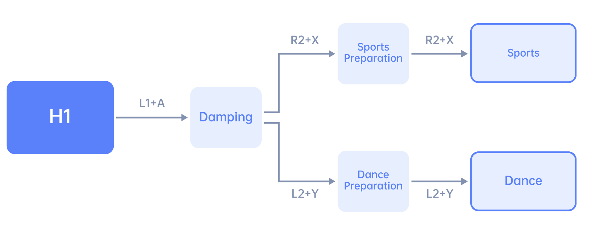

.. _H1_remote_Control:

==============
Remote Control
==============

.. warning:: The robot's current walking mode does not include the function for climbing stairs. Please avoid having the robot climb stairs at will to prevent damage to the robot.

Remote Control Parts
--------------------

The remote controller’s various buttons are explained as shown in the diagram.
The functionality of the remote controller mainly consists of left and right joysticks and function buttons.

.. _figure_h1_remote_control:
.. figure:: ../../../images/unitree_go2/go2_remote_control.png
   :width: 100%
   :align: center
   :alt: H1 Remote Control

   H1 Remote Control

:numref:`figure_h1_remote_control` shows the parts of the remote control.
The parts names as follows:

    #. Right Rocker
    #. Left Rocker
    #. Key L1/L2
    #. Key R1/R2
    #. Type C Charging Interface
    #. Data transmission Signal Light
    #. Left Key
    #. Power Connect Indicator
    #. F1 Left Rocker Calibration Key
    #. SELECT Key
    #. Charging Status Indicator
    #. Power Indicator Light
    #. Power Button
    #. Data Transmission Indicator Light
    #. F3 Right Rocker Calibration Key
    #. START Key
    #. Right Key
    #. Bluetooth Signal Indicator Light

Remote Control Operation
------------------------

To control the H1, you can use the following commands:

    1. Press ``START`` to switch to continuous walking mode.
    2. Push the left joystick forward to move H1 forward.
    3. Press ``START`` again to stop H1 and make it stand in place.
    4. Press ``START`` once more to return H1 to continuous walking mode.
    5. Push the left joystick back to make H1 walk backward.
    6. Push the right stick to the right to rotate H1 in that direction.
    7. Push the right stick to the left to rotate H1 in the opposite direction.
    8. Press ``B`` to increase the height of the leg lift, and press ``A`` to lower the leg lift.
    9. Reattach the rope to the protection hook once H1 remains standing.
    10. Raise the hook until there is tension on the rope supporting H1.
    11. Press ``L1+A`` to enter damping mode; Now you can safely shut down or enter debug mode.
    12. To enter debug mode, press ``L2+R2`` while under suspension. See :numref:`H1_debug` for more details.

.. _H1_debug:
.. figure:: ../../../images/unitree_h1/h1_debug_mode.gif
   :align: center
   :scale: 80%
   :alt: Unitree H1 debug mode

   Unitree H1 debug mode

    13. Press ``L2+B`` again to re-enter damping mode and return H1 to its original position.

Operation Guid
--------------

=========================  =============================================================================================
Concept                     Description
=========================  =============================================================================================
Damping state               All joint motors stop moving immediately
-------------------------  ---------------------------------------------------------------------------------------------
Damping mode                The robot is in a damping state and can enter the preparation mode

                            or Develop mode
-------------------------  ---------------------------------------------------------------------------------------------
Preparatory mode            The robot will slowly assume the preparatory posture before

                            movement mode within 5 seconds
-------------------------  ---------------------------------------------------------------------------------------------
Motion mode                 Mode where the robot can be controlled by remote control
-------------------------  ---------------------------------------------------------------------------------------------
Continuous walking mode     The robot is always in the stepping state.
-------------------------  ---------------------------------------------------------------------------------------------
Standing mode               In this mode, when the joystick command is zero,

                            the robot stops stepping and enters standing;

                            when the joystick command is not zero, or the robot is

                            disturbed and difficult to maintain balance,

                            the robot will start to step.
-------------------------  ---------------------------------------------------------------------------------------------
Develop mode                Used for Low-cmd development. When you need to use the SDK for

                            development and debugging, please make sure that H1 has entered

                            Develop mode to stop the support motion control program from sending

                            instructions, so as to avoid potential instruction conflicts. You can

                            confirm whether you have entered Develop mode by pressing ``L2+A``.
=========================  =============================================================================================

Mode Switch
--------------

:numref:`remote_control` shows the mode switch of the robot.

.. _remote_control:

.. figure:: ../../../images/unitree_h1/h1_mode_switch.png
   :align: center
   :width: 100%
   :alt: Unitree H1 remote control

   Unitree H1 remote control

Key Description
---------------

+---------------------+-------------------+------------------------------------------------------------------------------+
| Mode                | Button            | Description                                                                  |
+---------------------+-------------------+------------------------------------------------------------------------------+
| General             | L1 + A            | Enter damping mode                                                           |
+                     +-------------------+------------------------------------------------------------------------------+
|                     | L2 + R2           | Enter Develop mode                                                           |
+---------------------+-------------------+------------------------------------------------------------------------------+
| Damping mode        | R2 + X            | Enter preparation mode                                                       |
+---------------------+-------------------+------------------------------------------------------------------------------+
| Preparatory mode    | R2 + X            | Enter sports mode                                                            |
+---------------------+-------------------+------------------------------------------------------------------------------+
| Sports mode         | Left joystick     | Translation speed  :math:`(v_x, v_y)`                                        |
+                     +-------------------+------------------------------------------------------------------------------+
|                     | Right joystick    | Yaw angular velocity :math:`(w_{yaw})`                                       |
+                     +-------------------+------------------------------------------------------------------------------+
|                     | Left cross key    | Speed command compensation                                                   |
+                     +-------------------+------------------------------------------------------------------------------+
|                     | A                 | Reduce the height of your feet                                               |
+                     +-------------------+------------------------------------------------------------------------------+
|                     | B                 | Increase foot lift                                                           |
+                     +-------------------+------------------------------------------------------------------------------+
|                     | START             | Switch between continuous walking mode/standing mode                         |
+---------------------+-------------------+------------------------------------------------------------------------------+
| Develop mode        | L2 + A            | Perform position control and control the robot to perform diagnostic actions |
+                     +-------------------+------------------------------------------------------------------------------+
|                     | L2 + B            | Stop the diagnostic action and the robot enters the damping state            |
+---------------------+-------------------+------------------------------------------------------------------------------+

Advance Motion
---------------
Beyond the basic sports modes, the H1 robot is capable of executing more sophisticated movements.
To use these advanced action modes, follow these steps:

    #. Activate the damping mode by pressing ``L1 + A``.
    #. Press the ``mode selection key`` to enter the preparation state for the desired mode.
    #. Press the ``mode selection key`` once more to transition into the control state of that mode.

Follow the key logic for further operations within this mode. See :numref:`H1_advance_motion` for more details.

.. _H1_advance_motion:

   Unitree H1 advanced motion

+---------------------+-------------------------------+----------------------------------------------------------------+
| Mode                | Mode Selection Key            | Description                                                    |
+---------------------+-------------------------------+----------------------------------------------------------------+
| Sport Mode          | R2 + X                        | The most commonly used walking action                          |
+---------------------+-------------------------------+----------------------------------------------------------------+
| Dance Mode          | L2 + Y                        | Full body dynamic coordinated dance                            |
+---------------------+-------------------------------+----------------------------------------------------------------+

Sports Mode
~~~~~~~~~~~

The sports mode is the most frequently used mode. To activate this mode:

    #. Press ``R2 + X`` to enter the ready state,
    #. Then press ``R2 + X`` **again** to switch to sports mode.

.. note:: ``R2 + X`` is the mode selection button for sports mode.

Dance Mode
~~~~~~~~~~~

The dance mode is a full-body dynamic coordinated dance. To activate this mode:

    #. Put the robot in a suspended state, and use ``L1 + A`` to enter damping mode.
    #. Press ``L2 + Y`` to enter the ready state.
    #. Then slowly lower the robot and press ``L2 + Y`` **again** to switch to dance mode. The robot will enter the standing state. At this time, you can relax or untie the protective rope.
    #. Press ``START``, and the robot will start a whole-body dynamic and coordinated dance, and enter a standing state after the movement is completed.

.. note:: After each dance, you can press ``START`` again to repeat the action.

