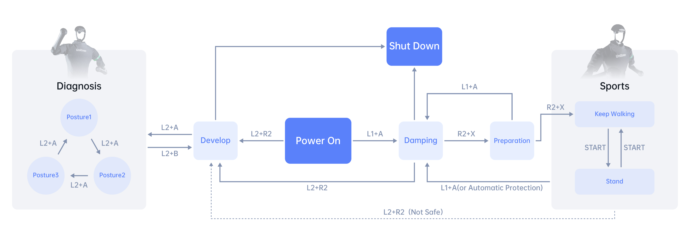

.. _H1_remote_Control:

==============
Remote Control
==============

To control the H1, you can use the following commands:

    1. Press ``START`` to switch to continuous walking mode.
    2. Push the left joystick forward to move H1 forward.
    3. Press ``START`` again to stop H1 and make it stand in place.
    4. Press ``START`` once more to return H1 to continuous walking mode.
    5. Push the left joystick back to make H1 walk backward.
    6. Push the right stick to the right to rotate H1 in that direction.
    7. Push the right stick to the left to rotate H1 in the opposite direction.
    8. Press ``B`` to increase the height of the leg lift, and press ``A`` to lower the leg lift.
    9. Reattach the rope to the protection hook once H1 remains standing.
    10. Raise the hook until there is tension on the rope supporting H1.
    11. Press ``L1+A`` to enter damping mode; Now you can safely shut down or enter debug mode.
    12. To enter debug mode, press ``L2+R2`` while under suspension. See :numref:`H1_debug` for more details.

.. _H1_debug:
.. figure:: ../../../images/unitree_h1/h1_debug_mode.gif
   :align: center
   :scale: 80%
   :alt: Unitree H1 debug mode

   Unitree H1 debug mode

    13. Press ``L2+B`` again to re-enter damping mode and return H1 to its original position.

Operation Guid
--------------

=========================  =============================================================================================
Concept                     Description
=========================  =============================================================================================
Damping state               All joint motors stop moving immediately
-------------------------  ---------------------------------------------------------------------------------------------
Damping mode                The robot is in a damping state and can enter the preparation mode

                            or Develop mode
-------------------------  ---------------------------------------------------------------------------------------------
Preparatory mode            The robot will slowly assume the preparatory posture before

                            movement mode within 5 seconds
-------------------------  ---------------------------------------------------------------------------------------------
Motion mode                 Mode where the robot can be controlled by remote control
-------------------------  ---------------------------------------------------------------------------------------------
Continuous walking mode     The robot is always in the stepping state.
-------------------------  ---------------------------------------------------------------------------------------------
Standing mode               In this mode, when the joystick command is zero,

                            the robot stops stepping and enters standing;

                            when the joystick command is not zero, or the robot is

                            disturbed and difficult to maintain balance,

                            the robot will start to step.
-------------------------  ---------------------------------------------------------------------------------------------
Develop mode                Used for Low-cmd development. When you need to use the SDK for

                            development and debugging, please make sure that H1 has entered

                            Develop mode to stop the support motion control program from sending

                            instructions, so as to avoid potential instruction conflicts. You can

                            confirm whether you have entered Develop mode by pressing ``L2+A``.
=========================  =============================================================================================

Mode Switch
--------------

:numref:`remote_control` shows the mode switch of the robot.

.. _remote_control:

   Unitree H1 remote control

Key Description
---------------

+---------------------+-------------------+------------------------------------------------------------------------------------------------------+
| Mode                | Button            | Description                                                                                          |
+---------------------+-------------------+------------------------------------------------------------------------------------------------------+
| General             | L1 + A            | Enter damping mode                                                                                   |
+                     +-------------------+------------------------------------------------------------------------------------------------------+
|                     | L2 + R2           | Enter Develop mode                                                                                   |
+---------------------+-------------------+------------------------------------------------------------------------------------------------------+
| Damping mode        | R2 + X            | Enter preparation mode                                                                               |
+---------------------+-------------------+------------------------------------------------------------------------------------------------------+
| Preparatory mode    | R2 + X            | Enter sports mode                                                                                    |
+---------------------+-------------------+------------------------------------------------------------------------------------------------------+
| Sports mode         | Left joystick     | Translation speed  :math:`(v_x, v_y)`                                                                |
+                     +-------------------+------------------------------------------------------------------------------------------------------+
|                     | Right joystick    | Yaw angular velocity :math:`(w_{yaw})`                                                               |
+                     +-------------------+------------------------------------------------------------------------------------------------------+
|                     | Left cross key    | Speed command compensation                                                                           |
+                     +-------------------+------------------------------------------------------------------------------------------------------+
|                     | A                 | Reduce the height of your feet                                                                       |
+                     +-------------------+------------------------------------------------------------------------------------------------------+
|                     | B                 | Increase foot lift                                                                                   |
+                     +-------------------+------------------------------------------------------------------------------------------------------+
|                     | START             | Switch between continuous walking mode/standing mode                                                 |
+---------------------+-------------------+------------------------------------------------------------------------------------------------------+
| Develop mode        | L2 + A            | Perform position control and control the robot to perform diagnostic actions                         |
+                     +-------------------+------------------------------------------------------------------------------------------------------+
|                     | L2 + B            | Stop the diagnostic action and the robot enters the damping state                                    |
+---------------------+-------------------+------------------------------------------------------------------------------------------------------+

