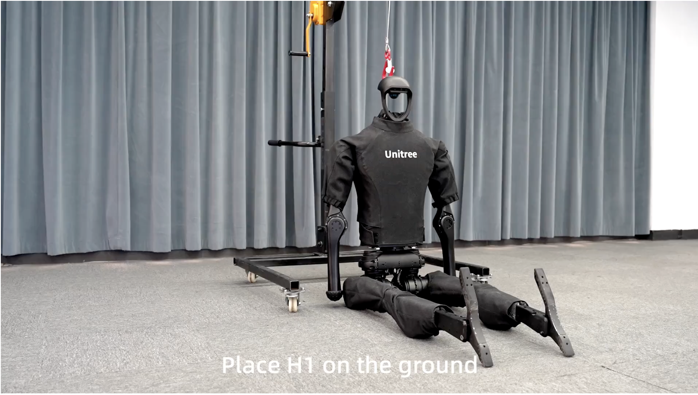
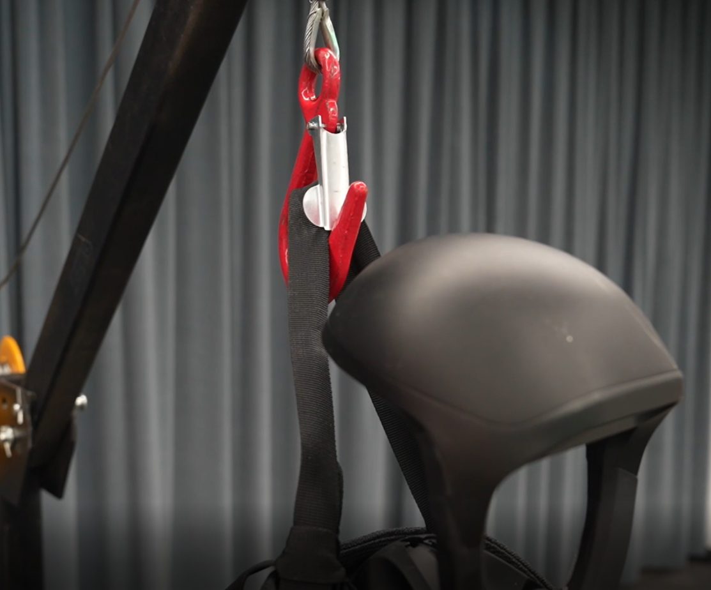
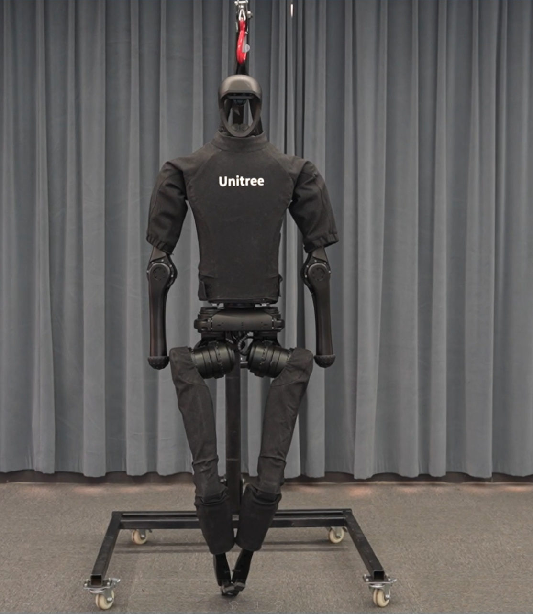
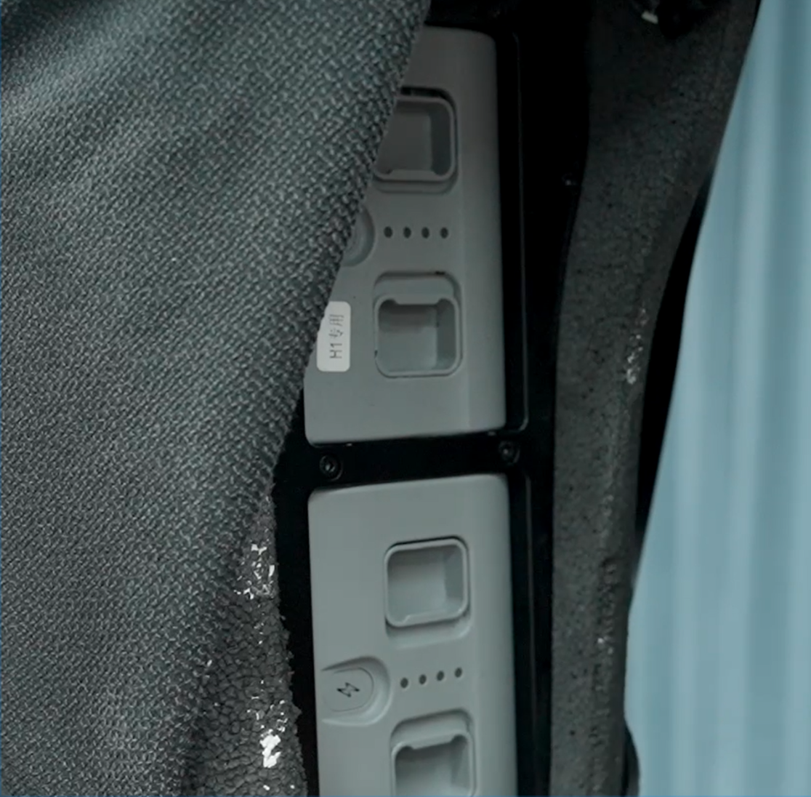
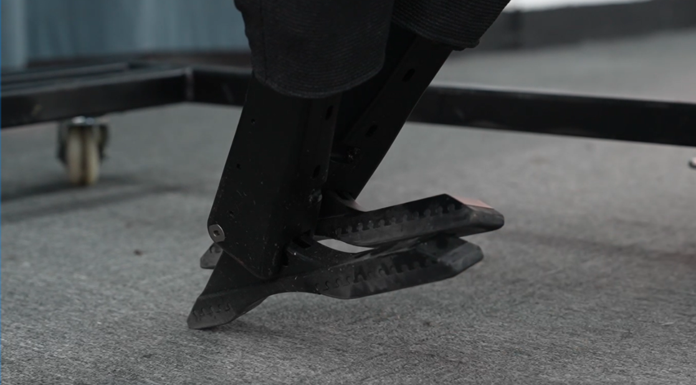
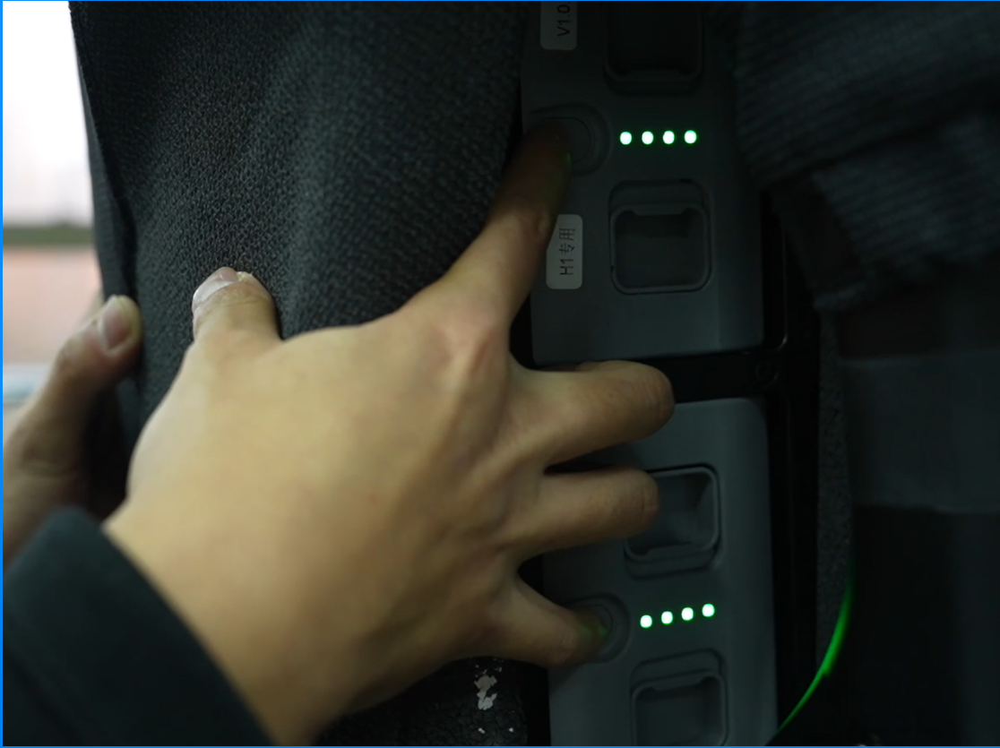

.. _h1_start:

===========
H1 Start Up
===========

For starting up the H1, first of all we need to prepare the robot into the proper position and then turn on the power.

Video below shows the H1 start up process.

.. raw:: html

    <vid>
        <iframe width="680" height="350" src="https://www.youtube.com/embed/IoZ_Mw1Keqo?si=vwXO5S_qEGAd7SPI" title="YouTube video player" frameborder="0" allow="accelerometer; autoplay; clipboard-write; encrypted-media; gyroscope; picture-in-picture; web-share" referrerpolicy="strict-origin-when-cross-origin" allowfullscreen></iframe>
    </vid>
     

Boot process
------------

To prepare the robot for startup, follow these steps:

1. Place H1 on the ground and secure it with a rope tied in a dead knot at H1’s shoulder latch. See :numref:`fig_h1_sitting`.

.. _fig_h1_sitting:

   Unitree H1 sitting

2. Hang the rope on the clasp of the protective frame to support H1. See :numref:`fig_h1_hanging`.

.. _fig_h1_hanging:

   Unitree H1 hanging

3. Raise H1 along with the protective frame to prepare for startup. See :numref:`fig_h1_raising`.

.. _fig_h1_raising:

   Unitree H1 raising

4. Insert two batteries into the battery compartment with the key-forward orientation. See :numref:`fig_h1_battery_insertion`.

.. _fig_h1_battery_insertion:

   Unitree H1 battery insertion

5. Turn the arm inward until it reaches its limit and then lower it vertically. See :numref:`fig_h1_arm_position`.

.. _fig_h1_arm_position:

.. figure:: ../../../images/unitree_h1/h1_arm_position.gif
   :align: center
   :scale: 80%
   :alt: Unitree H1 arm position

   Unitree H1 arm position

6. Ensure that the feet are cocked up to their limit. See :numref:`fig_h1_foot_position`.

.. _fig_h1_foot_position:

   Unitree H1 foot position

7. Maintain the position as depicted in the :numref:`fig_h1_raising`.
8. Short press and long press both batteries simultaneously to power them up. See :numref:`fig_h1_power_on`.

.. _fig_h1_power_on:

   Unitree H1 power on

9. Wait until you hear the ``sound`` indicating that the ankle has reached its limit, and then wait an additional ``30 seconds``.
10. Press :guilabel:`L1+A` to unlock damping, then press :guilabel:`R2+X` to enter ready mode. At this point, the feet will spread out, and the arms will be at the sides of the waist. See :numref:`fig_h1_ready`.

.. _fig_h1_ready:

.. figure:: ../../../images/unitree_h1/h1_startup_finish.gif
   :align: center
   :scale: 80%
   :alt: Unitree H1 ready

   Unitree H1 ready

11. Lower the H1 with the protective frame until H1's feet touch the ground and the fuselage remains stable.
12. Press :guilabel:`R2+X` again to activate Sport Mode, and H1 will start marching in place.
13. Press :guilabel:`START` to switch to standing mode, then lower the hook and remove the rope.

