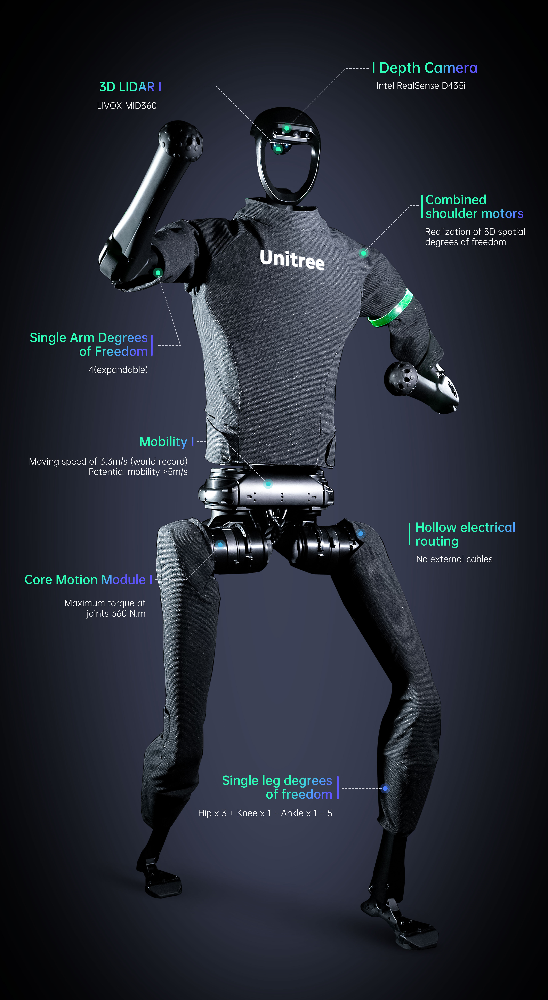

.. _Unitree: https://www.unitree.com/
.. _H1 ROS: https://github.com/unitreerobotics/unitree_ros
.. _H1 ROS2: https://github.com/unitreerobotics/unitree_ros2
.. _H1 Documentation: https://support.unitree.com/home/en/H1_developer/About_H1
.. _Unitree Github: https://github.com/unitreerobotics

.. _Unitree_h1:

===========
Unitree H1
===========

.. _fig_unitree_h1:

   Unitree H1

+------------------+--------------------------------------+
| Location         | Dry Lab                              |
+------------------+--------------------------------------+
| Contacts         | Pawel, Mohammad                      |
+------------------+--------------------------------------+
| Manufacturer     | `Unitree`_                           |
+------------------+--------------------------------------+
| Document         | `H1 Documentation`_                  |
+------------------+--------------------------------------+
| Github           | `Unitree Github`_                    |
+------------------+--------------------------------------+
| ROS              | `H1 ROS`_                            |
+------------------+--------------------------------------+
| ROS2             | `H1 ROS2`_                           |
+------------------+--------------------------------------+

This document provides usage instructions for the Unitree H1 Humanoid robot.
The H1 robot features a distinct upper and lower body structure, each with multiple degrees of freedom.
The robot's single arm includes four degrees of freedom: the body-shoulder joint, shoulder joint, upper arm joint, and elbow joint.
Its single leg comprises five degrees of freedom: the hip joint, leg joint, hip joint, knee joint, and ankle joint.
Additionally, the waist has one degree of freedom, referred to as the waist joint.
Overall, the robot is equipped with 19 joint motors, providing it with 19 degrees of freedom, which allows for precise control
of its movements and posture.

This document provides an overview of the robot's hardware, software, and operation.

    .. toctree::

        h1_start
        h1_manual_control
        h1_power_off
        h1_ros

