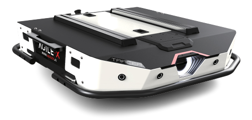

.. _AgileX: https://global.agilex.ai/
.. _AgileX Tracer Documentation: https://agilexrobotics.gitbook.io/tracer
.. _AgileX Tracer GitHub: https://github.com/agilexrobotics
.. _AgileX Tracer ROS: https://github.com/agilexrobotics/tracer_ros
.. _AgileX Tracer ROS2: https://github.com/agilexrobotics/tracer_ros2

.. _AgileXTracer:

=============
AgileX Tracer
=============

.. _fig_agilex_tracer:

   AgileX Tracer

+------------------+---------------------------------+
| Location         | Mobile Arena                    |
+------------------+---------------------------------+
| Contacts         | Mohammad                        |
+------------------+---------------------------------+
| Manufacturer     | `AgileX`_                       |
+------------------+---------------------------------+
| Document         | `AgileX Tracer Documentation`_  |
+------------------+---------------------------------+
| ROS              | `AgileX Tracer ROS`_            |
+------------------+---------------------------------+
| ROS2             | `AgileX Tracer ROS2`_           |
+------------------+---------------------------------+
| Github           | `AgileX Tracer GitHub`_         |
+------------------+---------------------------------+

``AgileX Tracer`` is a two-wheel differential mobile robot for indoor autonomous logistics and warehousing applications.
It is designed to handle heavy loads of up to `100KG` with strong power and easy maneuverability indoors.
This document provides usage instructions for the robot and how to use it with ROS and ROS2.

 .. toctree::

    startup

