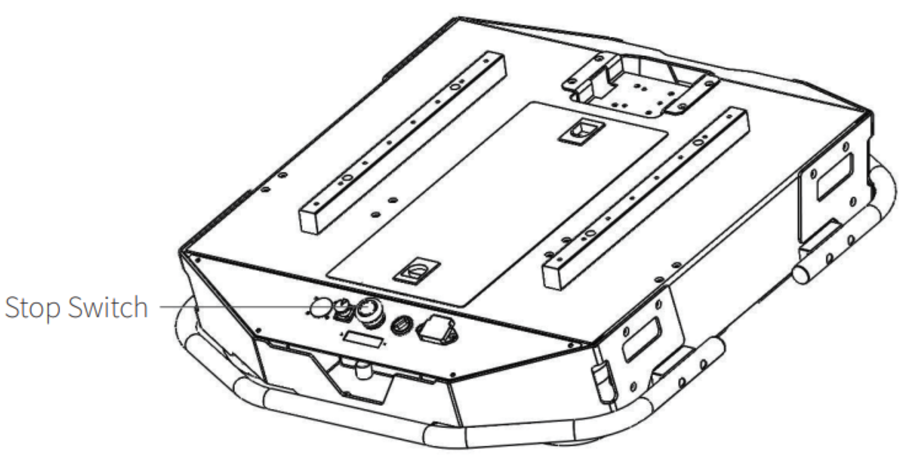
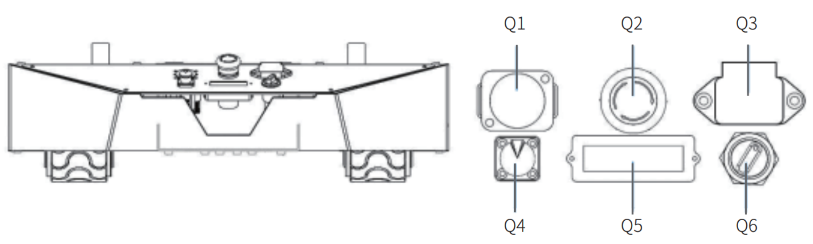

.. _Tracer_StartingUp:

=========================
AgileX Tracer Starting Up
=========================

Please follow this instruction when powering on the :ref:`AgileXTracer`.
This instruction is important to ensure the :ref:`AgileXTracer` boots up correctly.

Safety Precautions
-------------------

Before powering on the :ref:`AgileXTracer`,

.. warning:: Read the :ref:`AgileXTracer` user Documentation.
.. note:: Make sure the power supply is disconnected from the :ref:`AgileX Scout Mini`.
.. note:: Make sure the :ref:`AgileX Scout Mini` is is fully charged.
.. note:: Make sure Bunker does not have any obvious defects.

Powering On the Robot
---------------------

First of all find the place where the power switch is located. The power switch is located on the `back` of the robot. See :numref:`Tracer_RearPanel`.

.. _Tracer_RearPanel:

    Rear Panel

The control panel has the following components, See :numref:`Tracer_ControlPanel`:

    - *Q1*: D89 serial port
    - *Q2*: Stop Switch
    - *Q3*: Power Charging Port
    - *Q4*: Extension Interface
    - *Q5*: Electricity Meter
    - *Q6*: Rotary Switch [Main Electrical Switch]

.. _Tracer_ControlPanel:

    Control Panel

.. note:: Before powering on the robot, make sure the ``emergency stop buttons`` are all released.

Now, rotate the key switch ``Q6`` on the electrical panel, and normally, the voltmeter will display correct battery voltage
and front and rear lights will be both switched on.

Shutting Down the Robot
-----------------------

To shut down the robot, rotate the key switch ``Q6`` on the electrical panel to the OFF position.

.. _tracer_powering_on_remote_controller:

Powering On the Remote Controller
---------------------------------

Before powering on the remote controller, make sure the remote controller is fully charged. Also, make sure that all
four toggle switches are in the up position. Look at the picture :numref:`fig_tracer_remote_controller`.

To power on the remote controller, press the both power buttons on the remote controller at the same time.

.. _fig_tracer_remote_controller:

.. figure:: /images/agilex_tracer/tracer_remote_control.png
    :align: center
    :scale: 50%
    :alt: Remote Controller

    Remote Controller

Now the :ref:`AgileXTracer` is ready to be used.
