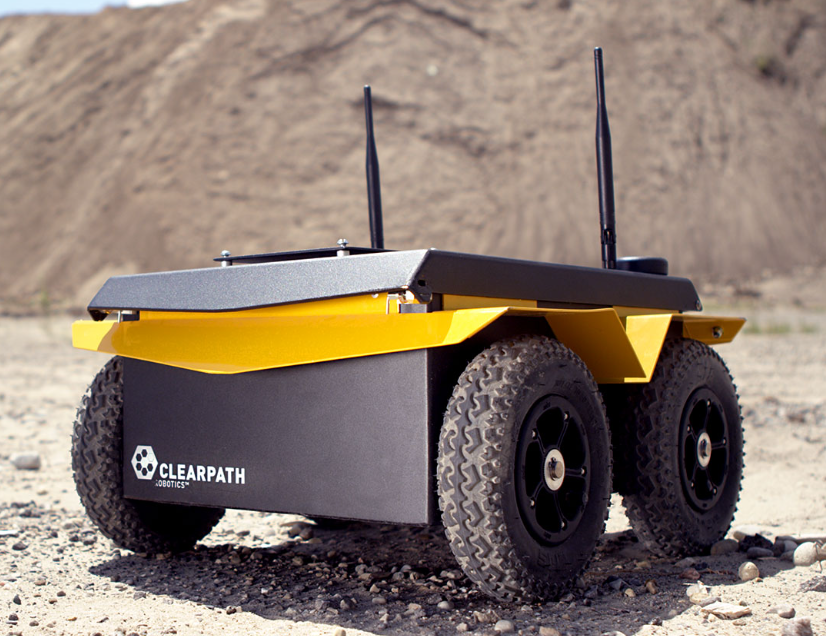

.. _ClearPath: https://clearpathrobotics.com/
.. _ClearPath Jackal Documentation: https://docs.clearpathrobotics.com/docs/robots/outdoor_robots/jackal/user_manual_jackal
.. _ClearPath GitHub: https://github.com/clearpath-gbp
.. _ClearPath Jackal ROS: https://github.com/clearpath-gbp/jackal_robot-release

.. _ClearPath Jackal:

================
Clearpath Jackal
================

.. _fig_clearpath_jackal:

   ClearPath Jackal

+------------------+------------------------------------+
| Location         | Mobile Arena                       |
+------------------+------------------------------------+
| Contacts         | Mohammad                           |
+------------------+------------------------------------+
| Manufacturer     | `ClearPath`_                       |
+------------------+------------------------------------+
| Document         | `ClearPath Jackal Documentation`_  |
+------------------+------------------------------------+
| ROS              | `ClearPath Jackal ROS`_            |
+------------------+------------------------------------+
| Github           | `ClearPath GitHub`_                |
+------------------+------------------------------------+

``ClearPath Jackal`` is a small, fast, and rugged unmanned ground vehicle that is capable of operating on rough terrain. It is designed
for rapid prototyping and research applications. Jackal is designed to be easy to use and comes with a number of pre-configured software packages. The robot is also highly
customizable, with a wide range of sensors and actuators available for integration. Jackal is perfect for a wide range of
applications, including research, development, and education.

This document provides usage instructions for the robot and how to use it with ROS.

    .. toctree::

        startup
        charging
        manual

