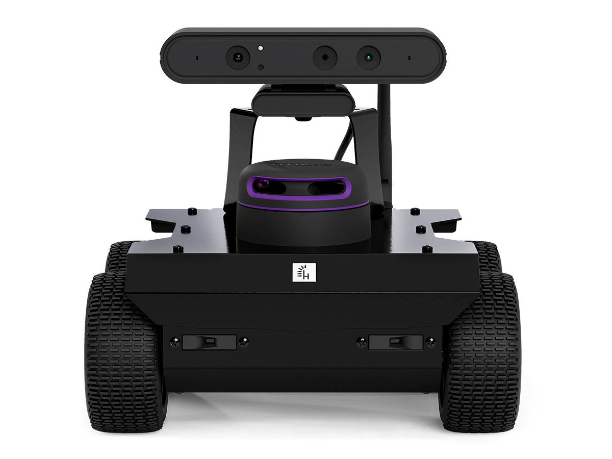

.. _Husarion: https://store.husarion.com/
.. _Rosbot2 PRO Documentation: https://husarion.com/manuals/rosbot/
.. _Husarion GitHub: https://github.com/husarion/
.. _Rosbot2 PRO ROS2: https://github.com/husarion/rosbot_ros

.. _Husarion Rosbot 2 Pro:

=======================
Husarion ROSBOT 2 PRO
=======================

.. _fig_husarion_rosbot_2_pro:

   Husarion Rosbot 2 Pro

+------------------+--------------------------------------+
| Location         | Mobile Arena                         |
+------------------+--------------------------------------+
| Contacts         | Mohammad                             |
+------------------+--------------------------------------+
| Manufacturer     | `Husarion`_                          |
+------------------+--------------------------------------+
| Document         | `Rosbot2 PRO Documentation`_         |
+------------------+--------------------------------------+
| Github           | `Husarion GitHub`_                   |
+------------------+--------------------------------------+
| ROS2             | `Rosbot2 PRO ROS2`_                  |
+------------------+--------------------------------------+

``Husarion Rosbot 2 Pro`` The ROSbot 2 Pro is a ROS-powered 4x4 drive autonomous mobile robot platform designed for
rapid development and versatility. It features LIDAR, an RGB-D camera, an IMU, encoders, and distance sensors.
This affordable platform serves as a base for custom service robots, inspection robots, and swarm robotics.

This document provides usage instructions for the robot and how to use it with ROS2.

    .. toctree::

        startup
        charging
        ros2
