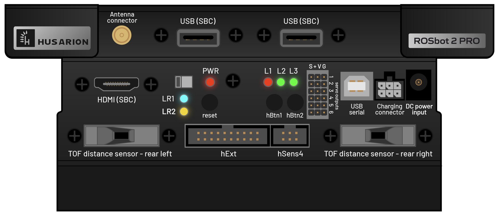

.. _ROSbot 2 PRO Quick Start: https://husarion.com/tutorials/howtostart/rosbot2r-quick-start/

.. _rosbot_2pro:

=====================
ROSbot 2 PRO Start Up
=====================

To start working with ROSbot 2 PRO, Tou can read the `ROSbot 2 PRO Quick Start`_ tutorial.
Also you can see the video below to get a quick overview.

.. raw:: html

    

        <iframe width="670" height="350" src="https://www.youtube.com/embed/Pfe3gGtKDxI?si=9c1eg9w__rmTQdnn" title="YouTube video player" frameborder="0" allow="accelerometer; autoplay; clipboard-write; encrypted-media; gyroscope; picture-in-picture; web-share" referrerpolicy="strict-origin-when-cross-origin" allowfullscreen></iframe>
    

     

Rear Panel
----------

The rear panel of ROSbot 2 PRO shows in the figure :numref:`fig_rosbot_2pro_rear_panel`.

.. _fig_rosbot_2pro_rear_panel:

   Rosbot 2 Pro Rear Panel

Powering On
-----------

To power on the robot, change the power switch to the ON position. The robot will boot up and after some seconds The robot is ready to use.
See the quick start tutorial video (3.10 sec) for more details.

