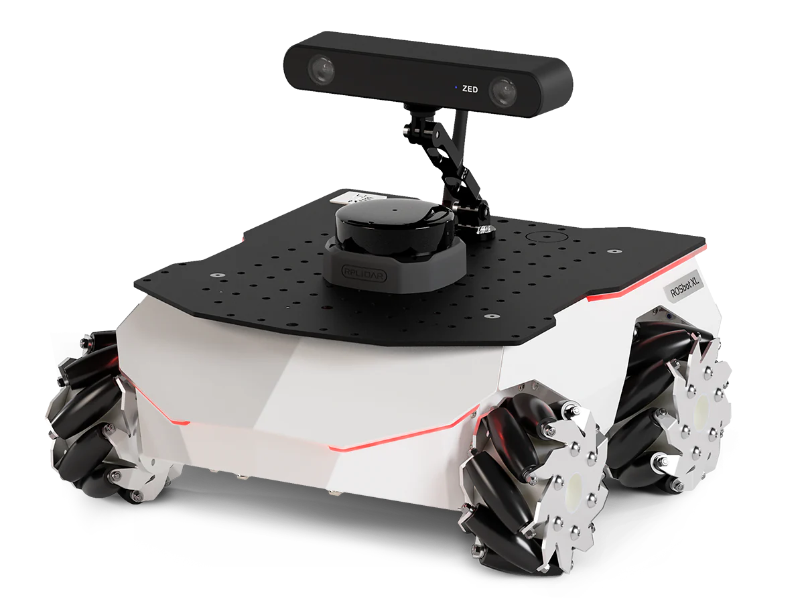

.. _Husarion: https://store.husarion.com/
.. _Rosbot XL Documentation: https://husarion.com/tutorials/howtostart/rosbotxl-quick-start/
.. _Husarion GitHub: https://github.com/husarion/
.. _Rosbot XL ROS: https://github.com/husarion/rosbot-xl-autonomy
.. _Rosbot XL ROS2: https://github.com/husarion/rosbot_xl_ros

.. _Husarion Rosbot XL:

Husarion Rosbot XL
==================

.. _fig_husarion_rosbot_xl:

   Husarion Rosbot XL

+------------------+--------------------------------------+
| Location         | Mobile Arena                         |
+------------------+--------------------------------------+
| Contacts         | Mohammad                             |
+------------------+--------------------------------------+
| Manufacturer     | `Husarion`_                          |
+------------------+--------------------------------------+
| Document         | `Rosbot XL Documentation`_           |
+------------------+--------------------------------------+
| Github           | `Husarion GitHub`_                   |
+------------------+--------------------------------------+
| ROS              | `Rosbot XL ROS`_                     |
+------------------+--------------------------------------+
| ROS2             | `Rosbot XL ROS2`_                    |
+------------------+--------------------------------------+

``Husarion Rosbot XL`` is a versatile, ROS2-native autonomous mobile robot with a mecanum drive structure, designed for indoor use. It serves as an excellent foundation for developing robotic products, conducting research, and facilitating quick prototyping.

This document provides usage instructions for the robot and how to use it with ROS.

    .. toctree::

        startup

