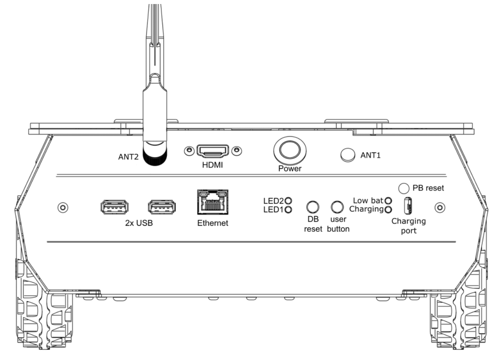

.. _RosbotXl Quick Start: https://husarion.com/tutorials/howtostart/rosbotxl-quick-start/

.. _RosbotXlStartup:

==================
Rosbot XL Start up
==================

Before you start working with Husarion Rosbot XL, you need to prepare it for work. This tutorial will guide you through the process of setting up your robot.
You can find more information in the `RosbotXl Quick Start`_ tutorial, as well. Also, you can see the official Husarion Rosbot video tutorial in below.

.. _QuickStart Video:

.. raw:: html

    

        <iframe width="670" height="350" src="https://www.youtube.com/embed/uVLyZ2ae4k0?si=VRo19y9c1AIpI6wu" title="YouTube video player" frameborder="0" allow="accelerometer; autoplay; clipboard-write; encrypted-media; gyroscope; picture-in-picture; web-share" referrerpolicy="strict-origin-when-cross-origin" allowfullscreen></iframe>
    

     

Rear panel overview
-------------------

To work with Rosbot XL, you need to be familiar with the rear panel of the robot. See :numref:`fig_rosbot_xl_rear_panel`.

.. _fig_rosbot_xl_rear_panel:

   Rosbot XL Rear Panel

The rear panel of the robot contains the following elements:
    - **Antenna connector**: Wi-Fi antenna RP-SMA socket. Required for Wi-Fi connectivity. For some SBCs, 2 antennas are used.
    - **USB**: USB 2.0 host ports from SBC.
    - **HDMI**: HDMI output from SBC.
    - **Power button**:	Turns ROSbot ON or OFF. Hold for 1.5 seconds to turn robot on, 0.5 seconds to turn off.
    - **LEDs**: LED1(green), LED2(red), LED3(green), LED4(red)
    - **DB Reset**:	Button used for reset digital board.
    - **PB Reset**:	Hidden button used for reset power board.
    - **User button**: Programmable button.
    - **USB type C power input**: USB-C Power Delivery input (15-20V) which supports simultaneous power delivery and battery charging.

The LED status is as follows:

+---------------+---------+--------------+-----------------------------------+
| LED           | Color   | State        | Message                           |
+---------------+---------+--------------+-----------------------------------+
| LED1          | Green   | ON           | Firmware finished booting         |
+---------------+---------+--------------+-----------------------------------+
| LED2          | Red     | Toggling     | Error of RTOS'a or microROS       |
+---------------+---------+--------------+-----------------------------------+
| Low Bat       | Red     | ON           | Battery level is low              |
+---------------+---------+--------------+-----------------------------------+
| Charging      | Green   | Toggling     | Battery is charging               |
+---------------+---------+--------------+-----------------------------------+
| Charging      | Green   | ON           | Battery is fully charged          |
+---------------+---------+--------------+-----------------------------------+
| Power button  | White   | ON           | Power is ON                       |
+---------------+---------+--------------+-----------------------------------+
| Power button  | White   | Toggling     | System is shutting down           |
+---------------+---------+--------------+-----------------------------------+
| Pixel Panel   | RGB     | Programmable | In default shows looped animation |
+---------------+---------+--------------+-----------------------------------+

Powering on
-----------

To power on the robot, press the power button for 1.5 seconds. The LED1 will turn green, indicating that the firmware has finished booting. The robot is now ready to use.
See the upper video for more information.

