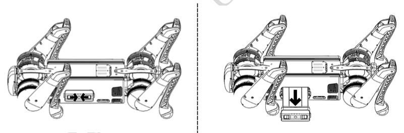
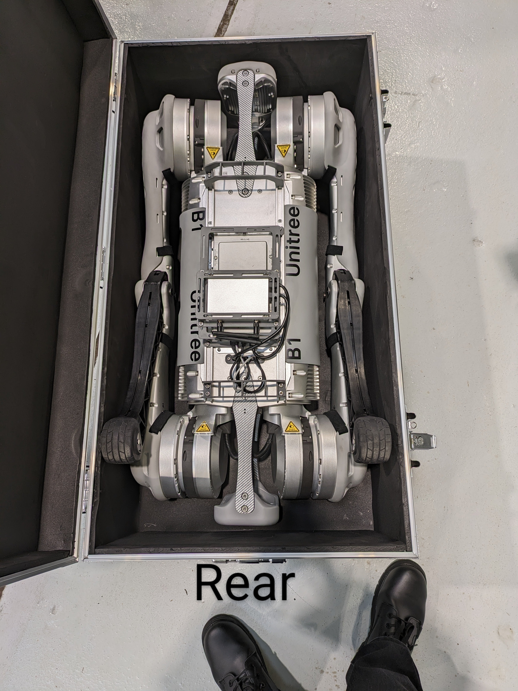

.. _power_off:

=========
Power Off
=========

Before turning off the robot,
    - Ensure that the :ref:`Unitree_B1` robot stands on a flat surface.
    - Ensure that the robot is in a static state and not moving.

Now, follow the steps below to turn off the robot:
    - Press the :guilabel:`L2+A` buttons twice. The robot completed the joints locking and laying down actions in turn.
    - After robot's laying down action is completed, press the ``power`` button briefly and then press the ``power`` button again for 4 seconds to shut down the robot.

Battery Remove
--------------

To remove the battery, Press and hold the two buckles on the battery packs and push it inward to pop up the battery packs.
See :numref:`battery_removal` for more details.

.. _battery_removal:

   B1 Battery Removal

Boxing
------

.. warning:: Be careful to pinch your fingers when boxing the robot.

:numref:`fig_b1_boxing` shows the boxing of the robot.

.. _fig_b1_boxing:

   B1 Boxing

