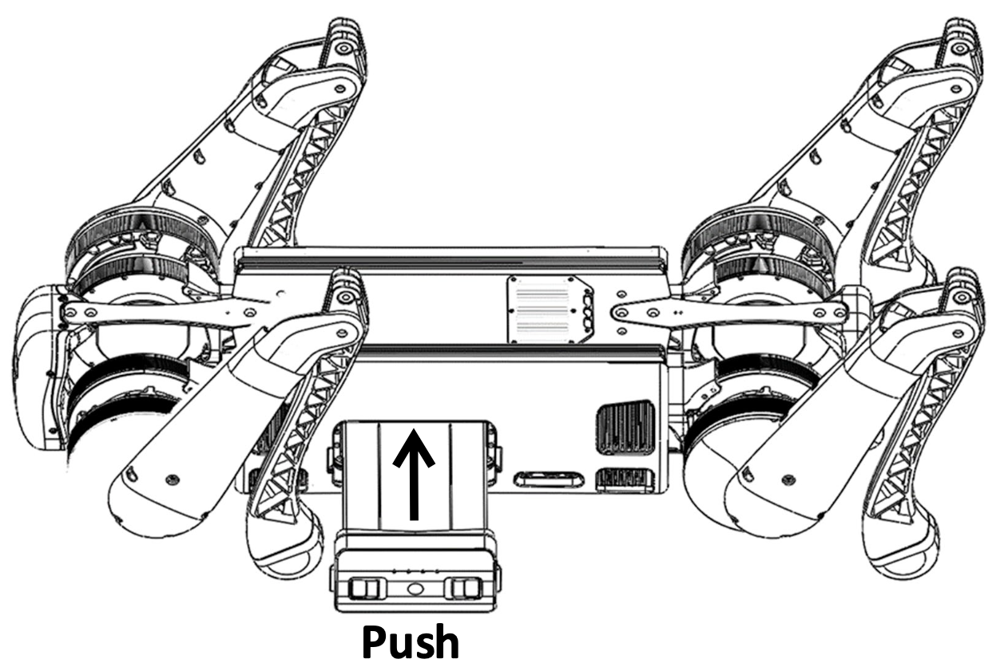
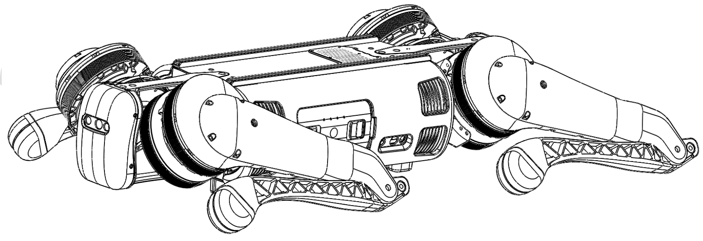
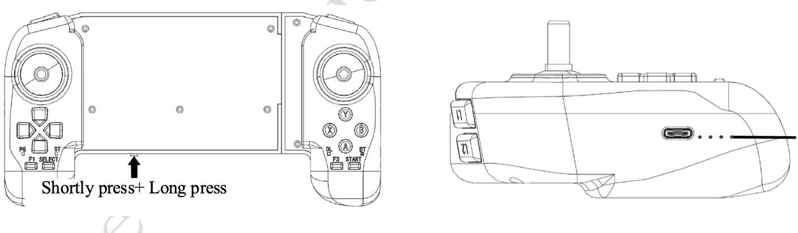

.. _b1_StartUp:

===========
B1 Start Up
===========

In this section, we will go through the steps to start up the B1 Robot.

To have a better understanding of the robot's body parts, please refer to tutorial video below.

.. raw:: html

    

        <iframe width="680" height="350" src="https://www.youtube.com/embed/nP6fa-LCz6g?si=k9QRkx21KBZoSf11" title="YouTube video player" frameborder="0" allow="accelerometer; autoplay; clipboard-write; encrypted-media; gyroscope; picture-in-picture; web-share" referrerpolicy="strict-origin-when-cross-origin" allowfullscreen></iframe>
    

     

Check Before Powering Up
------------------------

.. warning::
    Before powering up the B1 Robot, please make sure that the following steps are completed:

    1. Only use Unitree Robotic parts and ensure that all parts are in good working condition.
    2. Ensure the firmware has been updated to the latest version.
    3. The users ensure that they are nit operating the robot while intoxicated or under the influence of drugs.
    4. Be familiar with the characteristics of each gait mode.
    5. Be familiar with the emergency braking method of the robot in case of instability / loss of control.
    6. Ensure that the are no foreign matters such as water, oil, sand, soil, etc inside the robot and its components.
    7. Ensure that the remote control module and battery pack are fully charged.
    8. If the expansion interface is used, ensure that its cable connected correctly.
    9. Check whether  the waterproof plug is installed correctly.

.. note::
    Use the appropriate handles to lift the robot from the box. Be mindful of the placed warnings about hazardous parts.

Installing the Battery
----------------------

.. note:: Ensure that the battery is fully charged before installing it into the robot.

Put the Bl on the flat ground and install the battery pack into the battery slot from the side of the robot dog. See :numref:`b1_battery_installation`.

.. warning::
    - Pay attention to the installation direction.
    - If the battery pack cannot be fully inserted, please adjust the direction of the battery packs and do not press forcibly to avoid damage to the battery interface and buckle.
    - Please make sure that the buckle is in place!

.. _b1_battery_installation:

   B1 Battery Installation

Body Placement
--------------

**Horizontal type startup:** please make sure that the robot dog is placed on a flat ground before startup and operation.
The belly support pad of the robot dog should be flat against the ground.
The machine body should lie on the ground horizontally without tilting.
The legs of the robot dog should be fully retracted as shown in :numref:`b1_body_placement`.
The four knee joints and foot ends should be flat on the ground to ensure that neither the thighs nor the legs of the robot dog are pressed by the machine body.

.. _b1_body_placement:

   B1 Body Placement

.. warning:: **Do not turn on the battery before ensuring proper robot positioning!**

.. note::
    - If the starting up fails, please check the placement of the body!
    - The thigh and the lower legs protruding outward or the lower legs being pressed inward may cause the robot dog to fail to start up!
    - Be careful with your hands at the movement joints, be careful!

Connecting the Remote Control Module
------------------------------------

First, briefly press the power switch of the remote control once, and then long press the power switch for more than 2 seconds.
The users can turn on the remote control when they hear ``tick ~``.
The remote control corresponds to the data transmission module of the robot dog one-to-one, and it can be connected automatically when it is turned on.
All the data transmission signal lights on the left side of the handle indicate that the connection is successful,
and the remote control can control the robot dog, as shown in the :numref:`b1_remote_control_module`.

.. _b1_remote_control_module:

   B1 Remote Control Module

Powering On the Robot
---------------------

After the robot completes the pre-boot inspection, and the pre-boot preparation requirements are placed, follow the following to boot the machine:
    - Press the power switch once, and then press the power switch for more than 4 seconds, you can turn on the battery (when the battery is on, the indicator light is green, and the indicator light shows the current battery level). After the battery starts, wait for 2 minutes, the robot stands, the fuselage height is about 63cm, parallel to the ground, that is, the robot is power on successfully.
