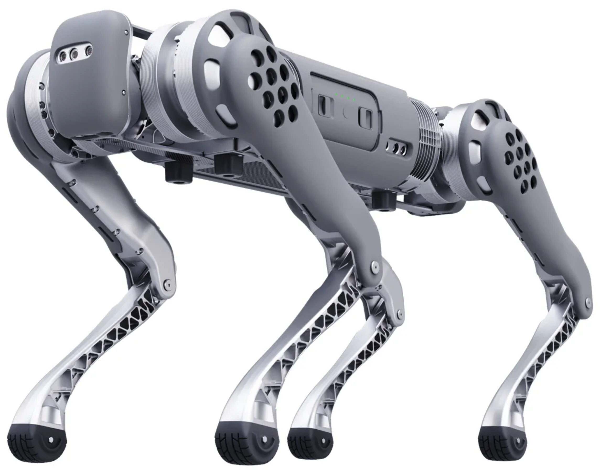

.. _Unitree: https://www.unitree.com/
.. _B1 Software Manual: https://livemanchesterac.sharepoint.com/:b:/r/sites/UOM-FSE-EEE-REEL-at-RAICo/Shared%20Documents/General/REEL/3.%20Operations/SSOW/Operating%20Instructions/B1%20Documents/B1_Software_Manual_V1.0-1.pdf?csf=1&web=1&e=LDHrRp
.. _B1 User Manual: https://livemanchesterac.sharepoint.com/:b:/r/sites/UOM-FSE-EEE-REEL-at-RAICo/Shared%20Documents/General/REEL/3.%20Operations/SSOW/Operating%20Instructions/B1%20Documents/B1_User_Manual_V1.0-1.pdf?csf=1&web=1&e=qM8h6P
.. _B1 ROS: https://github.com/unitreerobotics/unitree_ros
.. _B1 Documentation: https://docs.quadruped.de/projects/b1/html/operation.html
.. _Unitree Github: https://github.com/unitreerobotics

.. _Unitree_B1:

==========
Unitree B1
==========

.. _fig_unitree_b1:

   Unitree B1

+------------------+--------------------------------------+
| Location         | RAICo1                               |
+------------------+--------------------------------------+
| Contacts         | Mohammad                             |
+------------------+--------------------------------------+
| Manufacturer     | `Unitree`_                           |
+------------------+--------------------------------------+
| Software Doc     | `B1 Software Manual`_                |
+------------------+--------------------------------------+
| Manual Doc       | `B1 User Manual`_                    |
+------------------+--------------------------------------+
| Document         | `B1 Documentation`_                  |
+------------------+--------------------------------------+
| Github           | `Unitree Github`_                    |
+------------------+--------------------------------------+
| ROS              | `B1 ROS`_                            |
+------------------+--------------------------------------+

This document provides usage instructions for the Unitree B1 quadruped robot.
The B1 is a quadruped robot developed by Unitree Robotics.
The robot is capable of walking, running, and performing various other tasks.

This document provides an overview of the robot's hardware, software, and operation.

    .. toctree::

        b1_start
        b1_manual_control
        b1_power_off
        b1_ros

