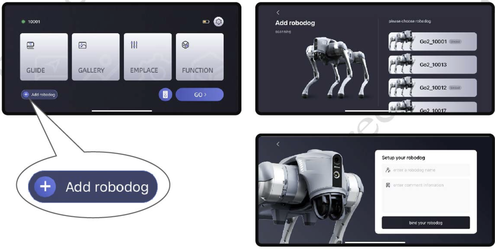
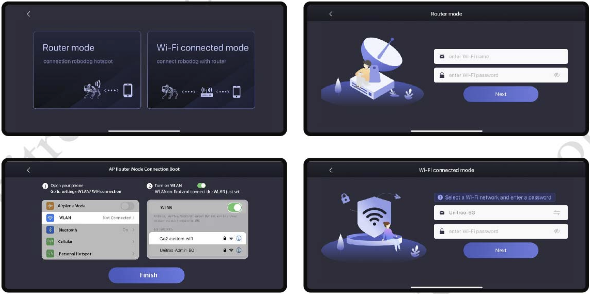
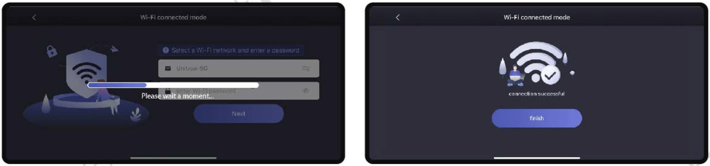

.. _`Go2 App_`: https://www.unitree.com/app/go2/

.. _`go2_app_binding`:

=======
Go2 App
=======

The Go2 App is a simple web application that demonstrates how to use the Go2.
You can access the Go2 App at `Go2 App`_.
First of all you need to download the Go2 App from the link above.

Binding
-------

During the  binding process, keep your phone bluetooth on, close to the robot, and do the following steps:

    #. Add robot to the app by clicking the "+" button.
    #. Click on the robot you want to bind. See :numref:`fig_go2_binding` for the binding process.
    #. Click on the "Bind" button.
    #. You can choose AP router and Wifi connection mode to connect. See :numref:`fig_go2_wifi_binding` for the wifi connection process.

.. _fig_go2_binding:

    Go2 App Binding

.. _fig_go2_wifi_binding:

    Go2 App Wifi Binding

