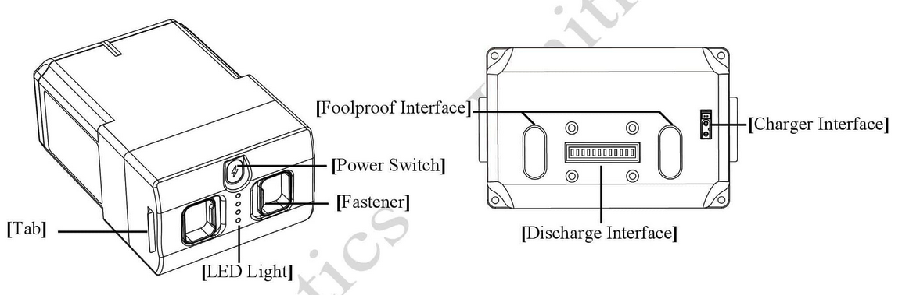
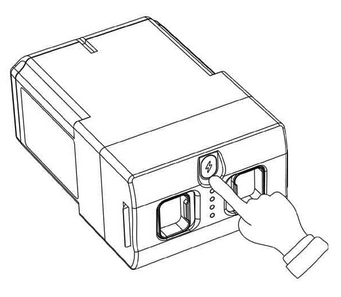
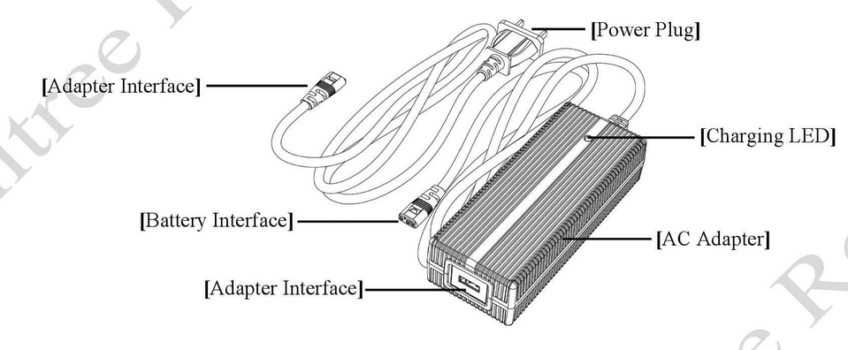

.. _go2_charging:

========
Charging
========

To get more information regarding the battery and charging process read Go2 battery and charger document in Go2 App.

Battery
-------

The battery pack details shown in :numref:`go2_battery_pack`. Also, the charger part is shown in :numref:`go2_charger_part`.

.. _go2_battery_pack:

    Go2 Battery Pack

Battery Turn On
~~~~~~~~~~~~~~~

In the `OFF` state, briefly press the battery switch (Key) once, and then press the battery switch (Key) for more than 3 seconds to turn on the battery.
When the battery is turned on, the indicator light is green and the current battery level is displayed.

.. _go2_battery_power_switch:

    Go2 Battery Power Switch

Battery Turn Off
~~~~~~~~~~~~~~~~

In the `ON` state, briefly press the battery switch (Key) once, and then press the power switch for more than 3 seconds to turn off the battery.
After the battery is turned off, the indicator lights go out.

Force Shutdown
~~~~~~~~~~~~~~

Press and hold the battery switch (Key) for more than 15 seconds to force the battery to shut down.

:numref:`go2_battery_power_switch` shows the battery power button.

Charging
--------

:numref:`go2_charger_part` shows the charging parts of Go2.

.. _go2_charger_part:

    Go2 Charger Part

To charge the battery do the steps below:

    #. Connect the charger to an AC power source (100-240V, 50/60Hz).

        It must be ensured that the external power supply voltage matches the rated input voltage of the charger before connecting.
        Otherwise, the charger will be damaged (the rated input voltage of the charger is marked on the nameplate of the charger).
    #. Before charging the battery, ensure that the battery is switched off. Otherwise, the battery and charger may be damaged.
    #. The users need to remove the battery from the robot itself when charging the battery.
    #. When all the indicator lights are off, it indicates that the battery is fully charged.

        Please remove the battery and charger to complete charging.
        You can also check the current charging status through the charger indicator.
    #. The temperature of the battery may be high after running, and the battery must be charged after the temperature of the battery has dropped to room temperature.

