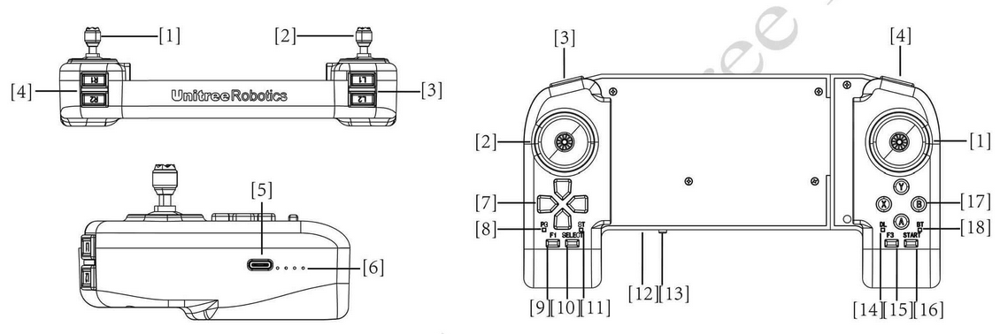

.. _go2_remote_control:

==============
Manual Control
==============

To control the :ref:`Unitree_go2` robot manually, first of all you ned to turn the robot and remote control on.
To know how to turn the robot and remote control on, please refer to the :ref:`go2_startup` section.

Video below shows how to connect the remote control to the robot.

.. raw:: html

    <vid>
        <iframe width="680" height="350" src="https://www.youtube.com/embed/yyrR0eTFZHg?si=qyyfXf0Mfa9Iigtt" title="YouTube video player" frameborder="0" allow="accelerometer; autoplay; clipboard-write; encrypted-media; gyroscope; picture-in-picture; web-share" referrerpolicy="strict-origin-when-cross-origin" allowfullscreen></iframe>
    </vid>
     

Remote Control Parts
--------------------

.. _figure_remote_control:

   Go2 Remote Control

:numref:`figure_remote_control` shows the parts of the remote control.
The parts names as follows:

    #. Right Rocker
    #. Left Rocker
    #. Key L1/L2
    #. Key R1/R2
    #. Type C Charging Interface
    #. Data transmission Signal Light
    #. Left Key
    #. Power Connect Indicator
    #. F1 Left Rocker Calibration Key
    #. SELECT Key
    #. Charging Status Indicator
    #. Power Indicator Light
    #. Power Button
    #. Data Transmission Indicator Light
    #. F3 Right Rocker Calibration Key
    #. START Key
    #. Right Key
    #. Bluetooth Signal Indicator Light

Remote Control Commands
-----------------------

.. table:: Remote Control Commands
    :align: center

    +----------------------------------------+------------------------------------------------+
    |               :guilabel:`Button`       |                :guilabel:`Effect`              |
    +---------------+------------------------+------------------------------------------------+
    | Left Rocker   | Push Forward/Backward  | Move back and forth                            |
    |               +------------------------+------------------------------------------------+
    |               | Push Left/Right        | Sideways Movement                              |
    +---------------+------------------------+------------------------------------------------+
    | Right Rocker  | Push Forward/Backward  | Head Up or Down                                |
    |               +------------------------+------------------------------------------------+
    |               | Push Left/Right        | Left or Right Turn                             |
    +---------------+------------------------+------------------------------------------------+
    +-----------------------------------------------------------------------------------------+
    |                             :guilabel:`Switch Mode`                                     |
    +-----------------------------------------------------------------------------------------+
    +----------------------------------------+------------------------------------------------+
    | START                                  | Get Unlocked                                   |
    +                                        +------------------------------------------------+
    |                                        | Walking Mode                                   |
    +                                        +------------------------------------------------+
    |                                        | Keep Walking Mode (Double Click)               |
    +----------------------------------------+------------------------------------------------+
    | SELECT                                 | Make a Pose                                    |
    +----------------------------------------+------------------------------------------------+
    | L2 (Long Press) + A (Click)            | Locking Posture 1:Lock the joints when standing|
    +                                        +------------------------------------------------+
    |                                        | Locking Posture 2:Press again to go prone      |
    +----------------------------------------+------------------------------------------------+
    | L2 (Long Press) + B (Click)            | Damping Mode (soft emergency stop)             |
    +----------------------------------------+------------------------------------------------+
    | L2 (Long Press) + START (Click)        | Running Mode                                   |
    +----------------------------------------+------------------------------------------------+
    | L2 (Long Press) + START (double Click) | Keeping Running Mode                           |
    +----------------------------------------+------------------------------------------------+
    | Right (Long Press) + START (Click)     | Stairs Climbing Mode1:                         |
    +                                        +                                                +
    |                                        | Upstairs Forward / Downstairs Backwards        |
    +----------------------------------------+------------------------------------------------+
    | Left (Long Press) + START (Click)      | Stairs Climbing Mode 2:                        |
    +                                        +                                                +
    |                                        | Upstairs Downstairs Forward                    |
    +----------------------------------------+------------------------------------------------+
    | L1 (Long Press) + SELECT (Click)       | Endurance Mode                                 |
    +----------------------------------------+------------------------------------------------+
    +-----------------------------------------------------------------------------------------+
    |                                :guilabel:`Customised Movements`                         |
    +-----------------------------------------------------------------------------------------+
    +----------------------------------------+------------------------------------------------+
    | L2 (Long Press) + X (Click)            | Back to Stand Up after falling down            |
    +----------------------------------------+------------------------------------------------+
    | R2 (Long Press) + A (Click)            | Stretch                                        |
    +----------------------------------------+------------------------------------------------+
    | R2 (Long Press) + B (Click)            | Shake hands                                    |
    +----------------------------------------+------------------------------------------------+
    | R2 (Long Press) + Y (Click)            | Cheer                                          |
    +----------------------------------------+------------------------------------------------+
    | R1 (Long Press) + X (Click)            | Punch                                          |
    +----------------------------------------+------------------------------------------------+
    | R1 (Long Press) + A (Click)            | Jump Forward                                   |
    +----------------------------------------+------------------------------------------------+
    | R1 (Long Press) + B (Click)            | Sit Down                                       |
    +----------------------------------------+------------------------------------------------+
    | L1 (Long Press) + A (Click)            | Dance 1                                        |
    +----------------------------------------+------------------------------------------------+
    | L1 (Long Press) + B (Click)            | Dance 2                                        |
    +----------------------------------------+------------------------------------------------+
    +-----------------------------------------------------------------------------------------+
    |                                     :guilabel:`Function`                                |
    +-----------------------------------------------------------------------------------------+
    +----------------------------------------+------------------------------------------------+
    | X (Click)                              | Avoidance on (Default)                         |
    +----------------------------------------+------------------------------------------------+
    | Y (Long Press for 3 second)            | Avoidance off                                  |
    +----------------------------------------+------------------------------------------------+
    | L2 (Click) + SELECT (Click)            | Searching Switch - Default off                 |
    +----------------------------------------+------------------------------------------------+
    | Arrow keys left and right              | Light switch - default green                   |
    +----------------------------------------+------------------------------------------------+
    +-----------------------------------------------------------------------------------------+
    |                                   :guilabel:`Parameters Settings`                       |
    +-----------------------------------------------------------------------------------------+
    +----------------------------------------+------------------------------------------------+
    | L1 + Arrow keys Up/Down                | Adjust leg lift height                         |
    +----------------------------------------+------------------------------------------------+
    | Arrow keys Up/Down                     | Adjust body height                             |
    +----------------------------------------+------------------------------------------------+

.. note::
    The ``Athletic Mode`` can be run only via ``Go2 App``. The athletic actions are:
        #. Moon Walk.
        #. Side Step.
        #. Cross Step.
        #. Parallel Leg Running.

.. note:: To have more information about the remote control, please read the documentation of the robot in Go2 App.

