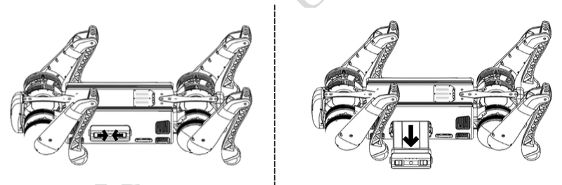

============
Powering Off
============

Before turning off the robot,
    - Ensure that the :ref:`Unitree_go2` robot stands on a flat surface.
    - Ensure that the robot is in a static state and not moving.

To power off the robot, follow the steps below:

    #. Operate the robot into the prone state;
    #. After the robot enters the prone state, ``short press`` the power button then ``long press`` the power button for `2` seconds to switch off the robot.

Battery Removal
---------------

To remove the battery, Press and hold the two buckles on the battery packs and push it inward to pop up the battery packs.
See :numref:`fig_battery_removal` for more details.

.. _fig_battery_removal:

   B1 Battery Removal

