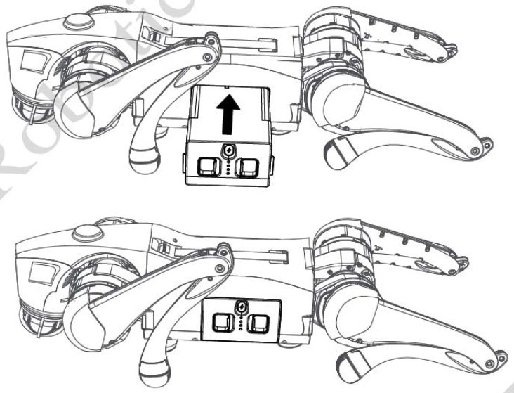
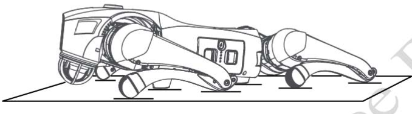

.. _Go2 App: https://www.unitree.com/app/go2/

============
Go2 Start Up
============

This document provides the necessary information to start up the Go2 robot.
To have a better understanding of the robot, install the `Go2 App`_ and read the documents and also watch the tutorial videos.

Check Before Powering Up
------------------------

.. warning::
    Before powering up the Go2 Robot, please make sure that the following steps are completed:

    1. Only use Unitree Robotic parts and ensure that all parts are in good working condition.
    2. Ensure the firmware has been updated to the latest version.
    3. The users ensure that they are nit operating the robot while intoxicated or under the influence of drugs.
    4. Be familiar with the characteristics of each gait mode.
    5. Be familiar with the emergency braking method of the robot in case of instability / loss of control.
    6. Ensure that the are no foreign matters such as water, oil, sand, soil, etc inside the robot and its components.
    7. Ensure that the remote control module and battery pack are fully charged.
    8. Ensure that the surface of the robot's Camera and Lidar are free of dust and are not surrounded by obstacles.

Installing Battery
------------------

Lay Go2 on a flat surface, insert the battery pack into the battery packs from the side of the robot. See the :numref:`fig_go2_battery_installation` for the correct installation direction.
When you hear a ``click`` sound, the battery pack installation is complete.

.. note:: pay attention to the direction of installation, with the power switch button facing upwards.

.. warning:: If the battery pack cannot be fully inserted, please adjust the direction of the battery packs and do not press forcibly to avoid damage to the battery interface and buckle.

.. _fig_go2_battery_installation:

   Go2 Battery Installation

Body Placement
--------------

**Horizontal start-up:** Please make sure that:

    - The robot is placed on a flat surface before start-up.
    - The robot's abdominal support pad is flat on the ground.
    - The robot's body is lying on the ground horizontally without any tilting.
    - The robot's lower legs are in a fully retracted state (as shown in the :numref:`fig_go2_horizontal_startup`).
    - All four joints and the ends of the feet are placed on the ground flatly to make sure that the robot's thighs and lower legs are not pressed down by the robot's body.

.. _fig_go2_horizontal_startup:

   Go2 Horizontal Start-up

